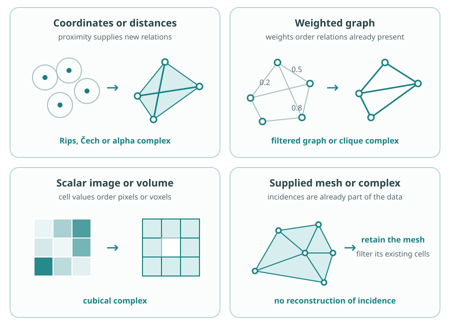
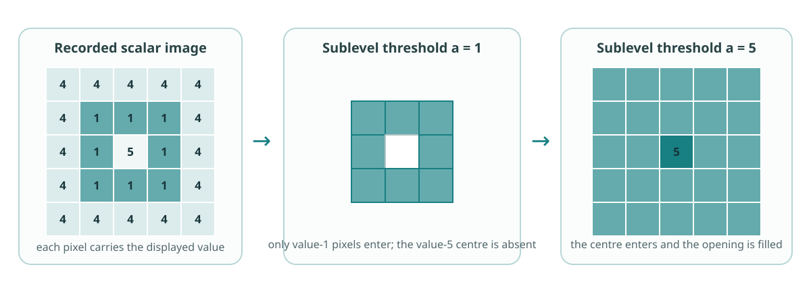

**Practical notebook.** Hold the data fixed, change one upstream decision and
attribute the difference. <a href="../downloads/pause-and-take-stock-practical.ipynb" download="pause-and-take-stock-practical.ipynb">Download the notebook</a>.

Homology and the filtered family are now in place, but their classes have not
yet been linked across scale. Before doing that, inspect the modelling choices
that will determine the meaning of the persistence calculation:

$$
\text{scientific system}
\to \text{observations}
\to \text{stored data}
\to \boxed{\text{representation, constructor and }f}
\to \{K_a\}_{a\in I}
\to \{H_p(K_a)\}_{a\in I}
\to \underbrace{\text{persistent homology}\to\text{barcode or diagram}}_{\text{next}}
\to \text{claim}.
$$

The highlighted part revisits stages 1 and 3 of the course spine. A different
metric, constructor or filtration direction may produce a different diagram
without either calculation being erroneous. The calculations may answer
different questions.

## The decisions to make explicit

::: {.pipeline-stages}
::: {.pipeline-stage}
**Question and evidence**

What scientific system is being studied, what was observed, and what simpler
quantity could already answer the question?
:::

::: {.pipeline-stage}
**Analysed representation**

Does the calculation act on coordinates, distances, a graph, an image, a
scalar field or a supplied complex? State what has already been inferred or
discarded.
:::

::: {.pipeline-stage}
**Constructor and filtration**

What relations may form cells, what creates higher-order cells, what does
$f$ measure, and why are the resulting complexes nested?
:::

::: {.pipeline-stage}
**Algebra to request**

State the coefficient field and homology degrees. Predict which visible
features should be born, persist or disappear before asking software to
compute them.
:::

::: {.pipeline-stage}
**Comparison and claim**

Change one choice at a time. Compare with a simpler baseline or justified
null, then state the most limited conclusion supported by the constructed
object.
:::
:::

::: {.column-margin .study-note .insight}
**A barcode has a modelling history.** Its endpoints inherit their meaning
and units from the filtration. Its classes inherit their interpretation from
the representation and constructor.
:::

## $K$ and $f$ are useful questions, not a unique split

It is useful to ask which relations are admissible in $K$, then when they
enter according to $f$. That allocation is not always unique. A forbidden
edge may be omitted from $K$, or retained in an ambient complex and assigned
$f(e)=\infty$. Both conventions produce the same complex at every finite
filtration value.

Interpret the resulting filtered family, and report the convention used. Do
not attribute a difference solely to $K$ or $f$ when the same construction
could be encoded another way.

::: {.column-margin .study-note .qualification}
**The constructor is the umbrella choice.** It specifies the admissible
relations, how higher-order cells form and how filtration values extend to
them. Rips, directed flag and cubical constructions therefore embody
different modelling assumptions.
:::

## Let the stored data constrain the route

The filtered object should retain structure that is already meaningful in the
data. Converting every input into an unstructured point cloud can introduce
assumptions that were not required.

| Stored data | Plausible starting construction | Filtration value means |
|---|---|---|
| coordinates or distances | Rips, Čech or alpha complex | spatial or state-space proximity |
| weighted graph | filtered graph or clique complex | edge strength, cost or dissimilarity |
| image, volume or scalar grid | cubical complex | intensity, density, energy or another field value |
| supplied mesh or complex | filter the existing cells | a value attached to vertices or cells |

{fig-alt="Four teal panels show a point cloud becoming a proximity complex, a weighted graph being thresholded, a scalar image becoming a cubical complex and a supplied mesh retaining its incidences."}

This is a set of starting routes, not an automatic selector. Alpha shapes
give a scale-dependent Euclidean point-set construction
[@edelsbrunner1994alpha], while witness complexes reduce a point cloud using
landmarks [@desilva2004witness]. For weighted networks, Petri and collaborators
use representative persistent cycles to construct homological scaffolds of
functional brain networks; their Figure 6 shows the resulting group-level
structures [@petri2014scaffolds]. For greyscale images, cubical complexes
retain the adjacency of pixels or voxels [@robins2011images].

:::: {.worked-example}
### Why a cubical hole appears

{fig-alt="A five-by-five scalar image has low-valued ring cells and a higher-valued centre. The ring enters first and the centre later fills its hole."}

At threshold $a=1$, the value-$1$ pixels have entered but the central
value-$5$ pixel has not. The included squares therefore surround an absent
square. At $a=5$, the centre enters and fills it. Birth and death now have the
units of the scalar field, not units of Euclidean distance.
::::

## The pipeline audit protocol {#pipeline-audit-protocol}

Use this protocol whenever a construction or software choice is tested.

| Stage | Question | Evidence to retain |
|---:|---|---|
| 1. Inspect | What is actually stored? | units, missingness, sampling and a direct plot |
| 2. Predict | What should appear? | expected features and approximate parameter range |
| 3. Construct | What filtered object was built? | constructor, filtration convention and cell counts |
| 4. Compute | What algebra was requested? | field, homology degree and threshold |
| 5. Check | Does one visible case agree with reasoning? | inspected cell, entry value or interval |
| 6. Compare | Which single decision changes? | fixed quantities and changed quantity |
| 7. Interpret | What claim survives? | result, limitation and simpler baseline |

::: {.checkpoint-route}

You are ready to continue when you can state what $K_a$ represents, what makes
the family nested, which upstream choice gives the filtration parameter its
meaning, and which visible features you expect persistent homology to follow.

:::
