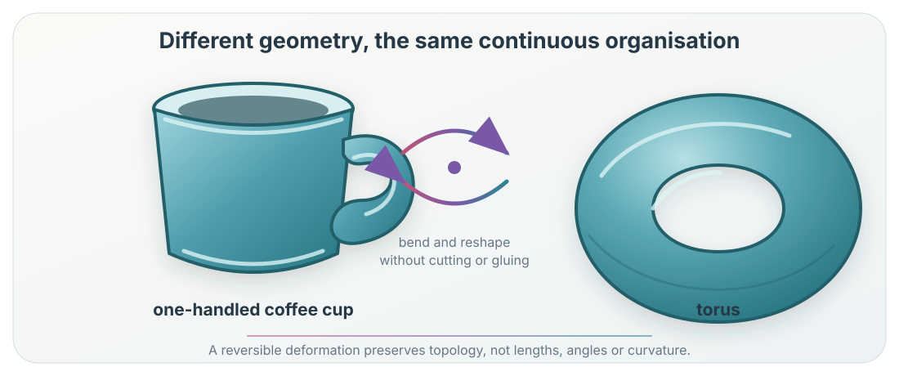

**Practical notebook.** Explore the Datasaurus Dozen and test which summaries
retain visible structure. <a href="../../downloads/topic-01-participant.ipynb" download="topic-01-participant.ipynb">Download the notebook</a>.

Data sets can share familiar statistical summaries while having visibly
different structure. Shape may therefore contain information that those
summaries omit. Geometry and topology retain different parts of that
structure.

::: {.callout-note collapse="true" title="Optional reading"}
- Matejka and Fitzmaurice introduce the Datasaurus Dozen
  [@matejka2017samestats].
- Postol, Chapter 2, gives a preparatory account of topology.
- Edelsbrunner and Harer, Chapter I.1, discusses connectedness.
:::

## The Datasaurus problem: shape matters

The thirteen Datasaurus point clouds have nearly identical coordinate means,
coordinate standard deviations and Pearson correlations, yet visibly
different organisation [@matejka2017samestats; @gillespie2025datasaurus].

{fig-alt="Thirteen scatter plots with similar summary statistics but visibly different shapes."}

The plots make one point immediately: the selected summaries do not retain
everything we perceive as shape.

- coordinate means locate the centre;
- coordinate standard deviations describe horizontal and vertical spread;
- Pearson correlation describes linear association.

They do not record where individual observations lie, whether density varies,
whether the cloud branches, or whether points surround an empty region.

This is not a failure of statistics. It is a reminder that every summary
answers a specified question and discards other information. A density model
or other flexible statistical description could distinguish the clouds.

## A geometric response

Geometry asks about distance, direction, curvature, density and scale. It can
distinguish many structures hidden by the opening summaries:

- radial distances separate a ring from a cloud occupying many radii;
- nearest-neighbour distances expose local spacing and clustering;
- curvature distinguishes straight, bent and sharply turning structures; and
- a convex hull records the outer envelope.

Geometry has not failed merely because means and correlations are
insufficient. We can choose richer geometric measurements. The limitation is
that each descriptor still retains only a selected aspect of shape. A convex
hull fills every indentation; a radial summary may confuse a ring with
separate arcs at the same radius.

## A topological response

Topology asks a different question. It studies features preserved by
continuous reversible deformation, such as connected components, loops and
cavities. It deliberately ignores exact distance, angle and curvature.

The coffee cup and doughnut make this loss of information visible. A
one-handled cup can be continuously and reversibly reshaped into a doughnut
without cutting or gluing. Topology therefore treats the idealised spaces as
the same.

{fig-alt="A coffee cup and torus connected by a continuous reversible deformation."}

From a geometric or functional perspective, this is a failure to distinguish
objects that plainly differ. The topology does not record which one holds
coffee, their curvature, dimensions or material distribution.

From another perspective, this is exactly the intended feature. Both objects
have the same broad continuous organisation: one component and one tunnel in
the solid model. If bending, stretching or a change of coordinates is a
nuisance rather than the signal, treating them as equivalent can expose the
structure we care about.

::: {.qualification}
**† The space must be declared.** If the object is all solid material, the mug
and doughnut each have one tunnel. If it is the complete boundary surface,
each has two independent surface-loop directions and one closed surface
class. “The mug” is not a complete mathematical specification.
:::

## When controlled forgetting helps, and when it does not

Topology is useful when the scientific question concerns organisation more
than exact measurement. Examples include:

- whether observations form one connected regime or several;
- whether a state-space representation contains recurrent loop-like organisation;
- whether an interaction structure contains an unfilled cycle; or
- whether observations surround an avoided region.

It can also reduce sensitivity to smooth coordinate distortion. Two
representations may differ greatly in length, angle or curvature while
retaining the same continuous organisation.

::: {.column-margin .study-note .audience-dynamics}
**Dynamical and complex systems intuition.** A loop in state space may express
recurrence even when its precise geometry changes under observation or
coordinates. Frequency, speed and stability are not retained by that loop.
:::

**It does not help when the discarded information carries the mechanism.**
Amplitude, distance, density, curvature, orientation and temporal order may
all be scientifically decisive. A topological summary should then complement,
not replace, statistical, geometric or dynamical descriptions.

| Lens | Typical question | Deliberately retains |
|---|---|---|
| Statistical | What distributional pattern or uncertainty is present? | Features specified by the model or summary |
| Geometric | How far, curved, dense or directed? | Metric and coordinate structure |
| Topological | How connected, looped or enclosed? | Structure preserved by continuous reversible deformation |

## From continuous shape to finite data

The coffee cup and doughnut are ideal continuous spaces. A **point cloud** is a
finite set of observations. Even if sampled around a circle, the points do not
themselves contain connecting arcs or a loop.

To study topological organisation, we construct a representation that records
which observations are treated as related. Its topology belongs first to that
representation. A claim about the observed data or underlying system requires
an argument connecting the objects.

::: {.qualification}
**† Qualification.** A visible gap in a scatter plot is not automatically a
topological hole. The representation and neighbourhood rule determine whether
a homology class is present.
:::

::: {.checkpoint-route}

You are ready if you can explain:

1. what the Datasaurus summaries retain and omit;
2. why richer geometry can distinguish many of the clouds;
3. why topology treats a cup and doughnut as equivalent;
4. when that equivalence is useful and when it is destructive; and
5. why finite observations require a constructed representation.

:::
