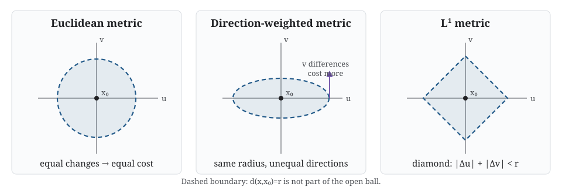

## Sets and spaces

A **set** is a collection of elements. If $x$ is an element of $X$, write
$x\in X$. If every element of $U$ belongs to $X$, write $U\subseteq X$.
The empty set $\varnothing$ has no elements.

When a set is treated as a space, its elements are called **points**. “Point”
and “element” refer to the same member of the set; the word *point* signals
that spatial structure matters.

::: {.callout-note collapse="true" title="Example: elements, subsets and collections"}
For $X=\{a,b,c\}$, the statement $a\in X$ concerns an element, while
$\{a,b\}\subseteq X$ concerns a subset. A collection such as
$\mathcal T=\{\varnothing,\{a\},X\}$ has subsets of $X$ as its elements.
:::

## Open sets and topology

An **open set** is a subset declared to contain some neighbourhood around each
of its points. The precise declaration is supplied by a topology.

A **topology** on $X$ is a collection $\mathcal T$ of subsets of $X$ such
that:

1. $\varnothing$ and $X$ belong to $\mathcal T$;
2. any union of members of $\mathcal T$ belongs to $\mathcal T$; and
3. any finite intersection of members of $\mathcal T$ belongs to $\mathcal T$.

The pair $(X,\mathcal T)$ is a **topological space**, and the members of
$\mathcal T$ are its open sets.

In ordinary language, the rules ensure that the whole space is available as a
neighbourhood, open regions can be joined, and finitely many open conditions
can be imposed simultaneously without losing openness.

::: {.callout-note collapse="true" title="Example: a topology on three points"}
Let $X=\{a,b,c\}$ and

$$
\mathcal T=\{\varnothing,\{a\},\{a,b\},X\}.
$$

The required empty and whole sets are present. Unions and finite intersections
of listed sets remain listed, so $\mathcal T$ is a topology. The subset
$\{b\}$ is not open in this topology.
:::

Open is not an intrinsic property of a subset. The same set $X$ can carry
different topologies, representing different notions of neighbourhood.

::: {.column-margin .study-note .insight}
**Intuition.** A topology specifies which local distinctions the space allows
us to make continuously. More open sets mean a finer ability to distinguish
neighbourhoods.
:::

### Why intersections are only required to be finite

Finite intersections preserve a positive amount of neighbourhood room.
Infinite intersections may shrink that room to nothing. For example,

$$
\bigcap_{n=1}^{\infty}(-1/n,1/n)=\{0\},
$$

and the singleton $\{0\}$ is not open in the usual topology on $\mathbb R$.

## Metrics and open balls

A **metric** is a distance function $d:X\times X\to\mathbb R$ satisfying:

1. $d(x,y)\geq0$, with $d(x,y)=0$ exactly when $x=y$;
2. $d(x,y)=d(y,x)$; and
3. $d(x,z)\leq d(x,y)+d(y,z)$.

The second part of the first rule is sometimes called **identity of
indiscernibles**: distinct points must not have zero distance.

The open ball of radius $r>0$ around $x$ is

$$
B_r(x)=\{y\in X:d(x,y)<r\}.
$$

A subset is open in the metric topology when every one of its points lies in
some ball contained within the subset.

{fig-alt="Euclidean, direction-weighted and L1 metrics produce circular, elliptical and diamond-shaped open balls."}

Different metrics produce different balls and different notions of proximity.
Euclidean balls are circular in two dimensions; Manhattan-distance balls are
diamond-shaped. Weighting one coordinate more heavily produces ellipses in
the original coordinates.

::: {.column-margin .study-note .audience-dynamics}
**Dynamical and complex systems intuition.** Weighting a direction can encode
unequal units or anisotropic dynamics. It changes which state differences are
treated as small.
:::

::: {.column-margin .study-note .audience-data}
**Data analysis intuition.** Scaling variables changes distances and hence
neighbourhoods. Standardisation is a modelling choice when proximity drives
the analysis.
:::

## Continuity

A map $f:X\to Y$ is **continuous** if the preimage of every open set in $Y$
is open in $X$:

$$
V\text{ open in }Y\quad\Longrightarrow\quad f^{-1}(V)\text{ open in }X.
$$

Intuitively, nearby output requirements pull back to neighbourhood
requirements in the input. The map has no abrupt tear in the topology being
used.

::: {.column-margin .study-note .audience-dynamics}
**Dynamical and complex systems intuition.** Continuous finite-time evolution
can amplify small differences without making instantaneous jumps. Continuity
and stability are not the same claim.
:::

## Connectedness and paths

A space is **connected** if it cannot be separated into two disjoint,
non-empty open subsets. It is **path-connected** if any two points can be
joined by a continuous path lying in the space.

Path-connectedness implies connectedness. For the familiar spaces and finite
complexes used here, thinking in terms of continuous paths gives the intended
intuition.

::: {.callout-note collapse="true" title="Example: one piece or two"}
The interval $[0,1]$ is path-connected. The union
$[0,1]\cup[2,3]$ has two connected components because the gap prevents any
path within the space from joining the intervals.
:::

## Homeomorphism: the same topology

A **homeomorphism** is a bijection $f:X\to Y$ for which both $f$ and
$f^{-1}$ are continuous. Spaces related by such a map are **homeomorphic**.

The rubber sheet metaphor describes this informally. A space may be stretched,
bent or twisted, but not cut, glued or irreversibly collapsed. Requiring the
inverse to be continuous makes the deformation reversible.

::: {.callout-note collapse="true" title="Example: circle, ellipse and segment"}
A circle and ellipse are homeomorphic. A circle and line segment are not:
removing an interior point disconnects the segment, while removing one point
from a circle leaves one connected arc.
:::

The cup-and-doughnut slogan applies only after the spaces are specified. The
solid material, boundary surface, liquid-containing region and a finite scan
are different mathematical objects. A hollow handle may also change the
selected space.

::: {.column-margin .study-note .caution}
**Caution.** A continuous map alone need not preserve topology. A constant map
is continuous but collapses an entire space to one point.
:::

## Homotopy and deformation retracts

A **homotopy** is a continuous deformation from one map to another. Two
spaces are **homotopy equivalent** when maps between them compose to maps
homotopic to the corresponding identity maps. This is weaker than
homeomorphism.

A space is **contractible** when it is homotopy equivalent to a point. A
filled disc is contractible even though it is not homeomorphic to a point.

A **deformation retract** continuously contracts a space onto a subspace while
keeping that subspace fixed. An annulus deformation retracts onto its central
circle: radial thickness is discarded, but the loop remains.

::: {.column-margin .study-note .insight}
**Intuition.** A deformation retract identifies structure that can be removed
without changing the essential loop organisation. It is a controlled collapse,
not a homeomorphism.
:::

Homotopic describes maps with the same domain and codomain. Homotopy
equivalent describes spaces related by suitable maps in both directions.

## Homology: a computable invariant

Homology assigns algebraic objects $H_p(X)$ to a space. Informally,
$H_0$ records components, $H_1$ records independent loop classes and $H_2$
records independent closed-surface classes.

Homotopy-equivalent spaces have isomorphic homology:

$$
X\simeq Y\quad\Longrightarrow\quad H_p(X)\cong H_p(Y).
$$

The converse need not hold. Homology deliberately forgets some information
about how loops and higher-dimensional structures interact.

::: {.callout-note collapse="true" title="Example: outline and filling"}
An outline triangle realises a circle and has one $H_1$ class. Adding its
triangular face supplies a filling, so the resulting disc has $H_1=0$.
:::

There is no standard relation called “homologic” analogous to “homotopic”. We
say that two spaces **have isomorphic homology groups**, or more informally
that they **have the same homology** over stated coefficients.

## The hierarchy of controlled forgetting

$$
\text{metric geometry}\longrightarrow\text{topology}
\longrightarrow\text{homotopy type}\longrightarrow\text{homology}.
$$

- topology forgets exact distances, angles and curvature;
- homotopy type also forgets contractible thickness and attachments; and
- homology further compresses the remaining structure into algebraic classes.

Each step can bring robust organisation into focus, but none is universally
better. The discarded information may be the mechanism of interest.

::: {.checkpoint-route}

You are ready to continue when you can explain:

1. how a topology specifies open neighbourhoods;
2. how a metric generates open balls and a topology;
3. what continuity and connectedness mean;
4. why a homeomorphism must be reversible;
5. how homotopy equivalence is weaker than homeomorphism; and
6. why homology is a coarser invariant than homotopy type.

:::
