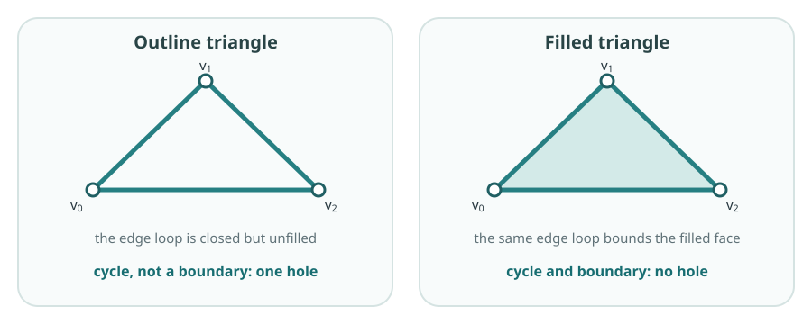

The pictures in 2A are useful for small familiar spaces, but inspection does
not scale to a large or high-dimensional complex. We already have a finite
simplicial complex $K$: its simplices record the pieces present in each
dimension and their face relations. That combinatorial information is enough
to calculate simplicial homology, without relying on how $K$ happens to be
drawn. Algebra makes the calculation systematic and reproducible. Chains and
boundary maps turn the geometric question into kernels, images and
dimensions.

## Coefficients and chain spaces

Fix a [field](algebra-survival-guide.qmd#coefficient-fields) $\mathbb F$,
usually $\mathbb F_2=\{0,1\}$ in the first
calculations. The $p$-chain space $C_p(K;\mathbb F)$ is the vector space
with the $p$-simplices of $K$ as a
[basis](algebra-survival-guide.qmd#vectors-and-bases). A chain is therefore a formal
linear combination of $p$-simplices.

::: {.column-margin .study-note .insight}
**Why chain spaces?** The complex $K$ contains pieces of several dimensions.
$C_p$ isolates its $p$-simplices and lets us combine them into candidate
$p$-dimensional structures. We are not moving through $K$; we are recording
one dimension of it in a vector space so that linear algebra can be used.
:::

Over $\mathbb F_2$, a simplex is either present or absent. Adding a simplex
to itself gives coefficient $1+1=0$, so repeated simplices cancel.

## Boundary maps, cycles and boundaries

The boundary map

$$
\partial_p:C_p(K;\mathbb F_2)\to C_{p-1}(K;\mathbb F_2)
$$

sends a simplex to the sum of its faces one dimension lower, called its
codimension-one faces. Thus

::: {.column-margin .study-note .insight}
**Where downward closure is used.** If a simplex belongs to $K$, each face in
its boundary also belongs to $K$. Therefore $∂_p$ really does land in
$C_{p-1}(K;\mathbb F_2)$. Without downward closure, taking a boundary could leave
the chain spaces and this algebra would not be defined.
:::

::: {.column-margin .study-note .insight}
**Why move between dimensions?** To decide whether a $p$-chain is closed, we
must inspect its exposed $(p-1)$-dimensional faces. To decide whether it is
already filled, we ask whether it is produced as the boundary of a
$(p+1)$-chain. Boundary maps make both comparisons possible.
:::

$$
\partial_1[v_0,v_1]=[v_0]+[v_1],
$$

and

$$
\partial_2[v_0,v_1,v_3]=[v_0,v_1]+[v_1,v_3]+[v_3,v_0].
$$

Linearity extends the definition to every chain.

The vector spaces and boundary maps form the **chain complex**

$$
\cdots\longrightarrow C_2(K;\mathbb F_2)
\xrightarrow{\partial_2}C_1(K;\mathbb F_2)
\xrightarrow{\partial_1}C_0(K;\mathbb F_2)
\longrightarrow 0.
$$

It is an algebraic record of $K$ organised by simplex dimension, with each map
recording how one layer is attached to the layer below.

For an edge chain forming a closed loop, each vertex appears twice in the
boundary and cancels over $\mathbb F_2$. Thus a cycle is a chain
$z\in C_p$ satisfying

$$
\partial_pz=0.
$$

::: {.column-margin .study-note .insight}
**Why does a closed cycle map to zero?** In an edge loop every vertex occurs
twice, once from each adjacent edge, and the two copies cancel over
$\mathbb F_2$. More generally, the lower-dimensional faces of a closed chain
cancel in pairs. Zero means that no exposed boundary remains; it does not mean
that the chain itself is empty.
:::

The cycle space is $Z_p=\ker\partial_p$. Here the
[kernel](algebra-survival-guide.qmd#kernel-image) contains the chains that the
boundary map sends to zero.

::: {.column-margin .study-note .insight}
**Kernel intuition.** In first-year linear algebra, a kernel contains the
inputs a map sends to zero. For $\partial_p$, those are the $p$-chains with no
remaining $(p-1)$-dimensional boundary: the closed $p$-dimensional structures.
:::

::: {.column-margin .study-note .insight}
**Notation.** The letter $Z$ comes from the German *Zyklus*, meaning cycle;
$z$ denotes one particular cycle in the cycle space $Z_p$. The letter $B$
stands for boundaries.
:::

Applying two consecutive boundary maps always gives zero:

$$
\partial_{p-1}\partial_p=0.
$$

Informally, the boundary of a filled region has no remaining boundary of its
own. Every boundary is therefore a cycle, so $B_p$ is a subspace of $Z_p$:

$$
B_p=\operatorname{im}\partial_{p+1}\subseteq\ker\partial_p=Z_p.
$$

::: {.column-margin .study-note .insight}
**Image intuition.** An image contains everything a map can produce. Thus
$\operatorname{im}\partial_{p+1}$ contains precisely the $p$-cycles produced
as boundaries of the available $(p+1)$-chains. They are closed, but already
filled.
:::

Let

$$
z=[v_0,v_1]+[v_1,v_2]+[v_2,v_0]
$$

be the edge loop in the figure. In both complexes,
$\partial_1z=0$, so $z\in\ker\partial_1$. In the outline complex there is no
2-simplex whose boundary is $z$, so $z\notin\operatorname{im}\partial_2$ and
the loop represents a hole. In the filled complex the face
$\sigma=[v_0,v_1,v_2]$ is present and

$$
\partial_2\sigma
=[v_0,v_1]+[v_1,v_2]+[v_2,v_0]=z.
$$

The same edge loop is now a boundary and does not represent a hole.

{fig-alt="Two complexes have the same three vertices and edges. In the outline triangle the edge loop is a cycle but not a boundary. In the filled triangle it is the boundary of the included two-simplex."}

Homology now treats cycles as equivalent when their difference is an available
boundary. For a cycle $z$, its **homology class** is

$$
[z]=z+B_p=\{z+b:b\in B_p\}.
$$

Thus $[z]=[z']$ exactly when $z-z'\in B_p$. In particular, every boundary
belongs to the zero class. The collection of these classes is the
[quotient](algebra-survival-guide.qmd#quotients)

$$
\boxed{
H_p(K;\mathbb F)
=\frac{Z_p(K;\mathbb F)}{B_p(K;\mathbb F)}
=\frac{\ker\partial_p}{\operatorname{im}\partial_{p+1}}
}.
$$

::: {.column-margin .study-note .insight}
**Why $H_p=\ker\partial_p/\operatorname{im}\partial_{p+1}$?** The kernel finds
every closed cycle, including cycles already explained as boundaries. Taking
the quotient by the image treats those filled cycles as zero and identifies
cycles that differ only by an available boundary. What remains is the
homology class of each unfilled structure.
:::

Over a field this is a vector space, and its dimension is the Betti number

$$
\beta_p=\dim H_p(K;\mathbb F).
$$

A **representative cycle** is one concrete cycle in a homology class. It is
not uniquely determined: adding a boundary changes the representative without
changing the class.

The two highlighted torus loops make independence concrete. Let $m$ go around
the tube and $\ell$ go around the central tunnel of the torus surface $T^2$.
Neither is the boundary of a surface contained in the torus, and neither can
be changed into the other by adding such a boundary. In a triangulation of
the torus, boundary-matrix
reduction therefore leaves two basis classes

$$
[m],\ [\ell]\in H_1(T^2;\mathbb F_2).
$$

Every one-dimensional class is one of
$[0],[m],[\ell],[m]+[\ell]$. Only the zero combination is trivial, so the two
classes are independent and $\dim H_1=2$.

::: {.column-margin .study-note .insight}
**Computing the ideal torus.** Sampling is not required. One can triangulate
the continuous torus and use the simplicial chain complex above, or use a
smaller cell decomposition with one vertex, two edges and one 2-cell. Both
give $(\beta_0,\beta_1,\beta_2)=(1,2,1)$. For sampled data, by contrast, a
complex must first be reconstructed and the result is evidence about an
underlying torus rather than a calculation on the torus itself.
:::

After ordering the simplices, each boundary map is represented by a matrix.
One column records the boundary of one basis simplex; rows correspond to
basis simplices one dimension lower.

::: {.column-margin .study-note .insight}
**Matrix reminder.** A matrix represents a linear map after bases and their
orders are chosen. Reading one column asks what the map does to the
corresponding basis simplex.
:::

For the triangular face $t=[v_0,v_1,v_3]$, the column of $[\partial_2]$ has a $1$
in the rows for $[v_0,v_1]$, $[v_1,v_3]$ and $[v_3,v_0]$, and zero elsewhere. Matrix rank
then supplies

$$
\dim Z_p=\dim C_p-\operatorname{rank}\partial_p,
\qquad
\dim B_p=\operatorname{rank}\partial_{p+1}.
$$

Hence

$$
\beta_p
=\dim C_p-\operatorname{rank}\partial_p-\operatorname{rank}\partial_{p+1}.
$$

ExampleThe house: a complete homology calculation

The house is a useful first calculation because it has two visible edge
cycles and one filled face. One cycle becomes a boundary while the other
survives. A larger example would lengthen the matrices without introducing a
new idea.

{fig-alt="Five labelled vertices form a house. Six labelled edges form the outside and the roof base, and the triangular roof is filled."}

Use the bases

$$
C_2=\langle t\rangle,\qquad
C_1=\langle x,y,z,u,v,w\rangle,\qquad
C_0=\langle v_0,v_1,v_2,v_3,v_4\rangle,
$$

where

$$
\begin{aligned}
x&=[v_0,v_1], & y&=[v_1,v_2], & z&=[v_2,v_3],\\
u&=[v_3,v_4], & v&=[v_4,v_0], & w&=[v_4,v_1],
\end{aligned}
$$

and $t=[v_0,v_1,v_4]$ is the filled roof. Over $\mathbb F_2$,

$$
\partial_2t=x+v+w,
$$

and the edge boundaries are

$$
\begin{aligned}
\partial_1x&=v_0+v_1, & \partial_1y&=v_1+v_2,
& \partial_1z&=v_2+v_3,\\
\partial_1u&=v_3+v_4, & \partial_1v&=v_4+v_0,
& \partial_1w&=v_4+v_1.
\end{aligned}
$$

With the displayed basis orders, the boundary matrices are

$$
[\partial_1]=
\begin{bmatrix}
1&0&0&0&1&0\\
1&1&0&0&0&1\\
0&1&1&0&0&0\\
0&0&1&1&0&0\\
0&0&0&1&1&1
\end{bmatrix},
\qquad
[\partial_2]=
\begin{bmatrix}1\\0\\0\\0\\1\\1\end{bmatrix}.
$$

Row reduction gives

$$
\operatorname{rank}\partial_1=4,
\qquad
\operatorname{rank}\partial_2=1.
$$

The two independent edge cycles may be represented by

$$
r=x+v+w \quad\text{(roof)},
\qquad
q=y+z+u+w \quad\text{(room)}.
$$

Both have zero boundary. Hence $Z_1=\langle r,q\rangle$. But
$r=\partial_2t$, so $B_1=\langle r\rangle$. The roof cycle is explained by
the filled triangular face; the room cycle is not. Therefore

$$
H_1=Z_1/B_1=\langle[q]\rangle,
\qquad \beta_1=1.
$$

This example also shows directly why the boundary of a boundary is zero:

$$
\begin{aligned}
\partial_1\partial_2t
&=\partial_1(x+v+w)\\
&=(v_0+v_1)+(v_4+v_0)+(v_4+v_1)=0.
\end{aligned}
$$

Every roof vertex occurs twice and cancels. Geometrically, the edge loop
bounding the filled roof has no endpoints left over.

Finally, rank-nullity gives all three Betti numbers:

$$
\begin{aligned}
\beta_0&=\dim C_0-\operatorname{rank}\partial_1=5-4=1,\\
\beta_1&=\dim C_1-\operatorname{rank}\partial_1-
          \operatorname{rank}\partial_2=6-4-1=1,\\
\beta_2&=\dim C_2-\operatorname{rank}\partial_2=1-1=0.
\end{aligned}
$$

Thus the house has one connected component, one unfilled one-dimensional
cycle and no two-dimensional cavity.

For a finite complex, the **Euler characteristic** is the alternating sum of
its simplex counts. If $f_p$ is the number of $p$-simplices, then

$$
\chi(K)=\sum_{p\geq0}(-1)^p f_p
       =\sum_{p\geq0}(-1)^p\beta_p.
$$

For the house, $\chi=5-6+1=0$, agreeing with
$\beta_0-\beta_1+\beta_2=1-1+0$.

::: {.column-margin .study-note .insight}
**When is $\chi$ useful?** It is a quick check when simplex counts are easy,
and it can recover one unknown Betti number when the others are known. It is
more compressed than the Betti numbers: different spaces can have the same
Euler characteristic, so it cannot say which dimensions contain the holes.
:::

::: {.checkpoint-route}

You are ready to continue when you can read a boundary-matrix column, explain
$\partial^2=0$, and obtain cycles, boundaries and Betti numbers from kernels,
images and ranks.

:::
