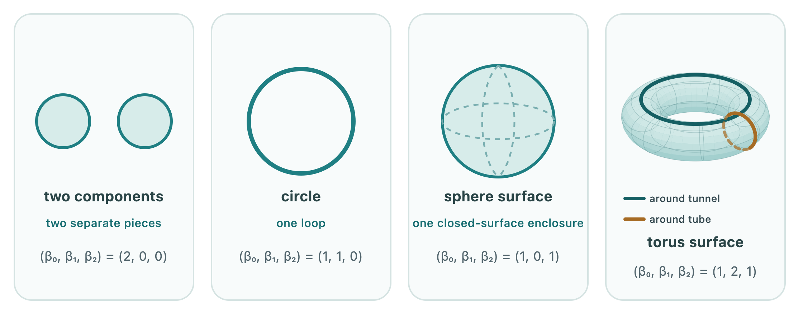

Topology studies more than holes, and homotopy describes much more of a
space's deformation behaviour. **Homology** extracts a smaller collection of
invariants that can be calculated with linear algebra. It records connected
pieces, loops that cannot be filled, and closed surfaces that enclose a
missing volume.

::: {.course-question}
Homology asks which closed structures cannot be explained as the boundary of
something already present one dimension higher.
:::

::: {.column-margin .study-note .insight}
**Why holes?** A hole is an obstruction: a path cannot be contracted, or a
cycle cannot be filled, using the pieces available in the represented space.
Such obstructions can reveal separation, recurrence, avoidance or missing
relations, depending on what the space represents.
:::

The homology groups retain algebraic information about these structures. Their
simplest numerical summary, and the one most often read first in TDA, is a
**Betti number**. The Betti number $\beta_p$ counts the number of independent
homology classes in dimension $p$:

- $\beta_0$ counts connected components;
- $\beta_1$ counts independent loop directions; and
- $\beta_2$ counts independent closed-surface enclosures.

{fig-alt="Two separated components, a circle, a sphere surface and a torus surface. The two independent loop directions on the torus are shown in different colours. Each object is labelled with its first three Betti numbers."}

::: {.column-margin .study-note .qualification}
**Homology and homotopy.** Homology is not a computable version of homotopy.
It is a coarser invariant: homotopy equivalent spaces have the same homology,
but spaces with the same homology need not be homotopy equivalent. Its
advantage here is that the calculation becomes linear algebra.
:::

The word *independent* matters. A torus surface has infinitely many loops that
can be drawn on it, but only two independent loop directions. Every other loop
class is assembled from those directions. Its Betti numbers begin

$$
(\beta_0,\beta_1,\beta_2)=(1,2,1).
$$

The final 1 records the closed torus surface itself. If the declared object
were instead all of the solid material inside that surface, the enclosed
volume would be present and $\beta_2$ would be zero.

For example, a sphere surface has $(1,0,1)$, whereas a solid ball has
$(1,0,0)$. A torus surface has $(1,2,1)$: the figure highlights its two
independent loop directions. A solid torus has $(1,1,0)$. Filling its material
removes the closed-surface class and the loop around the tube, but the central
tunnel remains.

::: {.column-margin .study-note .insight}
**Why $\beta_1=0$ for the sphere surface.** Any loop drawn on the sphere can be
contracted continuously to a point while remaining on the surface. There is
therefore no non-trivial one-dimensional loop class. The sphere's
two-dimensional class records the complete closed surface instead.
:::

## What can a hole mean in data?

The mathematics counts holes in the constructed space. Their scientific
meaning comes from what that space represents:

- In a sensor network, a one-dimensional class can indicate a region not covered by
  sensing neighbourhoods [@desilva2007coverage].
- In a sliding-window representation of a signal, a strong one-dimensional class can
  express periodic recurrence rather than an empty region in physical space
  [@perea2015sw1pers].
- In grid-cell population activity, the pattern
  $(\beta_0,\beta_1,\beta_2)=(1,2,1)$ supported a toroidal latent state space
  [@gardner2022torus].
- In a reconstructed neocortical network, directed flag complexes encoded the
  direction of synaptic transmission. Their cavities supplied a global
  description of information-flow organisation and were related to
  stimulus-evoked activity [@reimann2017cliques].
- In collective-motion models, components and loops can describe clustering,
  fragmentation and occupation of a periodic spatial domain
  [@topaz2015aggregation].

These examples do not give a universal dictionary. A one-dimensional class is
only “recurrence”, “uncovered territory” or “circulation” when the data,
representation and construction justify that interpretation.

::: {.column-margin .study-note .insight}
**Beyond spatial holes.** In a high-dimensional state, feature or relational
space, a hole need not surround a literal empty region that could be drawn in
physical space. The algebraic question remains the same: is a closed
$p$-dimensional structure the boundary of an available $(p+1)$-dimensional
structure?
:::

::: {.checkpoint-route}

You are ready to continue when you can identify 0-, 1- and 2-dimensional holes
in the classical spaces, read their Betti numbers, and explain why the meaning
of a hole depends on the represented object.

:::
