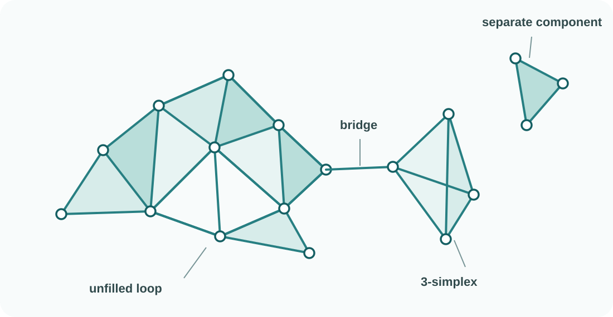

**Practical notebook.** Inspect fixed complexes before calculating their
homology. <a href="../../downloads/topic-02-participant.ipynb" download="topic-02-participant.ipynb">Download the notebook</a>.

Topology describes spaces using neighbourhoods, connected pieces, loops and
fillings. These ideas are natural for a continuous curve, surface or region.
A finite data set is different: by itself, it is just a collection of isolated
observations. A suggestive scatter plot does not add paths or surfaces between
them.

::: {.column-margin .study-note .insight}
**Rubber sheet intuition.** Imagine the continuous space made from flexible
material. Stretching or bending it changes lengths and angles, but not which
pieces are joined or which loops remain unfilled. A finite sample has no
material between its observations, so that continuous organisation must first
be represented.
:::

We therefore build a finite combinatorial representation called a
**simplicial complex**, denoted by $K$. This supplies the connections and
fillings needed to ask topological questions about the observations.

There are two common interpretations:

1. *Approximate an underlying space.* If observations sample a curve,
   surface, attractor or manifold, $K$ acts like a finite triangulated
   approximation. We hope its connectedness and holes recover those of the
   sampled space over an appropriate range of resolutions.
2. *Construct a topological model.* If no underlying continuous space is
   assumed, $K$ encodes a scientific choice about proximity, interaction,
   similarity or joint participation. Its topology describes that chosen
   relationship system.

In either case, the pieces of $K$ make particular claims:

- a **vertex** stands for one observation, state, agent or other basic item;
- an **edge** says that two vertices count as connected or related;
- a **filled triangle** says that three vertices form one coherent filled
  relation, not merely three pairwise links around an empty centre; and
- higher-dimensional pieces extend the same idea to larger groups.

The meaning of an edge or filling must come from the construction. It might
represent spatial proximity, correlation, communication, an observed
transition or a directly measured group interaction. The data do not choose
that meaning by themselves.

{fig-alt="A teal simplicial complex contains filled triangular regions, an unfilled loop, a one-edge bridge to a tetrahedron and a disconnected filled triangle."}

A modelling choice is already present before homology is calculated. The
same observations can support different complexes when the scientific meaning
of proximity, interaction or joint participation changes.

::: {.checkpoint-route}

You are ready to continue when you can explain why isolated observations need
added structure, state what an edge and a triangular piece assert, distinguish
approximation from construction, and explain why building $K$ is a modelling
choice.

:::
