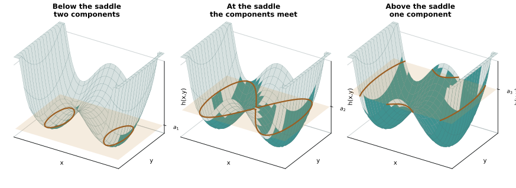
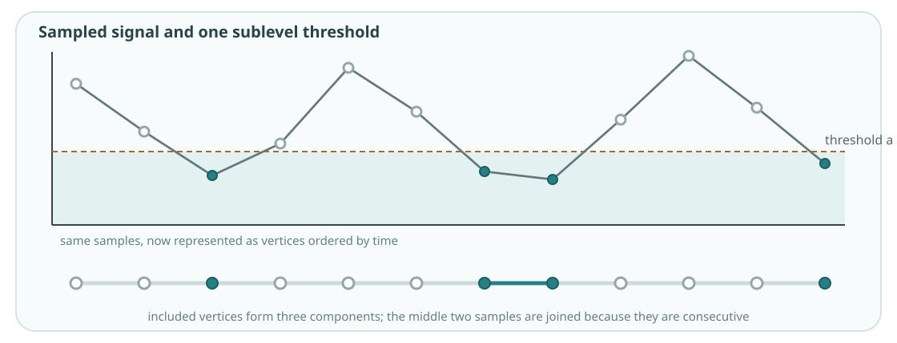
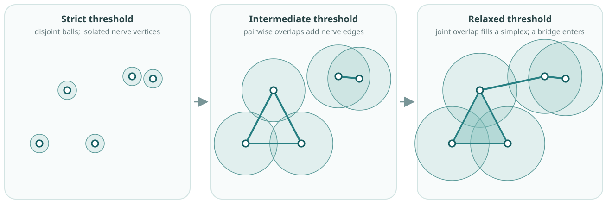
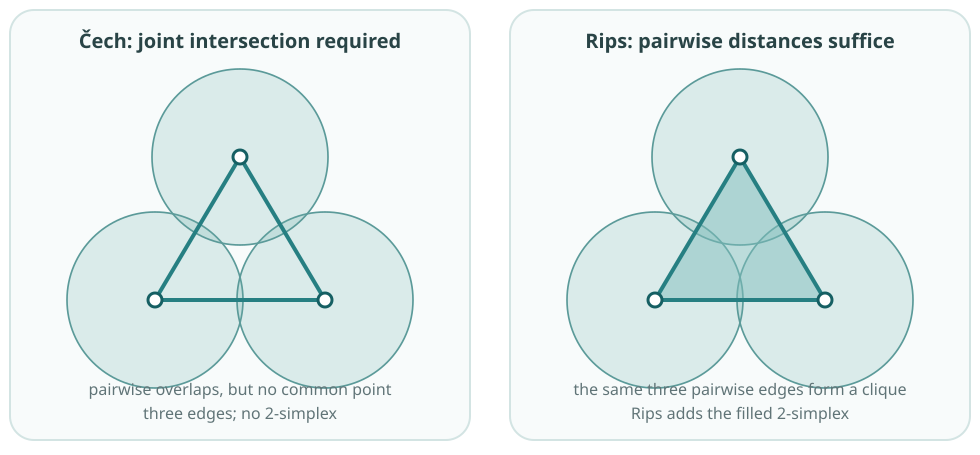

::: {.reading-line}
**Further reading.** Edelsbrunner and Harer, Chapter III, develops nerves,
Čech, Rips and alpha complexes [@edelsbrunner2010computational]. Postol,
Sections 5.1, 5.6 and 5.7, gives a shorter route through Rips, sublevel and
graph filtrations [@postol2024algebraic]. See Chazal, de Silva and Oudot for a
more technical geometric treatment [@chazal2014geometric].
:::

The course construction starts with a finite simplicial complex $K$ and an
entry-value function

$$
f:K\to\mathbb R.
$$

Here $K$ is a collection of simplices. The notation means that every simplex
$\sigma\in K$ receives its own real value $f(\sigma)$; it does not assign one
number to the whole complex. At threshold $a$, retain

$$
K_a=\{\sigma\in K:f(\sigma)\leq a\}.
$$

::: {.column-margin .study-note .insight}
**Reading $f:K\to\mathbb R$.** Think of a table with one row per simplex and
one entry value beside it. Thresholding that column selects the simplices in
$K_a$.
:::

The values must respect faces:

$$
\tau\subseteq\sigma
\quad\Longrightarrow\quad
f(\tau)\leq f(\sigma).
$$

Thus a filled triangle cannot enter before one of its edges. Because $K$ is
downward closed and faces enter no later than their cofaces, every $K_a$ is a
simplicial complex. Because $a\leq b$ implies $f(\sigma)\leq a$ only if
$f(\sigma)\leq b$, these complexes are nested:

$$
K_a\subseteq K_b.
$$

::: {.column-margin .study-note .insight}
**Two separate requirements.** Downward closure concerns the faces within one
complex $K_a$. Nestedness compares two thresholds and says that later
complexes retain earlier simplices. Downward closure of $K$, together with a
face-monotone entry rule, makes every $K_a$ a complex; thresholding the same
entry values makes the family nested.
:::

The values of $f$ need only be ordered and face-monotone. They need not be
distances: height, intensity, density, edge weight and other real-valued
scores can all define filtrations.

The **constructor** determines which simplices are available and how entry
values are obtained. In a lower-star filtration, a supplied complex is fixed
and vertex values extend to its simplices. In a Rips filtration, the point
cloud, metric and clique rule determine both the simplices and their entry
values. These constructions share the nested form above, but they do not
represent the same scientific relationships.

## Value-based filtrations

A scalar field orders locations by a measured or modelled value. Sublevel
sets retain low values first; superlevel sets retain high values first. The
direction changes what a component or hole means.

ExampleFilter a landscape by height

Let $h:X\to\mathbb R$ give the height of a landscape. Its sublevel set is

$$
X_a=\{x\in X:h(x)\leq a\}=h^{-1}(-\infty,a].
$$

{fig-alt="Three panels show a threshold plane rising through a double-well landscape. Teal regions below the plane grow from two separate basins, meet at the saddle and become one connected region."}

Two low basins appear as separate components. They meet when the threshold
reaches the saddle. Raising the threshold adds locations rather than replacing
them, so $a\leq b$ gives $X_a\subseteq X_b$.

Height is the chosen ordering. For an energy landscape, low-valued basins and
their merger barriers may be meaningful. If large density or activity is the
target, a superlevel filtration may be the appropriate question instead.

::: {.column-margin .study-note .audience-dynamics}
**Dynamical and complex systems intuition.** If $h$ is an energy or potential
on state space, sublevel sets expose low-energy regions and the barriers that
join them. If $h$ is speed or instability, birth and merger acquire a
different interpretation.
:::

For a simplicial complex with values $g(v)$ on its vertices, the
**lower-star filtration** assigns

$$
f(\sigma)=\max_{v\in\sigma}g(v).
$$

A simplex enters when its highest-valued vertex enters. Every face enters no
later than its coface, so the rule is face-monotone.

::: {.column-margin .study-note .insight}
**Why “lower star”?** The star of a vertex contains the simplices that include
it. At value $g(v)$, the lower-star construction adds $v$ together with those
simplices in its star whose other vertices have values no larger than $g(v)$.
The maximum rule is the compact formula for this operation.
:::

ExampleFilter a sampled time series directly

Treat sample times as vertices of a path and join consecutive times by edges.
Give vertex $t_i$ the value $x(t_i)$. At threshold $a$, include the samples
with $x(t_i)\leq a$ and an edge whenever both of its endpoint samples have
entered.

{fig-alt="Samples at or below a horizontal threshold are coloured teal. The same samples appear below as vertices in a time-ordered path; an edge is included when both consecutive endpoint samples are included."}

Each connected component is a consecutive run of included sample times. It is
not a cluster of similar values drawn from unrelated times. As $a$ rises,
runs grow and merge when the intervening sample enters.

::: {.column-margin .study-note .audience-data}
**What this preserves.** The path edges retain temporal adjacency. A direct
sublevel filtration therefore studies low-valued runs along time, not a
state-space loop or periodic orbit.
:::

## Proximity filtrations

Let $X=\{x_1,\ldots,x_n\}\subset\mathbb R^d$ be a point cloud with a chosen
metric. At pairwise-distance threshold $\varepsilon$, place a ball of radius
$\varepsilon/2$ around each point:

$$
U_\varepsilon=\bigcup_{x\in X}B(x,\varepsilon/2).
$$

The same observations and metric produce increasingly connected unions as
$\varepsilon$ grows. Their Čech nerves form a finite nested representation of
that geometry.

{fig-alt="The same five points are shown at three thresholds. Small balls are disjoint, intermediate balls create local nerve edges, and larger balls retain those edges while adding a filled simplex and connecting the groups."}

::: {.column-margin .study-note .audience-data}
**Sampling still matters.** Dense sampling can close a gap sooner than sparse
sampling, while an outlier can remain isolated for a long range. Persistence
describes this sampled construction before it supports a claim about an
underlying space.
:::

The **Čech complex** is the nerve of these balls:

$$
\check C_\varepsilon(X)=
\left\{\sigma\subseteq X:
\bigcap_{x\in\sigma}B(x,\varepsilon/2)\ne\varnothing\right\}.
$$

Every joint intersection creates a simplex. Any subcollection also
intersects, so the constructor is automatically downward closed. Euclidean
ball intersections are convex and therefore contractible. The Nerve Theorem
then gives

$$
|\check C_\varepsilon(X)|\simeq U_\varepsilon.
$$

The symbol $\simeq$ denotes homotopy equivalence. The complex and union have
the same homotopy-invariant information, including homology; they are not the
same geometric subset of space.

The **Vietoris–Rips complex** uses only pairwise distances:

$$
\operatorname{Rips}_\varepsilon(X)=
\{\sigma\subseteq X:\operatorname{diam}(\sigma)\leq\varepsilon\}.
$$

Connect points at distance at most $\varepsilon$, then fill every clique. The
pairwise test is easier to compute, but it can add a higher-order simplex when
the corresponding balls have no common joint intersection.

::: {.column-margin .study-note .insight}
**Rips is a flag filtration.** At each $\varepsilon$, form the threshold graph
whose edges join pairs at distance at most $\varepsilon$; its flag, or clique,
complex is $\operatorname{Rips}_\varepsilon(X)$. A general flag filtration can
instead order edges by network weight, correlation or another pairwise score.
:::

::: {.column-margin .study-note .qualification}
**What Ripser checks.** Ripser.py can take a point cloud or a precomputed
square matrix and builds the flag filtration from those pairwise values. It
does not establish that a supplied matrix is a scientifically meaningful
metric. If the values are non-metric dissimilarities, describe the result as a
dissimilarity-based flag filtration and do not assume metric-specific
interpretations or guarantees. See the [Ripser.py input
documentation](https://ripser.scikit-tda.org/en/latest/reference/stubs/ripser.ripser.html).
:::

{fig-alt="Both panels show the same three teal balls and all three nerve edges. The balls overlap pairwise but have no common triple intersection, so the Čech triangle is unfilled. Rips promotes the three pairwise edges to a filled triangle."}

Here all three pairs of balls overlap, but no point lies in all three balls.
Čech therefore contains the three edges but not the 2-simplex. Rips sees the
same three pairwise relations and fills their clique. Thus

$$
\check C_\varepsilon(X)\subseteq
\operatorname{Rips}_\varepsilon(X),
$$

and the inclusion can be strict [@edelsbrunner2010computational, Chapter
III.2]. The point cloud, metric and threshold are unchanged; the constructor
changes which higher-order relations are asserted and hence which cycles are
filled.

::: {.column-margin .study-note .audience-dynamics}
**Collective systems intuition.** Filling a Rips triangle treats three
mutually close agents as one coherent three-way unit. If the science supports
only pairwise interaction, that clique-filling assumption must remain visible
when interpreting a missing $H_1$ class.
:::

## Inclusion maps

For $a\leq b$, nestedness supplies the **inclusion map**

$$
\iota_{a,b}:K_a\hookrightarrow K_b.
$$

It sends each simplex already present in $K_a$ to that same simplex in $K_b$.
The hooked arrow emphasises that this map includes the smaller complex in the
larger one. Applying homology to these inclusions will say what each class
becomes as the threshold changes.

::: {.checkpoint-route}

The checkpoint is to explain what $f(\sigma)$ means, distinguish downward
closure from nestedness, identify the constructor and entry rule in a
value-based or proximity filtration, and read
$\iota_{a,b}:K_a\hookrightarrow K_b$ as inclusion of complexes.

:::
