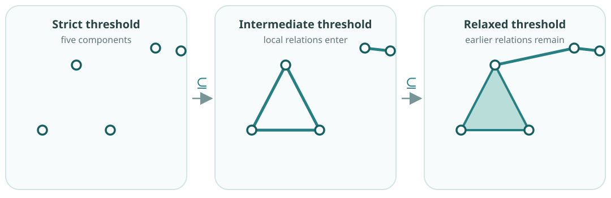

**Practical notebook.** Vary scale and construction while checking nestedness
and simplex entry times. <a href="../../downloads/topic-03-participant.ipynb" download="topic-03-participant.ipynb">Download the notebook</a>.

One threshold gives one provisional complex. A filtration retains the whole
nested family obtained as that threshold is relaxed, rather than declaring
one value correct in advance.

A point cloud does not say which observations should be connected. Choose a
relation rule and let $\varepsilon$ control how permissive it is. A strict
value may leave the vertices separate. Increasing $\varepsilon$ can add edges
and higher simplices, while retaining everything already admitted.

::: {.column-margin .study-note .insight}
**Why add connections?** The homology calculation acts on a complex $K$, not
on a bare list of observations. Vertices alone give only isolated components.
Edges and higher simplices provide the paths, loops and fillings whose
homology can be calculated.
:::

{fig-alt="Three panels contain the same seven vertices. A strict threshold leaves them isolated, an intermediate threshold adds local relations, and a relaxed threshold retains those simplices while adding a bridge and further filled relations."}

Let $K_\varepsilon$ be the complex built at scale $\varepsilon$. If
$\varepsilon_1\leq\varepsilon_2$, every relation present at the smaller scale
must remain present at the larger one:

$$
K_{\varepsilon_1}\subseteq K_{\varepsilon_2}.
$$

This nested family is a **filtration**. It records the complete sequence of
complexes produced by the chosen rule.

::: {.column-margin .study-note .audience-data}
**What “close” makes homology mean.** Euclidean distance makes a loop a gap in
spatial or state-space proximity. Correlation makes it a loop in a similarity
relation; network distance makes it a loop in connectivity. Changing the rule
changes the complexes and therefore what their components and holes describe.
:::

Not every filtration is based on distance. If the data carry a value such as
height, energy or intensity, a threshold can instead admit locations from low
to high value. A proximity filtration asks which relations appear as
closeness is relaxed; a value-based filtration asks which parts of an object
have crossed a stated level. Both produce nested complexes, but their features
answer different questions.

::: {.checkpoint-route}

The checkpoint is to explain why the homology calculation needs a complex,
why relaxing one stated rule gives a nested family, and what $\varepsilon$
means for the data being analysed.

:::
