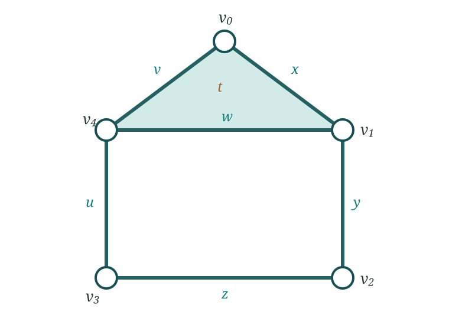

The persistence module

$$
V=H_p\circ\mathcal K_f
$$

contains a vector space at every filtration value and maps between those
spaces. For a finite one-parameter filtration over a field, it decomposes as

$$
V\cong\bigoplus_{\ell} I_{[b_\ell,d_\ell)}.
$$

The interval $[b_\ell,d_\ell)$ records the birth and death of one class. Its
persistence is $d_\ell-b_\ell$.

## Interval modules

For an interval $J\subseteq I$, the interval module $I_J$ assigns the field
$\mathbb F$ to parameter values in $J$, the zero vector space outside $J$,
and identity maps wherever both parameters lie in $J$.

For a pointwise finite-dimensional one-parameter persistence module over a
field, suitable finiteness or tameness assumptions give the interval
decomposition above.

Repeated intervals are retained. The collection is therefore a **multiset**,
not an ordinary set.

## From intervals to the two displays

The fifth course spine stage abbreviates the complete progression as

$$
V\cong\bigoplus_{\ell}I_{[b_\ell,d_\ell)}
\longrightarrow
\operatorname{Bar}_p(V),\ \operatorname{Dgm}_p(V).
$$

The two encodings are

$$
\operatorname{Bar}_p(V)=\bigl\{[b_\ell,d_\ell)\bigr\}_{\ell},
\qquad
\operatorname{Dgm}_p(V)=\bigl\{(b_\ell,d_\ell)\bigr\}_{\ell}.
$$

These braces denote multisets, so repeated intervals or points retain their
multiplicity. The arrow in the course spine is one-way because the calculation first
produces the interval decomposition and then displays it in either form. Under
the stated one-parameter assumptions, the barcode and diagram encode the same
birth and death data.

## From a filtered boundary matrix to intervals

Order the simplices compatibly with the filtration and downward closure. The
boundary matrix records the boundary of each simplex. Column reduction over
$\mathbb F_2$ pairs a simplex that creates a class with a later simplex that
destroys it. An unpaired birth produces an interval extending to the end of
the filtration.

::: {.column-margin .study-note .insight}
**Intuition.** The algorithm pairs algebraic events, not visible holes. A
birth simplex is not the class itself. The class is represented by a cycle
assembled from simplices.
:::

Each finite pair $(b,d)$ gives the interval $[b,d)$, a barcode segment and a
point above the diagonal in a persistence diagram. The vertical distance to
the diagonal is proportional to the lifespan $d-b$.

The reduced matrix provides birth and death indices. Interpreting a class may
also require a representative cycle, the original data and the construction
choices. Those are not recoverable from the diagram coordinates alone.

ExampleReduce the filtered house

Use the labelled house and boundary matrices from the complete homology
calculation. Let all vertices enter at $0$, the five outer edges
$x,y,z,u,v$ at $1$, the roof-base edge $w$ at $2$, and the roof face $t$ at
$3$.

{fig-alt="Five labelled vertices form a house. The five outer edges form one loop, the roof-base edge creates a second loop and the triangular roof is filled."}

The filtered column order is

$$
v_0,v_1,v_2,v_3,v_4;\quad x,y,z,u,v;\quad w;\quad t.
$$

The pivot of a non-zero column is its lowest non-zero row. Repeatedly add an
earlier column with the same pivot. Over $\mathbb F_2$, the relevant
reductions are

| simplex | $\varepsilon$ | initial column | reduced column and event |
|---|---:|---|---|
| $x$ | $1$ | $v_0+v_1$ | $v_0+v_1$: merge components |
| $y$ | $1$ | $v_1+v_2$ | $v_1+v_2$: merge components |
| $z$ | $1$ | $v_2+v_3$ | $v_2+v_3$: merge components |
| $u$ | $1$ | $v_3+v_4$ | $v_3+v_4$: merge components |
| $v$ | $1$ | $v_4+v_0$ | $0$: birth of the outer $H_1$ class |
| $w$ | $2$ | $v_4+v_1$ | $0$: birth of a second $H_1$ class |
| $t$ | $3$ | $x+v+w$ | pivot row $w$: death of the class born with $w$ |

For example, the $w$ column reduces as

$$
(v_4+v_1)
\xrightarrow{+\,\partial u}v_3+v_1
\xrightarrow{+\,\partial z}v_2+v_1
\xrightarrow{+\,\partial y}0.
$$

Its zero reduced column creates a class at $2$. The face column has lowest
non-zero row $w$, so the pair $(w,t)$ produces $[2,3)$. The outer class born
when $v$ closes the first loop is unpaired and continues to the end of this
filtration. After the roof is filled, that surviving class can be represented
by the room cycle $q=y+z+u+w$.

Thus the degree-one barcode contains one interval beginning at $1$ and the
finite interval $[2,3)$. This is the persistence version of the same kernel,
image and quotient calculation used for the unfiltered house.

## Verify what was computed

Before interpreting a diagram, inspect a small instance of the filtered
object. Check cell counts, several entry values, filtration direction and the
treatment of infinite intervals. Homology in dimension $p$ uses

$$
C_{p+1}\xrightarrow{\partial_{p+1}}C_p
\xrightarrow{\partial_p}C_{p-1}.
$$

Correct $H_1$ therefore needs information about triangles, and correct $H_2$
needs information about tetrahedra. Package options can name either the
largest constructed simplex dimension or the largest returned homology
degree, so their documentation must be read in context.

::: {.column-margin .study-note .insight}
**Dimension affects cost.** An $N$-point Rips complex can contain
$\binom{N}{k+1}$ simplices of dimension $k$. Ambient coordinate dimension and
requested homology degree are different quantities.
:::

A minimum report states the stored object and preprocessing, constructor,
metric or scalar convention, filtration direction and units, coefficient
field, homology degrees, truncation, software and treatment of essential
intervals.

::: {.checkpoint-route}

You are ready to continue when you can state the assumptions behind interval decomposition,
explain what matrix reduction pairs, and distinguish a birth simplex, a
representative cycle, an interval and a diagram point. You should also be able
to read every symbol in the fifth course spine expression from left to right.

:::
