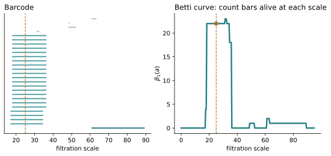
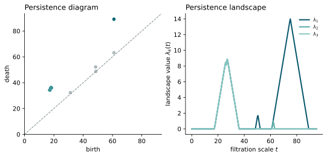
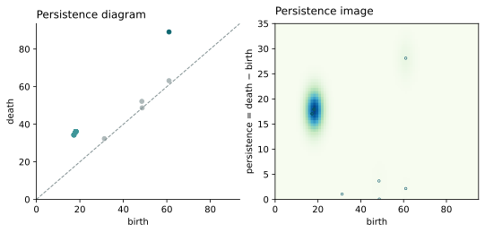
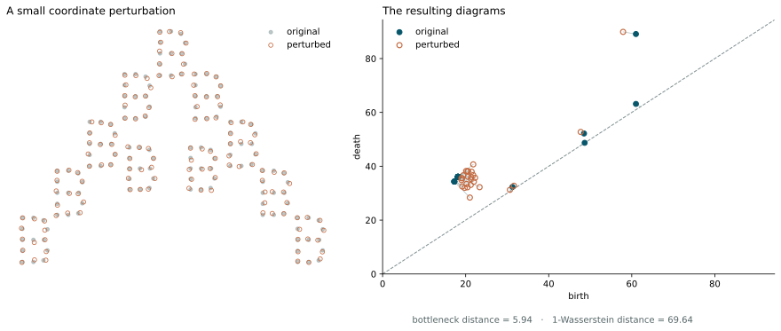

**Practical notebook.** Transform the A/B/C intervals, perturb the locations
and compare the resulting diagrams. <a href="../../downloads/topic-05-participant.ipynb" download="topic-05-participant.ipynb">Download the notebook</a>.

::: {.column-margin .study-note .insight}
**Relation to the course spine.** Stage 5 produced a barcode or persistence diagram.
The question now is what to retain for a particular analysis: feature counts,
functional structure, a fixed-length vector or differences between diagrams.
:::

## Transform

Return to the degree-one persistence of the 143 A/B/C locations. In its
**barcode**, each horizontal segment begins when a class is born and ends when
it dies; its length is its persistence. The 22 similar teal bars are the two
local loops within each of the eleven B-shaped groups. The darker bar is the
larger A-scale loop.

In the **persistence diagram**, the same interval $[b_i,d_i)$ becomes the point
$(b_i,d_i)$. Its vertical distance above the diagonal is proportional to
$d_i-b_i$. Points near the diagonal are short-lived, but are not automatically
noise. Neither display records where a representative cycle lies in the data.

The next transformations make averaging, regression or classification easier
by deliberately discarding some interval information.

:::: {.transform-pair}
::: {.transform-copy}
The **Betti curve** is obtained directly from the barcode by counting intervals
alive at each scale:

$$
\beta_p(a)=\sum_i\mathbf 1_{[b_i,d_i)}(a).
$$

It retains the rise to many B-scale loops and the later A-scale loop, but
forgets which birth is paired with which death. Different barcodes can
therefore have the same Betti curve.
:::

::: {.transform-figure}
{fig-alt="The A/B/C barcode appears beside a Betti curve. A vertical line at one scale crosses the bars counted by the curve at that scale."}
:::
::::

:::: {.transform-pair}
::: {.transform-copy}
For a **persistence landscape**, each diagram point $(b_i,d_i)$ defines the
triangular function

$$
\lambda_i(t)=\max\{0,\min(t-b_i,d_i-t)\}.
$$

Its support is $[b_i,d_i]$, and its peak occurs halfway between birth and death
with value $(d_i-b_i)/2$. This equals the point's $L_\infty$ distance from the
diagonal. The landscape $\lambda_k(t)$ records the $k$th-largest triangular
value at $t$, placing the intervals in a function space where means and norms
are available [@bubenik2015landscapes].
:::

::: {.transform-figure}
{fig-alt="The A/B/C persistence diagram appears beside its first three persistence landscape functions. Longer-lived diagram points produce higher triangular profiles."}
:::
::::

:::: {.transform-pair}
::: {.transform-copy}
A **persistence image** first converts each diagram point $(b_i,d_i)$ to
birth-persistence
coordinates $(b_i,d_i-b_i)$. Weighted smoothing around those points produces a
density, which is integrated over a fixed pixel grid to give a vector
[@adams2017images]. Grid bounds, resolution, bandwidth and weighting determine
what remains visible. In this example the 22 similar B-scale intervals form
the strongest concentration.
:::

::: {.transform-figure}
{fig-alt="The A/B/C persistence diagram appears beside a smoothed persistence image in birth-persistence coordinates. The cluster of similar B-scale intervals creates the strongest region."}
:::
::::

Scalar summaries compress further. **Maximum persistence** retains only the
longest interval; **total persistence** aggregates lifespans; **persistence
entropy** records how evenly total persistence is distributed
[@chintakunta2015entropy]. No transformation is universally best. Its
information loss must match the scientific task.

::: {.column-margin .study-note .qualification}
**One construction.** These are transformations of Rips persistence on the 143
locations. Rasterising the letters and using a cubical filtration would
produce a different starting diagram.
:::

## Compare

Perturb each A/B/C coordinate slightly and repeat the complete persistence
calculation. The left panel overlays the perturbed locations on the original
sample. The right panel overlays the resulting diagrams; faint segments show
the displayed matching, including matches to the diagonal.

{fig-alt="The first panel overlays the slightly perturbed A/B/C locations on the original data. The second overlays the original and perturbed persistence diagrams, with faint segments connecting matched points or a point to the diagonal."}

Let $D$ and $E$ be persistence diagrams with diagonal points available as
needed. Using the $L_\infty$ cost

$$
\lVert(b,d)-(b',d')\rVert_\infty
=\max\{|b-b'|,|d-d'|\},
$$

the **bottleneck distance** chooses the matching whose worst cost is smallest:

$$
d_B(D,E)=\inf_\gamma\sup_{x\in D}\lVert x-\gamma(x)\rVert_\infty.
$$

The **$q$-Wasserstein distance** instead accumulates all matching costs:

$$
W_q(D,E)=
\left(\inf_\gamma\sum_{x\in D}
\lVert x-\gamma(x)\rVert_\infty^q\right)^{1/q}.
$$

Matching $(b,d)$ to the diagonal costs $(d-b)/2$. For the displayed
perturbation, $d_B=5.94$ and $W_1=69.64$ in the original coordinate units. The
first value reports the worst unavoidable discrepancy; the second accumulates
many discrepancies.

The classical stability theorem explains why a controlled perturbation need
not produce an arbitrary diagram jump. For tame functions $f,g:X\to\mathbb R$
on the same space [@cohensteiner2007stability],

$$
d_B\bigl(D_p(f),D_p(g)\bigr)\leq\lVert f-g\rVert_\infty.
$$

The best worst-case movement between diagram points is bounded by the largest
change in the filtration function. Related theorems provide corresponding
guarantees for geometric constructions built from point clouds
[@chazal2014geometric].

::: {.column-margin .study-note .insight}
**Why stability matters.** Measurements, samples and preprocessing vary. If a
small permitted input change could create an arbitrarily different diagram,
persistence would be too fragile to use as a data summary. Stability supplies
a precise continuity guarantee under stated conditions.
:::

Near-diagonal points can arise from sampling, measurement error or outliers,
but may instead represent fine texture or rare structure. Stability does not
declare them noise, validate the metric or establish scientific significance.
Those claims require sensitivity analysis and a relevant baseline. Confidence
sets [@fasy2014confidence] and robust constructions [@chazal2018robust] address
particular uncertainty questions rather than creating a universal threshold.

For any transformation or comparison, report the homology degree, treatment
of essential intervals, metric or transform, discretisation and weighting
choices, fitting procedure and simpler baseline.

::: {.checkpoint-route}

You are ready to continue when you can derive a Betti curve, landscape or
image from intervals, state what each discards, distinguish bottleneck from
Wasserstein aggregation and read the stability inequality in words.

:::
