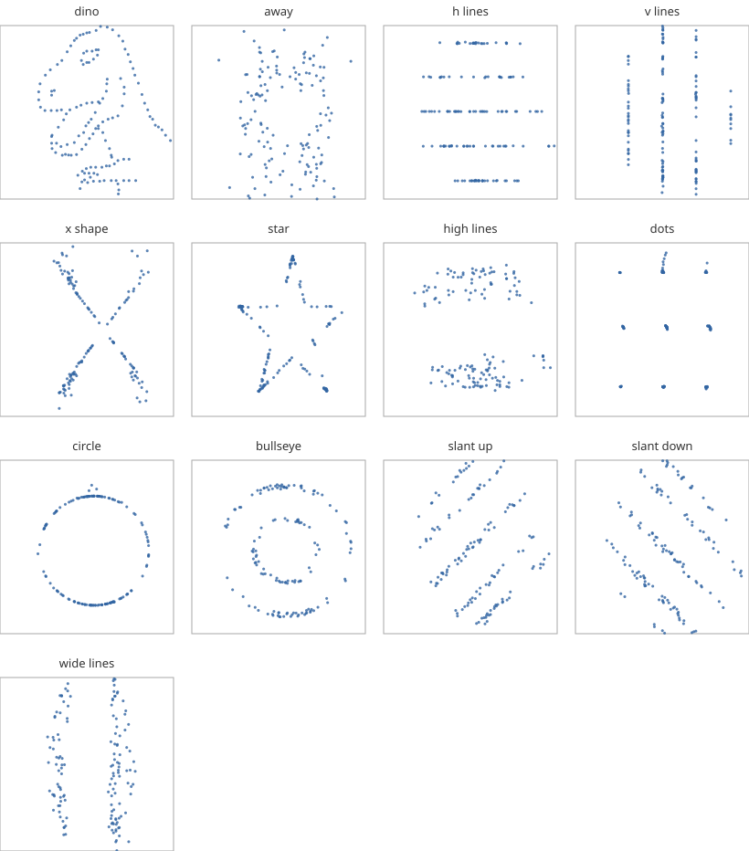
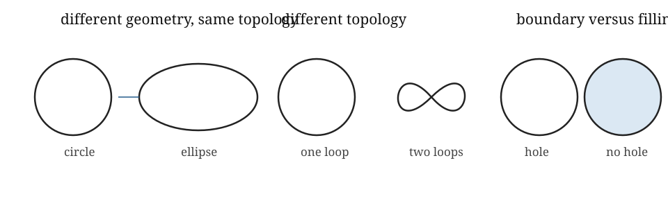

::: {.callout-tip title="Week 1 resources"}
[Slides](slides.qmd) · [Lecture walkthrough](solutions.ipynb) · [Application page](case-study.qmd)
:::

<a class="btn btn-primary" href="../../downloads/week-01-participant.ipynb" download="week-01-participant.ipynb">Download participant notebook</a>

[Download the Datasaurus Dozen CSV](../../downloads/datasaurus_dozen.csv){.btn .btn-secondary download="datasaurus_dozen.csv"}

::: {.callout-note title="Optional reading for this week"}
Postol, Chapter 2, supplies the point set topology vocabulary used in the
survival guide. Edelsbrunner and Harer, Chapter I.1, develops connectedness by
moving between graphs and topological spaces. The Datasaurus example comes
from Matejka and Fitzmaurice [@matejka2017samestats].
:::

::: {.foundation-definition}
**[Guiding definition for Weeks 1–4](../../index.qmd#the-guiding-construction-for-weeks-14).** For a filtration $K_a\subseteq K_b$ when $a\leq b$, persistent homology is the module
$$a\mapsto H_p(K_a;\mathbb F),\qquad (a\leq b)\mapsto(\iota_{a,b})_*.$$

::: {.foundation-steps}
::: {.foundation-step .is-active}
**1 · Representation**

Scientific object, observations and the topological question. This week asks
why shape is scientifically relevant, what a topological lens retains, and why
a finite representation must be constructed before topology can be computed.
:::
::: {.foundation-step}
**2 · Homology**

$K_a$ and $H_p(K_a;\mathbb F)$.
:::
::: {.foundation-step}
**3 · Filtration**

$K_a\subseteq K_b$ across scale.
:::
::: {.foundation-step}
**4 · Memory**

Induced maps, module and barcode.
:::
:::
:::

## Learning goals

By the end of the week, you should be able to:

1. take a concrete example, such as a trajectory sampled at finitely many times, and name separately the underlying system, the recorded data and the point cloud or graph built for analysis;
2. use examples to explain which aspects of shape are geometric, such as distance and curvature, and which are topological, such as connected components and loops;
3. state what a homeomorphism is, beyond the rubber-sheet metaphor;
4. explain why a finite set of sampled points has no loop by itself, and why a finite representation must be constructed before homology can detect one; and
5. identify how preprocessing, metric, representation and scale choices can change a TDA result, then state what that result permits you to claim about the original system.

## The Datasaurus problem: matching summaries, different organisation

The Datasaurus story is a useful provocation. All 13 point clouds have nearly the same coordinate means, coordinate standard deviations and Pearson correlation, while having visibly different spatial organisation [@matejka2017samestats; @gillespie2025datasaurus].

{fig-alt="Thirteen scatter plots with nearly identical summary statistics but shapes including a dinosaur, circle, star, lines and a bullseye."}

::: {.callout-tip title="Explore all 13 datasets"}
The [participant practical](lab.ipynb) contains all 1,846 observations. It first reproduces the matching summaries, then lets you compare any two datasets using geometric descriptors and a threshold-graph experiment. The [lecture walkthrough](solutions.ipynb) follows the same argument with completed choices and interpretations.
:::

The lesson is not that statistics have failed. It is that every statistic answers a specified question and discards other information.

The dataset is distributed under the MIT licence through the `datasauRus` package. Provenance and the reproduced licence are stored beside the [course data](../../data/README.md).

### What the matching statistics actually say

For each dataset, the reported quantities have clear but limited meanings:

- **mean of (x) and mean of (y):** locate the centre of mass along the two coordinate axes;
- **standard deviation of (x) and standard deviation of (y):** describe overall horizontal and vertical spread; and
- **Pearson correlation:** describes the direction and strength of a *linear* association between the two coordinates.

Taken together, these summaries say that the 13 clouds have almost the same coordinate centre, marginal spread and linear co-variation. They do **not** say where individual observations lie, whether density is uniform, whether the cloud bends or branches, whether it has several clusters, or whether points surround an empty region. The `circle`, `star`, `dino` and `x_shape` datasets can therefore agree on these quantities without contradicting what your eyes see.

The covariance matrix does not rescue this particular comparison: its entries are determined by the same coordinate variances and covariance already represented above. A more detailed statistical model, such as a density estimate or a flexible generative model, could distinguish the clouds. The point is to understand the information content of the chosen summary, not to set statistics and topology against one another.

### Unpack the apparently obvious

The plots look different immediately. That judgement is not mysterious. Your visual system is combining several kinds of spatial evidence at once:

- **concentration and local density:** where points crowd together or thin out;
- **distance and spacing:** whether nearest neighbours are regular, uneven or separated by large gaps;
- **direction and anisotropy:** whether the cloud favours an axis, line or set of rays;
- **boundary and curvature:** whether an outline bends smoothly, turns sharply or encloses a region;
- **clusters and branches:** whether the observations form separated groups or junctions;
- **symmetry and repetition:** whether parts recur under rotation or reflection; and
- **scale:** whether a feature is visible only locally or remains apparent when the view is coarsened.

The matching summaries do not encode that organisation. They are global coordinate summaries, not a complete description of shape.

### What a geometric lens asks

Geometry attends to distance, angle, curvature, coordinates and scale. It is the natural lens when magnitude, proximity, direction, smoothness or metric distortion is scientifically meaningful.

Geometry can ask much richer questions than coordinate means, coordinate standard deviations and Pearson correlation:

- How far apart are nearby or distant observations?
- How does density vary over the plane?
- Is the cloud elongated, curved, symmetric or sharply bounded?
- What is its area, diameter or convex hull?
- Which features occur locally, and which occur at larger spatial scales?

The [participant practical](lab.ipynb) compares nearest-neighbour spacing, convex-hull area, radial variation and covariance anisotropy. For example, radial variation asks whether observations sit at similar distances from the centre, so it can treat the `circle` differently from clouds whose points occupy several radii. Nearest-neighbour spacing is sensitive to local sampling and clustering, while convex-hull area sees only the outer envelope. Covariance anisotropy is included as an instructive near-failure: because the Datasaurus clouds were designed to have similar second moments, it should add little beyond the opening summaries.

These are not universal shape scores. A convex hull can make a `star` and a filled region look similar because it fills every indentation. A radial descriptor can obscure whether points at the same radii form a circle, separate arcs or rays. Geometry can recover far more of the arrangement than the opening summaries, but only through measurements chosen for the structure of interest.

::: {.qualification}
**† Qualification.** The Datasaurus Dozen shows that a chosen set of summaries is insufficient. It does not show that geometry is insufficient, nor that topology is the uniquely correct replacement.
:::

### What a topological lens asks

Topology formalises continuity, neighbourhoods, connectedness and properties unchanged by continuous reversible deformation. It provides a deliberately coarser lens, asking which organisational features survive stretching and bending rather than measuring their exact length, angle or curvature. Applied to suitable constructed representations of the Datasaurus clouds, it invites questions such as:

- At a very local neighbourhood scale, how many pieces would the sample appear to have?
- As neighbourhoods expand, which pieces would join first?
- Which plots suggest a central gap, several loop-like gaps, branches or separated clusters?
- Which apparent gaps seem likely to close immediately, and which might remain visible across a range of neighbourhood sizes?
- Would the answer change after rescaling the axes or choosing another notion of distance?

The `circle` and `bullseye` suggest different numbers of ring-like bands even though their opening summaries match. The `dots` dataset suggests separated groups, while the `x_shape` suggests branches meeting near a common region. These are prompts for topological modelling, not homology results: the raw finite point sets do not yet contain filled edges, loops or surfaces.

A circle and an ellipse have different geometry but the same topology. A circle and a figure eight differ topologically because one has one loop and the other has two. A filled disk and its boundary differ because the boundary has a loop-like hole while the filled disk does not.

{fig-alt="A circle and ellipse illustrate different geometry with the same topology. A circle and figure eight illustrate one loop versus two. A ring boundary and filled disk illustrate a hole versus no hole."}

Ordinary homology is coarser again. It can count components and holes in specified dimensions, but it does not preserve every topological distinction. Two spaces can have the same Betti numbers without being homeomorphic.

In the [participant practical](lab.ipynb), students predict connectedness and loop-like organisation, then inspect what happens after a neighbourhood rule is imposed. This threshold-graph experiment illustrates sensitivity to a construction choice; its graph cycle rank is not yet simplicial homology. [Week 2](../week-02/index.qmd#graph-versus-clique-complex) explains the distinction between a graph and the filled complex generated from its cliques.

### Why topology is relevant to data

Many scientific questions concern organisation before they concern exact measurement. Is the observed behaviour concentrated in one regime or several? Does a trajectory organise around a recurrent cycle? Does an interaction network remain connected? Does a spatial pattern surround a void or barrier? Components, loops and voids are therefore not arbitrary mathematical decorations. They are coarse descriptions of separation, recurrence and enclosure that can have direct scientific interpretations.

::: {.applied-translation}
**Dynamical systems relevance.** The scientific object may be an attractor, recurrent orbit, collective regime, interaction structure, state-space manifold or changing spatial pattern. The observations are traces of that object rather than the object itself. A topological description is relevant when connectedness, recurrence or enclosure may complement geometric, spectral or statistical baselines. Even then, a constructed feature needs sensitivity checks and a mechanistic interpretation before it supports a claim about the system.
:::

Topology is particularly useful when exact coordinates are partly incidental. The same underlying organisation may be observed in different units, through a nonlinear measurement function, with local stretching, or at uneven sampling density. A geometric measurement can change under these distortions even when the broad pattern of connection remains. A topological description is designed to ignore some of that variation and retain the relational organisation.

This controlled insensitivity is also why topology can summarise high-dimensional data. Exact pairwise geometry may be difficult to inspect, while questions about how neighbourhoods connect, close into cycles or surround gaps remain meaningful. The benefit is not free: information about length, angle, density and curvature is deliberately discarded, and finite observations require a construction before topological features exist. Topology is worth pursuing when the scientific question concerns the retained organisation and when the result is checked against geometric or statistical baselines.

::: {.tda-connection}
**◆ TDA connection.** TDA makes this topological lens computable on finite data. The coming weeks construct a finite representation from the observations, compute algebraic summaries of its connected components and holes, and keep the modelling choices visible. Topology is the course's focus because these questions are useful and complementary, not because every dataset has a uniquely correct topological answer.
:::

| Lens | Typical question | Retains | Deliberately misses |
|---|---|---|---|
| Global coordinate summaries | Where is the cloud centred and how do its coordinates co-vary? | A few aggregate quantities | Most spatial arrangement |
| Richer geometry | How far, dense, curved, directed or symmetric? | Metric and coordinate detail chosen by the descriptor | Information outside that descriptor |
| Topology and homology | How is the constructed space connected; which holes occur? | Selected deformation-invariant structure | Exact length, angle and curvature |

::: {.qualification}
**† Qualification.** A visible white region in a scatter plot is not automatically a topological hole. Sampling, distance, neighbourhood scale and the chosen finite representation determine what is eventually computed.
:::

::: {.object-check}
**◇ Object check.** Keep three levels separate: the scientific object of interest, the finite observations, and the mathematical representation constructed from them. An attractor is not identical to a sampled trajectory; a sampled trajectory is not identical to its delay-coordinate point cloud.
:::

## The topology needed for this week

Topology gives precise meanings to neighbourhood, continuity and connectedness. A **homeomorphism** is a reversible continuous map between spaces: both the map and its inverse are continuous. This is the formal content behind the rubber-sheet idea. A circle and an ellipse are homeomorphic even though their distances and curvature differ.

For Week 1, retain the modelling consequence: topology can ignore some coordinate and metric variation while preserving broad relational organisation. That controlled forgetting is valuable only when connectedness, loops or enclosure are relevant to the scientific question.

::: {.callout-note title="Formal definitions live in the topology survival guide"}
Use the [pre-Week 1 topology survival guide](topology-survival-guide.qmd) for open sets, the topology axioms, metric-induced topology, continuity, connectedness, paths, homeomorphisms and homotopy. The main weekly notes now keep those details separate from the Datasaurus and modelling argument.
:::

::: {.sticking-point}
**▶ Likely sticking point.** An ellipse and a circle are homeomorphic, but two finite samples from them are not automatically being compared as continuous curves. Sampling, metric and the rule used to construct neighbourhoods sit between the observations and the topological claim.
:::

::: {.qualification}
**† Qualification.** “Data have shape” is a productive prompt, not a conclusion. Shape is assigned to a specified representation under specified relations, and its scientific meaning must be checked against baselines and sensitivity analyses.
:::

## Questions to carry forward

1. What is observed, and what is constructed?
2. What information does the construction retain and discard?
3. Which choice most changes the result?
4. What simpler baseline asks a nearby question?
5. Which conclusion about the underlying system would **not** be justified by this result alone, and what additional evidence would be needed to support it?
