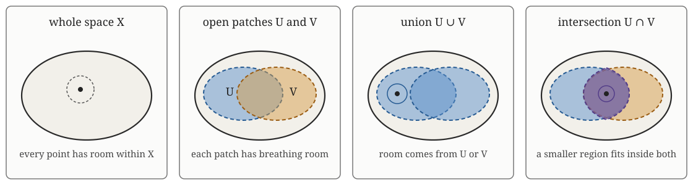
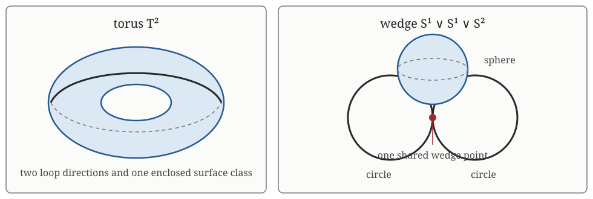

Part A begins with the familiar [coffee-cup and doughnut
example](topology-familiar-shapes.qmd). This second refresher isolates the
formal topology used by the course. Return here when a word such as *open*,
*continuous*, *connected* or *homeomorphic* needs a precise meaning.

The aim is recognition and interpretation. You do not need to complete this
page before starting Week 1.

::: {.callout-note title="Optional formal background"}
Sections explaining the topology axioms, infinite intersections and finer
homotopy qualifications are **expert-level background**. They can be skipped
on a first pass. Each is retained so that a technical paper's terminology can
be checked when needed.
:::

## Sets, subsets and collections

A **mathematical object** is simply a thing currently being discussed in
mathematics. It may be a number, vector, point, set, function, matrix, graph or
space. The word can sound more formal than it is. It is useful because the kind
of object determines which operations and questions make sense: two numbers
can be added, a point can belong to a set, a function can map between sets, and
a matrix can represent a linear map.

This course will use an **object check** whenever several related kinds of
object could easily be confused. The check asks: what are the objects here,
what kind of thing is each one, and how are they related?

A **set** is a collection of objects, called its **elements**. If $X$ is a
set, then $U\subseteq X$ means that every element of $U$ is also an element of
$X$. The **empty set** $\varnothing$ has no elements. The **power set**
$\mathcal P(X)$ is the collection of every subset of $X$.

Keep the following statements distinct:

- $x\in X$ says that $x$ is an **element** of the set $X$;
- $U\subseteq X$ says that $U$ is a subset whose elements all belong to $X$; and
- $\mathcal T\subseteq\mathcal P(X)$ says that $\mathcal T$ is a collection of selected subsets.

When $X$ is being treated as a geometric or topological space, its elements
are conventionally called **points**. “Point” and “element” do not name two
different things in that setting. *Element* describes the membership relation
$x\in X$; *point* signals that we are thinking of $X$ as a space.

::: {.callout-note collapse="true" title="Example: points, subsets and a collection of subsets"}
Let

$$
X=\{a,b,c\}.
$$

Here $a\in X$ is one element. The set $U=\{a,c\}$ is a subset, so $U\subseteq X$, but $U$ is not an element of $X$. The power set is

$$
\mathcal P(X)=\{\varnothing,\{a\},\{b\},\{c\},
\{a,b\},\{a,c\},\{b,c\},X\}.
$$

The object

$$
\mathcal C=\{\varnothing,\{a\},\{b,c\},X\}
$$

is a collection of subsets, so $\mathcal C\subseteq\mathcal P(X)$. This is the kind of object that can be tested against the topology axioms in the next section.
:::

::: {.object-check}
**◇ Object check.** In the example, $X$ is a set and $a$ is one element of
$X$. If we later treat $X$ as a space, we will also call $a$ a point of $X$;
this is the same object described from a spatial viewpoint. The object $U$ is
a subset of $X$, while $\mathcal C$ is a collection of subsets. Thus
$a\in X$, $U\subseteq X$ and $\mathcal C\subseteq\mathcal P(X)$ describe
three different relationships.
:::

::: {.data-translation}
**Data-analysis translation.** Let $X$ be the 1,000 rows in a sensor dataset.
One row $x\in X$ is one recorded observation. A subset $U\subseteq X$ might
contain the rows recorded while a machine was overheating. A collection
$\mathcal C\subseteq\mathcal P(X)$ might contain several candidate operating
regimes produced by a clustering method. A row, one selected group of rows and
a collection of groups are different kinds of object, even though all are
stored using familiar data structures.
:::

## Open and closed sets: the first intuition

A distance gives the most concrete definition first. A **metric** on $X$ is a
function $d:X\times X\to\mathbb R$ that behaves like a distance: it is
non-negative, $d(x,y)=0$ exactly when $x=y$, distance is symmetric, and the
triangle inequality holds.

The condition $d(x,y)=0$ exactly when $x=y$ is sometimes called the
**identity of indiscernibles**. It simply says that two distinct points cannot
be zero distance apart. If the distance is zero, the two labels refer to the
same point.

The **open ball** of radius $r>0$ about $x$ is

$$
B_r(x)=\{y\in X:d(x,y)<r\}.
$$

It contains all points less than distance $r$ from $x$. A subset
$U\subseteq X$ is **open** when

$$
\text{for every }x\in U,\text{ there is some }r>0
\text{ such that }B_r(x)\subseteq U.
$$

In common language, every point of an open set has some breathing room that
remains inside the set. The radius may be different at different points.

::: {.callout-note collapse="true" title="Example: open and non-open intervals"}
In $\mathbb R$ with the usual distance $d(x,y)=|x-y|$, the interval $(2,5)$
is open. Every $x\in(2,5)$ has some sufficiently small interval
$(x-r,x+r)$ contained in $(2,5)$. The interval $[2,5]$ is not open in
$\mathbb R$: every ball around the endpoint 2 also contains numbers below 2.
:::

Once open sets have been specified, a set is **closed** when its complement is
open. Thus $[2,5]$ is closed in $\mathbb R$ because
$\mathbb R\setminus[2,5]$ is open. Informally, a closed set contains the limit
points that form its boundary. “Open” and “closed” are not opposites in the
ordinary-language sense: a set can be neither, and $\varnothing$ and the whole
space are both open and closed.

These definitions depend on the surrounding space and its metric. For example,
$[2,5]$ is not open as a subset of $\mathbb R$, but it is open when regarded
as the whole metric space $X=[2,5]$: a ball in $X$ contains only points that
belong to $X$.

## A topology and its open sets

A definition of topology is often one of the hardest definitions in this
course to absorb. At a high level, a topology is a **consistent rulebook for
which subsets count as neighbourhood-like regions**. It does not record exact
distance. Instead, it records enough local structure to discuss continuity,
connectedness and deformation. The topology axioms ensure that these allowable
regions remain allowable when we combine them using “or” and finitely many
“and” conditions.

A metric tells us which subsets are open, but topology can begin directly with
the open subsets and forget the numerical distances that produced them. A
**topology** on a set $X$ is a collection $\mathcal T$ of subsets of $X$. The
subsets belonging to $\mathcal T$ are declared to be the **open sets**. The
pair $(X,\mathcal T)$ is a **topological space**.

A statement such as “$U$ is open” is incomplete until the surrounding
topological space is understood. What it means precisely is
$U\subseteq X$ and $U\in\mathcal T$. The collection $\mathcal T$ must satisfy
three rules:

1. $\varnothing\in\mathcal T$ and $X\in\mathcal T$;
2. the union of any collection of members of $\mathcal T$ also belongs to
   $\mathcal T$; and
3. if $U_1,\ldots,U_n\in\mathcal T$ is any finite family, then
   $$U_1\cap\cdots\cap U_n\in\mathcal T.$$

In common language:

1. **The two unavoidable cases are allowed.** The whole space $X$ is an
   allowable open region, and the region containing no points, $\varnothing$,
   is allowed too. This ensures that “everywhere” and “nowhere” do not require
   exceptions. If either were missing, the proposed collection would fail
   before any local structure was considered.
2. **Any number of open alternatives may be joined.** If a point may lie in
   region $U$ *or* region $V$ *or* any of a larger collection of open regions,
   their union is still open. Without this rule, combining valid
   neighbourhoods using “or” could produce an invalid neighbourhood.
3. **Finitely many open requirements may be imposed together.** If a point
   must lie in $U$ *and* $V$, their intersection is still open; the same holds
   for any finite number of open conditions. Without this rule, two compatible
   local requirements could each be valid separately but invalid when asked
   together.

These are closure requirements on the collection $\mathcal T$. They make
neighbourhood reasoning stable under the elementary operations used throughout
topology. A randomly selected list of subsets will usually fail one of them.

::: {.callout-note collapse="true" title="Example: what failure of an axiom looks like"}
Let $X=\{a,b,c\}$.

- The collection $\{\varnothing,\{a\}\}$ fails rule 1 because it omits $X$.
- The collection $\{\varnothing,\{a\},\{b\},X\}$ fails rule 2 because
  $\{a\}\cup\{b\}=\{a,b\}$ is missing.
- The collection $\{\varnothing,\{a,b\},\{b,c\},X\}$ fails rule 3 because
  $\{a,b\}\cap\{b,c\}=\{b\}$ is missing.

In each case the subsets may look reasonable individually, but the collection
does not behave consistently enough to be a topology.
:::

### Why metric-open sets satisfy the rules

The earlier breathing-room definition now explains the axioms rather than
sitting separately from them:

- **The whole space is open.** For any $x\in X$, every metric ball
  $B_r(x)$ is already a subset of $X$.
- **The empty set is open.** There is no point in $\varnothing$ at which the
  breathing-room condition could fail. This is an example of a condition being
  *vacuously true* because there are no cases to check.
- **Arbitrary unions are open.** If $x$ belongs to a union of open sets, then
  it belongs to at least one of them. That particular set supplies a small ball
  around $x$, and the ball also lies inside the union.
- **Finite intersections are open.** If $x\in U\cap V$, openness of $U$
  supplies one ball around $x$ and openness of $V$ supplies another. Choose the
  smaller radius. The resulting ball lies inside both sets, so it lies inside
  $U\cap V$. The same argument works for any finite number of sets.

Thus the axioms capture exactly the behaviour already seen in ordinary metric
neighbourhoods, while allowing topology to discuss spaces for which no metric
has been specified.

::: {.callout-note collapse="true" title="Example: a topology on three points"}
Return to $X=\{a,b,c\}$ and choose

$$
\mathcal T=\{\varnothing,\{a\},\{b,c\},X\}.
$$

This is a topology. It contains $\varnothing$ and $X$; every union of its members is still one of its members; and every finite intersection is also a member. Therefore $(X,\mathcal T)$ is a topological space.

The subset $\{a\}$ is open and $\{b,c\}$ is open, but $\{a,b\}$ is not open because it is not in $\mathcal T$. The topology distinguishes $a$ from the pair $\{b,c\}$ but does not separate $b$ from $c$ using open sets.

If instead we choose $\mathcal T=\mathcal P(X)$, every subset is open. The underlying set of three points has not changed, but its topology has.
:::

::: {.callout-note collapse="true" title="Picture: open patches on a surface"}
Imagine $X$ as a continuous surface and $U$ and $V$ as two overlapping open
patches painted on it. A point inside either patch can move a sufficiently
small amount along the surface without leaving that patch.

{fig-alt="Four schematic panels show a surface X, two overlapping open patches U and V, their union, and their intersection."}

The union $U\cup V$ gives the combined painted region. A point in it inherits
breathing room from whichever patch contains it. The intersection $U\cap V$
is the overlap. A point in the overlap has some smaller region that stays
inside both patches. The figure is only a local picture; the complete topology
contains all open patches satisfying the rules, not merely the two drawn here.

The coffee-cup and doughnut example appears later under
[homeomorphisms](#homeomorphisms-same-topology). It answers a different
question: when do two apparently different spaces carry the same continuous
organisation?
:::

### What open is trying to capture

In a metric space, the neighbourhood intuition becomes literal: an open set
contains a little room around each of its points.

The word **finite** in the third axiom matters. For two open sets, we can use
the smaller of the two available neighbourhoods. For five open sets, we can
still choose the smallest of five positive radii. More generally, every finite
list of positive radii has a positive minimum, so some breathing room remains
after imposing all the conditions.

An infinite list behaves differently. Its radii may become smaller and smaller
without any positive smallest radius. The intersection can then squeeze all
the breathing room away.

::: {.callout-note collapse="true" title="Example: why arbitrary intersections are not required"}
Imagine open intervals squeezing around 0. The first has radius 1, the next radius $1/2$, then $1/3$, and so on. Every nonzero point is eventually excluded: given $x\ne0$, choose $n>1/|x|$, and then $x\notin(-1/n,1/n)$. Only 0 survives all the conditions. Therefore

$$
\bigcap_{n=1}^{\infty}(-1/n,1/n)=\{0\}.
$$

The single point $\{0\}$ has no breathing room: every ball of positive radius around 0 contains other points. It is therefore not open. The example shows exactly what can fail for an infinite intersection: the common neighbourhood radii have shrunk to zero.
:::

### The same set can carry different topologies

At one extreme, $\mathcal T=\{\varnothing,X\}$ is a topology that distinguishes almost no local structure. At the other, $\mathcal T=\mathcal P(X)$ makes every subset open. Between these extremes lie topologies that encode useful notions of neighbourhood.

The two extremes do not by themselves prove that data need more structure.
They demonstrate something narrower: the underlying elements of $X$ do not
determine which subsets should count as neighbourhoods. A topology is
additional information attached to the set.

### Why topology for discrete data is sensible

For a finite dataset, adding a metric does **not** turn the observed points into
a continuous object. With its metric-induced topology, a finite point cloud is
discrete: each individual observation can be isolated in a sufficiently small
open ball. A graph or simplicial complex also remains a finite combinatorial
object.

The purpose of the extra structure is different. A metric or relation records
a modelling judgement about which observations should count as near. A graph
or simplicial complex then records selected neighbourhood relationships. Its
**geometric realisation** replaces abstract edges by intervals, triangles by
filled triangular regions and so on, producing a continuous space associated
with the finite construction. TDA computes the homology of that constructed
space. It does not claim that the original observations were already joined by
continuous material.

Why is this useful rather than artificial? Often the observations are discrete
because measurement and storage are discrete, while the scientific object of
interest may not be. A trajectory is sampled at finitely many times; an image
is stored as pixels; a spatial field is recorded at finitely many locations;
or a continuous state space is observed through a finite point cloud. The
neighbourhood construction asks which continuous organisation is supported by
those samples at a stated resolution.

There are three important qualifications:

1. **The continuous object is a hypothesis, not something contained literally
   in the rows.** The complex is a representation built from the observations.
2. **The representation depends on choices.** Metric, preprocessing,
   neighbourhood rule and scale decide which simplices appear.
3. **The connection to an underlying space requires conditions.** With suitable
   sampling and geometric assumptions, results such as the Nerve Theorem and
   reconstruction theorems can relate a complex to a continuous space. Without
   such conditions, homology still describes the constructed representation,
   but it is not automatically the topology of the latent system.

Persistent homology later repeats the construction across scale. This reduces
dependence on one arbitrary threshold and asks which features survive across a
range of neighbourhood sizes. It does not remove the upstream choices or turn
the representation into direct evidence of mechanism.

## Why the metric choice remains visible

The collection of open sets obtained from a metric is the **topology induced by
the metric**. The metric retains exact distances. Its induced topology retains
which subsets act as open neighbourhoods. Different metrics can induce the
same topology, so passing from metric geometry to topology deliberately
discards information.

::: {.data-translation}
**Data-analysis translation.** A data table supplies observations and
variables, but it does not specify which differences should count as small.
Using Euclidean distance, standardising columns, weighting variables, choosing
a mixed-data dissimilarity or first constructing an embedding can produce
different nearest neighbours. A later graph or complex turns those chosen
neighbour relations into the representation whose topology is computed. The
result therefore describes the observations **through that choice of
neighbourhood**, not the table independently of the choice. Units, missingness
and dominating variables should be checked before interpreting the result.
:::

{fig-alt="Three coordinate plots show an open Euclidean ball as a circle, a weighted Euclidean ball as a vertically compressed ellipse, and an L1 ball as a diamond, all centred at x zero."}

::: {.callout-note collapse="true" title="Example: a metric on a two-variable state space"}
Suppose a dynamical system has state $x=(u,v)\in\mathbb R^2$. The Euclidean metric is

$$
d(x,y)=\sqrt{(u_x-u_y)^2+(v_x-v_y)^2}.
$$

Its open ball $B_r(x)$ is a disk centred at $x$. This treats equal changes in $u$ and $v$ as equally important after units have been made comparable.

Suppose instead that the $v$ direction is dynamically more sensitive. It may align with a strongly expanding direction of the flow, or a small change in $v$ may represent a much larger energy or observational change than the same numerical change in $u$. A simple direction-weighted metric is

$$
d_w(x,y)=\sqrt{(u_x-u_y)^2+9(v_x-v_y)^2}.
$$

An open ball for $d_w$ appears as an ellipse in the original $(u,v)$ coordinates. It is narrower in the $v$ direction because a $v$ difference counts three times as much in distance. This does not claim that ellipses are inherently more dynamical. It illustrates that “equally near” depends on the metric and should reflect units, uncertainty or mechanism.

Other metrics produce other ball shapes. The $L^1$ metric

$$
d_1(x,y)=|u_x-u_y|+|v_x-v_y|
$$

has diamond-shaped balls, which are squares rotated by $45^\circ$ in Cartesian coordinates. These three metrics induce the usual topology on $\mathbb R^2$: they disagree about numerical distance and fixed-radius neighbourhoods, but agree about which subsets are open.
:::

::: {.applied-translation}
**Dynamical systems translation.** A metric specifies how separation in state space is measured. Rescaling a state variable, choosing an energy-weighted norm or combining variables with different units changes that geometry. The induced topology retains the local notion of continuous variation while forgetting the precise numerical separation.
:::

::: {.tda-connection}
**◆ TDA translation.** Point-cloud constructions use the metric more strongly than its induced topology alone: a threshold decides which observations become neighbours. [Week 3](../week-03/index.qmd#from-points-to-unions-of-balls) shows how metric balls generate Čech and Vietoris–Rips complexes across scale.
:::

## Continuity

A map $f:(X,\mathcal T_X)\to(Y,\mathcal T_Y)$ is **continuous** when

$$
f^{-1}(V)=\{x\in X:f(x)\in V\}\in\mathcal T_X
$$

for every $V\in\mathcal T_Y$. In words, pulling an open region of the output space back through $f$ must produce an open region of the input space.

For familiar metric spaces, this agrees with the idea that sufficiently small input changes cannot force a sudden finite output jump. The open-set definition expresses that idea without relying on particular coordinates.

::: {.callout-note collapse="true" title="Example: continuity of a flow"}
For a dynamical system with flow $\phi_t:X\to X$, continuity of $\phi_t$ means that nearby initial states cannot be sent to macroscopically separated states at a fixed finite time without passing through intermediate behaviour. A trajectory $\gamma(t)=\phi_t(x_0)$ is a continuous map from a time interval into state space: it moves without teleporting between separated regions.
:::

::: {.applied-translation}
**Dynamical systems translation.** Continuity formalises the assumption that state evolution and finite-time dependence on initial conditions have no instantaneous jumps. Sensitive dependence can amplify a small difference rapidly while the finite-time map remains continuous.
:::

::: {.tda-connection}
**◆ TDA translation.** Topological summaries are often interpreted under continuous changes of representation or perturbations. That does not make every finite-data pipeline invariant: sampling, metric and representation remain explicit choices in [Week 1](index.qmd#why-topology-is-relevant-to-data).
:::

::: {.data-translation}
**Data-analysis translation.** A continuous transformation can include a smooth recalibration or monotone rescaling, but continuity alone does not guarantee that a finite-sample statistic is unchanged. The relevant practical question is which perturbations the entire fitted pipeline tolerates, including preprocessing and neighbourhood construction.
:::

## Connectedness and paths

A topological space is **connected** if it cannot be written as the union of two disjoint, non-empty open sets. Intuitively, it cannot be separated into two open pieces.

It is **path-connected** if, for every $x,y\in X$, there is a continuous map $\gamma:[0,1]\to X$ with $\gamma(0)=x$ and $\gamma(1)=y$. A path is therefore a continuous route between points.

Path-connectedness implies connectedness. The converse can fail for unusual
spaces (for example, the **topologist's sine curve**, formed by the graph
$y=\sin(1/x)$ for $x>0$ together with its limiting vertical segment at $x=0$,
is connected but not path-connected). The distinction does not obstruct the
finite complexes and familiar manifolds used in this course.

::: {.callout-note collapse="true" title="Example: one regime or two separated pieces"}
An interval $[0,1]$ is path-connected: $\gamma(t)=(1-t)x+ty$ joins any $x,y\in[0,1]$. The union $[0,1]\cup[2,3]$ is disconnected because it separates into two non-empty pieces with a gap between them. No continuous path contained in the union can travel from the first interval to the second.
:::

::: {.applied-translation}
**Dynamical systems translation.** Connected components can represent separated regions of an invariant set or distinct pieces of an admissible state space. This alone does not establish distinct dynamical regimes: that interpretation also needs temporal and mechanistic evidence.
:::

::: {.tda-connection}
**◆ TDA translation.** In a graph, edge paths determine graph components. In a simplicial complex, $H_0$ records connected components. The [Week 2 examples](../week-02/index.qmd#examples) make this statement computable, while Week 3 shows why the component count depends on neighbourhood scale.
:::

::: {.data-translation}
**Data-analysis translation.** Connected components resemble clusters only after the neighbourhood rule and scale have been stated. Sparse sampling, outliers and a single bridging observation can merge or split components. Compare the result with a conventional clustering or density diagnostic before calling the components populations, regimes or segments.
:::

## Homeomorphisms: same topology

A **homeomorphism** is a bijection $f:X\to Y$ such that both $f$ and $f^{-1}$ are continuous. If such a map exists, $X$ and $Y$ are **homeomorphic**.

The **rubber-sheet metaphor** is an informal way to picture this definition.
Imagine a space made from perfectly flexible rubber. It may be stretched,
bent, twisted or compressed. It may not be cut, torn, punctured, glued to a
previously separate part, or crushed so that distinct regions become
irreversibly identified. The change must be reversible: the rubber can be
returned continuously to its original form. This is what the continuity of
both $f$ and $f^{-1}$ is protecting.

The metaphor concerns continuous spaces. Two finite samples do not become
homeomorphic merely because one point cloud can be visually warped to resemble
the other. For data, a continuous representation must first be constructed,
and the conclusion concerns that representation.

The two directions matter. Continuity of $f$ prevents tearing when going from $X$ to $Y$; continuity of $f^{-1}$ prevents information from being irreversibly collapsed.

::: {.callout-note collapse="true" title="Example: homeomorphic and non-homeomorphic spaces"}
A circle and an ellipse are homeomorphic: one can be stretched continuously into the other and the stretching can be continuously reversed. A circle and a line segment are not homeomorphic. Removing one point from a circle leaves a connected open arc, while removing an interior point from a segment separates it into two pieces. A homeomorphism would have to preserve that distinction.
:::

::: {.callout-note collapse="true" title="Example: the coffee cup and doughnut, stated carefully"}
The classical slogan says that a coffee cup with one handle and a doughnut are topologically equivalent. In an idealised model, a cup-shaped solid with one through-handle can be continuously deformed into a solid torus without cutting, gluing or collapsing material. Corresponding idealised one-handled surfaces can likewise be homeomorphic.

The conclusion depends on **which space has been selected**. The solid material of the cup, its outer surface, the region available to the coffee and a finite scan of the cup are different mathematical objects. A real handle might itself be hollow, adding an internal channel or extra boundary surface. A thick-walled cup also has an inner cavity and a rim whose treatment must be specified. Those details can change the topology, so the slogan is not a claim about every manufactured mug or every way of representing one. It illustrates homeomorphism only after the object and idealisation have been fixed.
:::

::: {.applied-translation}
**Dynamical systems translation.** A smooth invertible change of state coordinates may distort lengths, angles and densities while preserving topological organisation. Topological equivalence is therefore closer to asking whether two descriptions have the same continuous organisation than whether their plotted trajectories have the same geometry.
:::

::: {.tda-connection}
**◆ TDA translation.** The circle-versus-ellipse comparison appears in the [Week 1 shape discussion](index.qmd#what-a-topological-lens-asks). The data are finite samples, however, so the comparison becomes computational only after a metric complex is constructed.
:::

::: {.data-translation}
**Data-analysis translation.** Topological equivalence is stronger than visual resemblance and different from statistical similarity. Two scatter plots may share means and covariances without being homeomorphic representations of one underlying space; conversely, a smooth coordinate warp can preserve topology while greatly changing those summaries.
:::

::: {.sticking-point}
**▶ Likely sticking point.** A finite point cloud is a discrete set under its metric-induced topology. A sampled circle does not literally inherit a loop merely because the points resemble one. TDA constructs a complex from neighbourhood relations and studies the topology of that constructed object.
:::

## Homotopy, homology and controlled forgetting

A **homotopy** is a continuous deformation from one map to another. Spaces are **homotopy equivalent** when maps between them compose to something homotopic to the relevant identity maps. This is weaker than being homeomorphic.

A **homology group** $H_p(X)$ is an algebraic invariant assigned to a space in dimension $p$. Informally, $H_0$ records connected components, $H_1$ records independent loop classes and $H_2$ records independent void-enclosing surface classes. Homology is not a deformation itself. It is a computable algebraic summary that remains unchanged under homotopy equivalence.

The direction of implication is important:

$$
X\simeq Y\quad\Longrightarrow\quad H_p(X)\cong H_p(Y)
\quad\text{for every }p,
$$

but having isomorphic homology groups does not generally imply that two spaces are homotopy equivalent.

::: {.callout-note collapse="true" title="Example: homotopy contracts a disk"}
A filled disk is not homeomorphic to a single point: there is no bijection between them. It is nevertheless homotopy equivalent to a point because the disk can contract continuously to its centre. A circle cannot contract to a point while remaining inside the circle, so a circle is not homotopy equivalent to a point.

“Remaining inside the circle” refers to the target space of the deformation.
A contraction of the circle would be a continuous family of maps
$H:S^1\times[0,1]\to S^1$ beginning with the identity map and ending with a
constant map. At every intermediate time, every image point must still lie on
$S^1$. Allowing the circle to move through the filled disk would instead give
a deformation inside $D^2$, a different ambient space. The disk provides the
interior points needed for contraction; the circle alone does not.
:::

::: {.callout-note collapse="true" title="Example: homology distinguishes an outline from a filling"}
This is the finite combinatorial version of the preceding circle-versus-disk
example. The geometric realisation of an outline triangle is a circle: its
three edges form a closed loop with no interior. The geometric realisation of
a filled triangle is a disk.

The two complexes in [Week 2](../week-02/index.qmd#examples) have the same
vertices and edges. The outline has one nonzero $H_1$ class. Adding the
triangular face supplies the missing interior and makes the edge cycle a
boundary, so the filled triangle has $H_1=0$. Homology detects the presence
versus filling of the loop without retaining side lengths or angles.
:::

::: {.callout-note collapse="true" title="Example: the same homology need not mean the same homotopy type"}
A **wedge**, written $X\vee Y$, is formed by choosing one point in each space
and identifying those chosen points. The symbol $\vee$ therefore means
“attach at one common point”. The space
$S^1\vee S^1\vee S^2$ consists of two circles and one 2-sphere joined at a
single point.

{fig-alt="A torus is shown beside two loops and a sphere attached at one shared wedge point."}

A torus and $S^1\vee S^1\vee S^2$ have the same integral homology groups: one
connected component, two independent $H_1$ generators and one $H_2$
generator. They are not homotopy equivalent. Their fundamental groups differ:
the torus has commuting loop generators, while the two circle loops in the
wedge generate a non-commutative free group. Homology has deliberately
forgotten that distinction.
:::

### A comparison matrix

The entries below compare the spaces in pairs. All homology comparisons use
integer coefficients.

- **Homeomorphic** means the spaces match point for point by a continuous map
  with a continuous inverse.
- **Homotopy equivalent** means they have the same deformation type.
- **Same homology** means all their homology groups are isomorphic.
- **None** means that none of these three relationships holds.

|  | Point | Filled triangle $D^2$ | Circle $S^1$ | Outline triangle | Torus $T^2$ | Wedge $S^1\vee S^1\vee S^2$ |
|---|---|---|---|---|---|---|
| **Point** | Homeomorphic; homotopy equivalent; same homology | Homotopy equivalent; same homology | None | None | None | None |
| **Filled triangle $D^2$** | Homotopy equivalent; same homology | Homeomorphic; homotopy equivalent; same homology | None | None | None | None |
| **Circle $S^1$** | None | None | Homeomorphic; homotopy equivalent; same homology | Homeomorphic; homotopy equivalent; same homology | None | None |
| **Outline triangle** | None | None | Homeomorphic; homotopy equivalent; same homology | Homeomorphic; homotopy equivalent; same homology | None | None |
| **Torus $T^2$** | None | None | None | None | Homeomorphic; homotopy equivalent; same homology | Same homology only |
| **Wedge $S^1\vee S^1\vee S^2$** | None | None | None | None | Same homology only | Homeomorphic; homotopy equivalent; same homology |

The matrix makes the hierarchy visible. Homeomorphic pairs also appear as
homotopy equivalent and homologically identical. The point and filled triangle
show that homotopy equivalence need not imply homeomorphism. The torus and
wedge show that matching homology need not imply matching homotopy type.

::: {.applied-translation}
**Dynamical systems translation.** Homotopy asks whether one continuous organisation can be deformed into another. Homology replaces that full deformation question with counts and algebraic relations among selected features. It is coarser, but substantially easier to compute from a finite representation.
:::

::: {.tda-connection}
**◆ TDA translation.** Week 2 constructs homology from cycles modulo boundaries. [Week 4](../week-04/index.qmd) then follows those homology classes through a filtration. Persistent homology tracks the algebraic invariants across scale; it does not compute a homotopy between successive data sets.
:::

The course uses the following hierarchy as controlled forgetting:

$$
\text{metric geometry}\longrightarrow\text{topology}
\longrightarrow\text{homotopy type}\longrightarrow\text{homology}.
$$

The arrows do not mean that one description is universally better. They mean that a particular kind of information is deliberately set aside.

| Description retained | What is forgotten at the next step | What can come into clearer focus |
|---|---|---|
| **Metric geometry:** exact distances, angles, curvature, size and coordinate scale. | Passing to topology forgets exact lengths, angles, curvature and the amount of stretching. | A circle and an ellipse can be recognised as having the same continuous organisation despite different geometry. |
| **Topology:** neighbourhoods, continuity, connectedness and distinctions preserved by homeomorphism. | Passing to homotopy type forgets point-for-point structure, local thickness and attached pieces that can be continuously contracted away. | A filled disk and a point are both seen as contractible, so their non-essential geometric extent no longer distracts from their deformation type. |
| **Homotopy type:** information preserved by continuous contraction and expansion, including more about how loops interact. | Passing to homology forgets the full interaction and composition of loops, exact representatives and much of the remaining deformation structure. | Components, loop classes and void-enclosing classes become linear-algebraic objects that can be computed from finite matrices. |
| **Homology:** algebraic classes in each dimension for a chosen coefficient system. | Replacing the groups by Betti numbers forgets torsion, representatives and every distinction except dimension. | A small list of counts becomes easy to compare, although it is a substantially coarser summary. |

Forgetting helps when the discarded variation is a nuisance. A change of units, smooth coordinate distortion or local stretching can obscure that two state-space representations have the same broad organisation. Ignoring those quantities can bring separated components, recurrent loop-like organisation or enclosure into focus. Forgetting is harmful when amplitude, distance, curvature, density, orientation or time ordering carries the mechanism of interest.

::: {.applied-translation}
**Dynamical systems translation.** A smooth observation or coordinate change may distort the geometry of a reconstructed state space while leaving broad topological organisation intact. Moving towards homology can therefore emphasise recurrence or enclosure that survives such distortion. It simultaneously discards rates of contraction, oscillation frequency, amplitude and temporal ordering, so those quantities require complementary dynamical or geometric summaries.
:::

::: {.tda-connection}
**◆ TDA translation.** Persistent homology later restores a record of the scales over which homology classes appear and disappear. It does not restore all geometry that was forgotten. A long interval reports survival across the chosen filtration parameter, not the original curvature, density or physical-time evolution of the system.
:::

Homology does not classify all spaces: two spaces can have the same Betti numbers without being homeomorphic or homotopy equivalent.

## Putting the data choices together

The scientific object, finite observations and constructed topological representation must remain distinct. A typical route is

$$
\text{scientific system}
\longrightarrow
\text{observations}
\xrightarrow{\text{choose a metric or relation}}
\text{finite representation}
\xrightarrow{\text{compute}}
\text{homology of that representation}.
$$

The **metric or relation is a modelling choice**: it decides which observations count as close or related. Once that choice has been made, a second rule constructs a **finite representation** of the resulting neighbourhood organisation. A graph is one possible representation. A simplicial complex is another and will be introduced carefully in Week 2; it is not assumed knowledge here.

Homology is then computed from the chosen representation. It is not extracted directly from an unstructured table of observations, and it is not automatically the homology of the underlying scientific system. Sampling, preprocessing, metric, representation and scale all sit between the system and the algebraic result.

::: {.applied-translation}
**Dynamical systems translation.** Choosing Euclidean distance, an energy norm, a phase-aware distance or a weighted state-space metric changes what “nearby states” means. That decision should follow the variables, units and mechanism rather than software convenience.
:::

::: {.tda-connection}
**◆ TDA translation.** [Week 2](../week-02/index.qmd) introduces a simplicial complex as one possible finite representation and computes its homology. [Week 3](../week-03/index.qmd) then shows how a metric and a changing scale construct a nested family of such representations.
:::

Topology becomes useful when connectedness, recurrence, enclosure or other relational organisation is scientifically meaningful and exact coordinates are partly incidental. It is not automatically the right lens. The chosen representation, scale, sampling and metric determine which topological claims can be supported.

## You are ready to return to Week 1

::: {.callout-tip title="What to retain before returning"}
Topology specifies which subsets count as open neighbourhoods. A metric is one way to generate those neighbourhoods, while retaining more numerical information than the topology alone. Continuity, connectedness and homeomorphism are defined using the open sets. Homotopy describes continuous deformation; homology is a coarser algebraic invariant preserved by that deformation. TDA builds finite representations so that selected homology groups can be computed and followed across scale.
:::

You are ready to return to [Week 1](index.qmd) if you can explain, in your own words:

1. why an open set means membership in a chosen collection $\mathcal T$;
2. how a metric supplies open neighbourhoods;
3. what continuity and connectedness mean intuitively;
4. why a homeomorphism is reversible;
5. how homotopy differs from homology; and
6. why a finite point cloud is not automatically the continuous shape it resembles.
