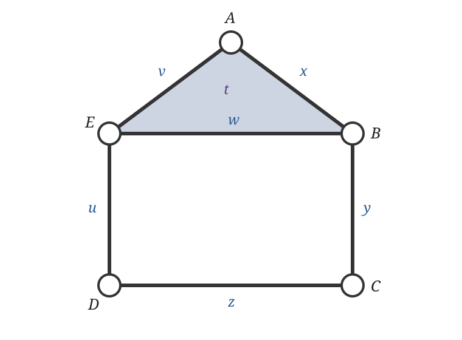

::: {.callout-tip title="Week 2 resources"}
[Slides](slides.qmd) · [Lecture walkthrough](solutions.ipynb) · [Application page](case-study.qmd)
:::

<a class="btn btn-primary" href="../../downloads/week-02-participant.ipynb" download="week-02-participant.ipynb">Download participant notebook</a>

::: {.callout-note title="Optional reading for this week"}
Edelsbrunner and Harer, Chapters III.1 and IV.1–IV.2, provide the simplicial
complex, homology and matrix reduction spine. Postol, Sections 3.3–3.4 and
4.1, provide a slower route through fields, vector spaces, simplicial homology
and induced maps.
:::

::: {.foundation-definition}
**[Guiding definition for Weeks 1–4](../../index.qmd#the-guiding-construction-for-weeks-14).** For a filtration $K_a\subseteq K_b$ when $a\leq b$, persistent homology is the module
$$a\mapsto H_p(K_a;\mathbb F),\qquad (a\leq b)\mapsto(\iota_{a,b})_*.$$

::: {.foundation-steps}
::: {.foundation-step}
**1 · Representation**

Scientific object, observations and the topological question.
:::
::: {.foundation-step .is-active}
**2 · Homology**

$K_a$ and $H_p(K_a;\mathbb F)$. This week treats the complex as already
chosen and asks what homology computes from it. A simplicial complex becomes a
finite bookkeeping device whose chains and boundary maps turn qualitative
shape into linear algebra.
:::
::: {.foundation-step}
**3 · Filtration**

$K_a\subseteq K_b$ across scale.
:::
::: {.foundation-step}
**4 · Memory**

Induced maps, module and barcode.
:::
:::
:::

## Learning goals

By the end of this week, you should be able to:

1. look at a small example and distinguish the abstract simplicial complex, a geometric drawing of it and its 1-skeleton;
2. explain what the chain space $C_p(K;\mathbb F_2)$ contains and how a chosen simplex ordering turns chains and boundary maps into columns and matrices;
3. read a small boundary matrix, explain what its entries record and use $\partial_{p-1}\partial_p=0$ as a meaningful consistency check;
4. explain cycles, boundaries and homology as the steps that separate closed chains from those already filled in; and
5. predict how adding an edge, triangle or tetrahedron can change the Betti numbers, then confirm that prediction with a small calculation.

## Simplices: the building blocks

A **simplex** is one building block. Its dimension is one less than its number
of vertices:

| Dimension | Name | Abstract notation | What is actually present? |
|---:|---|---|---|
| $0$ | vertex | $\{A\}$ | one labelled vertex |
| $1$ | edge | $\{A,B\}$ or $AB$ | the edge and its two endpoint vertices |
| $2$ | triangle | $\{A,B,E\}$ or $[A,B,E]$ | a **filled** triangular face, its three edges and its vertices |
| $3$ | tetrahedron | $\{A,B,C,D\}$ | a filled solid tetrahedron, its four triangular faces, edges and vertices |
| $p$ | $p$-simplex | $\{v_0,\ldots,v_p\}$ | a $p$-dimensional block with $p+1$ vertices and all its faces |

The word **filled** matters. Three vertices joined by three edges form an
outline triangle, but they do not form a 2-simplex unless the triangular face
is also included.

In a drawing, a vertex is shown as a point. More precisely, the **vertex** is
the combinatorial item, such as the label $A$, while the plotted **point** is a
chosen geometric location used to realise it. Moving that plotted point does
not change the abstract complex provided the same incidences are retained.

A geometric $p$-simplex is the convex hull of $p+1$ affinely independent
points. An abstract $p$-simplex is simply a set of $p+1$ vertex labels. We use
abstract simplices because the calculation needs to know which vertices belong
to which edges and faces; coordinates are optional.

:::: {.worked-example}
### Running example: read the house as a collection of simplices

{fig-alt="A labelled house complex has vertices A through E, outer edges x through v, diagonal roof-base edge w, and one filled triangular face ABE."}

The house contains:

- five 0-simplices: $A,B,C,D,E$;
- six 1-simplices: $x=AB$, $y=BC$, $z=CD$, $u=DE$, $v=EA$ and $w=EB$;
- one 2-simplex: the filled roof $t=[A,B,E]$; and
- no simplices in dimension 3 or above.

The square room is bounded by four edges, but its interior is not a simplex.
The roof is different: its shaded triangular interior is explicitly part of
the complex.
::::

## From simplices to a simplicial complex

A **simplicial complex** $K$ is a collection of simplices with one consistency
rule called **downward closure**:

$$
\sigma\in K,\quad \varnothing\ne\tau\subseteq\sigma
\quad\Longrightarrow\quad \tau\in K.
$$

In ordinary language: if a simplex is present, every face of that simplex must
also be present. The rule lets us move down one dimension without leaving the
collection.

:::: {.worked-example}
### Example and counterexample: what downward closure requires

**The house satisfies the rule.** Because the roof $t=[A,B,E]$ is included,
its three edges $AB$, $BE$ and $EA$ must be included. Because those edges are
included, their endpoint vertices $A$, $B$ and $E$ must also be included.

**A football-team hyperedge need not satisfy the rule.** Suppose a hypergraph
contains the group

$$
T=\{A,B,C,D\}
$$

to record that four players belong to the same team. The data may not assert
that every pair socialises or interacts separately; perhaps $A$ and $C$ never
spend time together. A hypergraph may therefore contain the four-person
hyperedge $T$ without containing all six pairwise edges.

That collection is a valid hypergraph but not a simplicial complex. If $T$ were
included as a 3-simplex, downward closure would require every three-player
face, every pairwise edge and every player vertex. Converting a team hyperedge
into a simplex therefore adds relational claims that the original data may not
support.
::::

::: {.object-check}
**◇ Object check.** The complex is $K$, the whole downward-closed collection.
A simplex such as $t=[A,B,E]$ is one member of $K$. A drawing is a geometric
realisation of that combinatorial information, not the definition of $K$.
:::

::: {.qualification}
**† Qualification.** Authors differ on whether the empty simplex is included.
Here every displayed simplex is non-empty, vertices are 0-simplices and the
ordinary chain complex begins at $C_0$.
:::

## Chains: selecting simplices algebraically

::: {.callout-note title="Algebra checkpoint"}
If basis, kernel, image, rank or quotient are unfamiliar, read the [pre-Week 2 algebra survival guide](algebra-survival-guide.qmd). Its [coefficient-field section](algebra-survival-guide.qmd#coefficient-fields) explains the arithmetic over $\mathbb F_2$ used below.
:::

For each dimension $p$, the **chain space** $C_p(K;\mathbb F_2)$ has the
$p$-simplices as a basis. For the house,

$$
C_2=\operatorname{span}\{t\},\qquad
C_1=\operatorname{span}\{x,y,z,u,v,w\},\qquad
C_0=\operatorname{span}\{A,B,C,D,E\}.
$$

A 1-chain is any selection of house edges. For example,

$$
y+u
$$

is a perfectly valid chain even though the two edges are disconnected. A
chain is an algebraic selection, not necessarily a path or loop. Two more
useful 1-chains are

$$
r=x+v+w \quad\text{(the roof outline)},
\qquad
q=y+z+u+w \quad\text{(the room outline)}.
$$

Over $\mathbb F_2$, a coefficient is either 0 or 1: omit a simplex or include
it. Adding chains uses symmetric difference because an edge selected twice
cancels, $1+1=0$.

## Boundary maps: record the faces of a chain

The boundary map lowers dimension by one:

$$
\partial_p:C_p\longrightarrow C_{p-1}.
$$

For an edge, the boundary is its two endpoints. In the house,

$$
\begin{aligned}
\partial_1x&=A+B,& \partial_1y&=B+C,& \partial_1z&=C+D,\\
\partial_1u&=D+E,& \partial_1v&=E+A,& \partial_1w&=E+B.
\end{aligned}
$$

For the filled roof, the boundary is its three surrounding edges:

$$
\partial_2t=x+v+w=r.
$$

Linearity means that the boundary of a chain is the sum of the boundaries of
its selected simplices. For the room outline,

$$
\begin{aligned}
\partial_1q
&=\partial_1(y+z+u+w)\\
&=(B+C)+(C+D)+(D+E)+(E+B)=0.
\end{aligned}
$$

Every vertex occurs twice and cancels. The same calculation gives
$\partial_1r=0$. Moreover,

$$
\partial_1\partial_2t=\partial_1r=0.
$$

This is the concrete meaning of $\partial_{p-1}\partial_p=0$: the boundary of
a boundary has no boundary left over.

With vertex rows $(A,B,C,D,E)$ and edge columns $(x,y,z,u,v,w)$, the same
information is recorded in the matrix

$$
[\partial_1]=
\begin{array}{c|cccccc}
 &x&y&z&u&v&w\\\hline
A&1&0&0&0&1&0\\
B&1&1&0&0&0&1\\
C&0&1&1&0&0&0\\
D&0&0&1&1&0&0\\
E&0&0&0&1&1&1
\end{array}.
$$

For example, the column labelled $y$ contains 1 in rows $B$ and $C$ because
$\partial_1y=B+C$. A matrix is therefore not an unexplained array: each column
is the boundary of the basis simplex named above it.

Together the house maps form

$$
0\longrightarrow C_2
\xrightarrow{\partial_2}C_1
\xrightarrow{\partial_1}C_0
\longrightarrow0.
$$

## Cycles, boundaries and homology in the house

A **cycle** is a chain with zero boundary:

$$Z_1=\ker\partial_1.$$

Both $r$ and $q$ are cycles. Row reduction gives
$\operatorname{rank}\partial_1=4$, so rank-nullity gives

$$
\dim Z_1=6-4=2,
\qquad Z_1=\operatorname{span}\{r,q\}.
$$

A **boundary** in dimension 1 is the boundary of an available 2-chain:

$$
B_1=\operatorname{im}\partial_2=\operatorname{span}\{r\}.
$$

The roof outline $r$ is therefore both a cycle and a boundary. The room outline
$q$ is a cycle but not a boundary because no filled 2-dimensional region has
the room as its boundary.

Homology keeps cycles while identifying boundaries with zero:

$$
H_1=Z_1/B_1
=\operatorname{span}\{[q]\}\cong\mathbb F_2,
\qquad \beta_1=1.
$$

The quotient is visible in this example. The outer house outline is

$$c=x+y+z+u+v=r+q.$$

Because $c$ and $q$ differ by the boundary $r$, homology treats them as two
representatives of the same class:

$$[c]=[q].$$

It has deliberately forgotten whether the representative travels around the
roof as well as the room; the filled roof makes that difference removable.

The house is connected, so $\beta_0=1$. Also $\partial_2t=r\ne0$, so the
2-simplex is not a 2-cycle and $\beta_2=0$. Hence

$$
(\beta_0,\beta_1,\beta_2)=(1,1,0).
$$

Rank-nullity gives the general computational formula

$$
\beta_p=\dim C_p-\operatorname{rank}\partial_p
-\operatorname{rank}\partial_{p+1}.
$$

For the house, the Euler check is

$$
\chi=5-6+1=0=1-1+0
=\beta_0-\beta_1+\beta_2.
$$

> *Homology keeps closed chains and removes those already explained as the
> boundary of something one dimension higher.*

## Examples

::: {.callout-tip title="Work through the complexes"}
Use the [lecture walkthrough](solutions.ipynb) while following the outline triangle, filled triangle, square loop and hollow tetrahedron below. The [participant practical](lab.ipynb) asks you to predict their cycles and boundaries, read the corresponding matrices, and explain the resulting Betti numbers.
:::

:::: {.worked-example}
### Worked example: outline and filled triangle

Use an outline triangle and a filled triangle. In the outline triangle,
the sum of the three edges is a cycle with zero boundary. It is not the
boundary of any two-chain because no triangular face is present, so it
represents a nonzero class in $H_1$. In the filled triangle, the same
edge cycle is now $\partial_2(\text{triangle})$, so its homology class
is zero.

{fig-alt="An outline triangle has a cycle z in Z1 but not B1. A filled triangle with the same vertices and edges has z equal to the boundary of the face 012."}

::: {.callout-note title="Return to the coefficient choice"}
The [field and chain-addition explanation](algebra-survival-guide.qmd#coefficient-fields) works this same triangle over $\mathbb F_2$ and contrasts its parity cancellation with the signed calculation over $\mathbb Q$ or $\mathbb R$.
:::

The two triangles have the same 1-skeleton. Adding the face leaves
$C_0$, $C_1$ and $\partial_1$ unchanged, but creates $C_2$ and a new
map $\partial_2$. The cycle does not disappear as a chain. It becomes a
boundary, so its class disappears in the quotient $Z_1/B_1$.

::: {.applied-translation}
**Dynamical systems translation.** Suppose three oscillators or agents have pairwise interactions. Their interaction graph contains the three edges of an outline triangle. Filling that triangle with a 2-simplex makes an additional modelling assertion: the three pairwise relations belong to one coherent three-way relation. The observations at the vertices and edges have not changed, but the chosen representation has, and the loop class is consequently filled. Whether that higher-order relation is scientifically justified must come from the coupling mechanism or construction rule, not from the triangular drawing alone.
:::
::::

:::: {.worked-example}
### Further examples: square loop and hollow tetrahedron

Use a square loop as the simplest visible $H_1$ class and a hollow
tetrahedron as a first $H_2$ example. Ask explicitly which chains are
cycles, which cycles are boundaries, and which distinctions survive in
the quotient.

The notebooks reproduce this algebra directly over $\mathbb F_2$,
following the matrix viewpoint in Edelsbrunner and Harer
[@edelsbrunner2010computational, Chapter IV] and the traditional
simplicial-homology route in Postol [@postol2024algebraic, Section 4.1].

For $H_1(S^1)$, the winding number gives useful intuition. Loops around
a circle are classified by how many times they wind around the hole.
Over $\mathbb{Z}$, this gives $H_1(S^1)\cong \mathbb{Z}$. For the
computational pipeline, we usually work over a field such as
$\mathbb{F}_2$, but the winding-number story helps explain why homology
classes are algebraic representatives of holes rather than the holes
themselves.
::::

## Graph versus clique complex

:::: {.worked-example}
### Worked example: the same triangle graph, with and without clique filling

An interaction graph may be treated as a one-dimensional simplicial complex:
it contains vertices and edges but no two-dimensional faces. A triangle of
three edges is then a cycle and, because no face is available, it represents a
nonzero $H_1$ class.

The **clique complex** of a graph adds a simplex for every complete subgraph.
The same three mutually adjacent vertices therefore generate a triangular
2-simplex. Its boundary is the three-edge cycle, so that cycle represents zero
in $H_1$.

{fig-alt="An outline triangle represents the graph alone, while a filled triangle represents the clique complex obtained by adding the triangular face."}

**What changed?** Not the vertices or pairwise observations. Clique filling
adds the modelling assertion that mutual pairwise interaction is evidence of
one coherent higher-order unit. This may be appropriate for a coordination
network and inappropriate when the graph cycles themselves are the scientific
objects of interest.
::::
