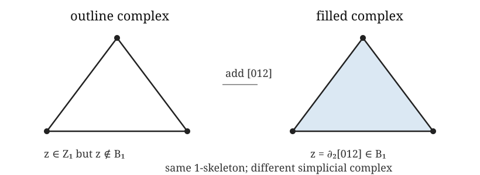

## The decision for today

What object are we constructing, what information does it retain, and what scientific claim could it support?

[Lecture walkthrough](solutions.ipynb)

---

## Story

Week 2 moves from qualitative shape to a combinatorial object on which
topology can be computed. The central message is that a simplicial
complex is the finite bookkeeping device that lets topology become
linear algebra. The complex is treated as already chosen. The aim is to
understand what homology computes once $K$ has been chosen.

---

## Mathematics to introduce

Geometric simplex: convex hull of $p+1$ affinely independent points.

Abstract simplex: a set of $p+1$ vertices.

$$\sigma\in K,\ \tau\subseteq\sigma\Longrightarrow\tau\in K.$$

The notebooks use abstract complexes: incidence matters; coordinates do not.

**◇ Object check.**
At this stage, $K$ is the topological/combinatorial object. The vector
spaces come next: one vector space $C_p(K;\mathbb F)$ for the
$p$-simplices in each dimension.

---

## The chain complex

$$
\cdots\to C_2(K;\mathbb F_2)
\xrightarrow{\partial_2}C_1(K;\mathbb F_2)
\xrightarrow{\partial_1}C_0(K;\mathbb F_2)\to0
$$

$$\partial_{p-1}\partial_p=0.$$

Therefore

$$B_p=\operatorname{im}\partial_{p+1}\subseteq
Z_p=\ker\partial_p.$$

---

## Algebra survival kit

Kernel: inputs sent to zero.

Image: outputs the map can produce.

Quotient: identify differences we agree to ignore.

[Open the pre-Week 2 algebra guide](algebra-survival-guide.qmd)

---

## What $Z_p/B_p$ means

$$z\sim z'\quad\Longleftrightarrow\quad z-z'\in B_p.$$

Two cycles represent the same class when the region between them is an available boundary.

One class, many representatives.

---

## Examples

### Same 1-skeleton, different complex

{fig-alt="Outline and filled triangle with the same 1-skeleton but different first homology." height="225"}

Outline triangle:

$$C_2=0,\qquad z=e_{01}+e_{12}+e_{02}\in Z_1\setminus B_1.$$

Filled triangle:

$$C_2=\langle [012]\rangle,\qquad z=\partial_2[012]\in B_1.$$

The cycle remains. Its class in $Z_1/B_1$ changes.

::: {.sticking}
**▶ Likely sticking point.** A simplicial complex is not determined by
its drawing or its 1-skeleton. The triangular 2-simplex is extra data.
:::

---

## Boundary maps become matrices

Choose simplex bases and fix their order. Each column of $[\partial_p]$ is the
boundary of one $p$-simplex.

Over $\mathbb F_2$:

$$[\partial_{p-1}][\partial_p]=0,
\qquad
\beta_p=\dim C_p-\operatorname{rank}\partial_p-
\operatorname{rank}\partial_{p+1}.$$

::: {.object-check}
**◇ Object check.** The matrix is a representation of a linear map. Its
rows and columns only make sense after the chain-space bases are named.
:::

---

## Examples to compute

Use a square loop as the simplest visible $H_1$ class and a hollow
tetrahedron as a first $H_2$ example. Ask explicitly which chains are
cycles, which cycles are boundaries, and which distinctions survive in
the quotient.

---

## Two computational checks

$$\beta_p=\dim C_p-\operatorname{rank}\partial_p-
\operatorname{rank}\partial_{p+1}.$$

$$\chi(K)=\sum_p(-1)^p\dim C_p
=\sum_p(-1)^p\beta_p.$$

Euler characteristic is a check, not a replacement for homology.

---

## DP relevance

Graphs enter as the simplest data-derived complexes. An interaction
graph can be treated as a one-dimensional simplicial complex, with
vertices and edges only. This supports component and graph-cycle
homology. To study higher-dimensional topology, the graph must be
promoted to another object, such as a clique complex. That promotion is
a modelling assumption: pairwise mutual interaction is being treated as
evidence of a higher-order collective unit.

## Before we leave

1. What is the mathematical object?
2. Which choice most changed its interpretation?
3. When would this construction mislead us?

[Participant practical](lab.ipynb)
