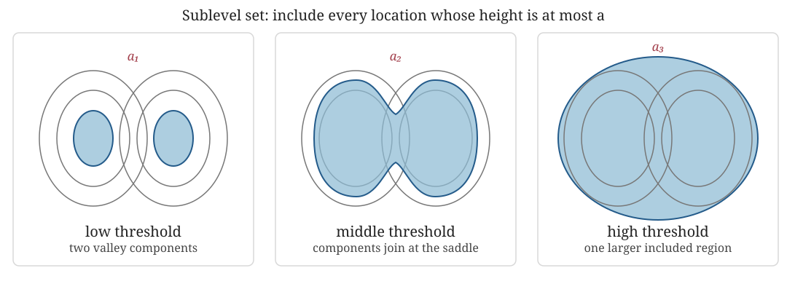
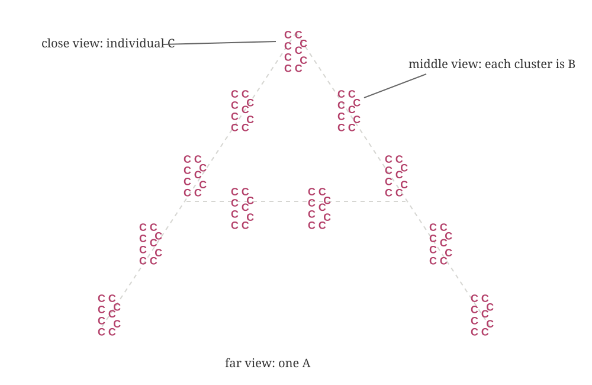
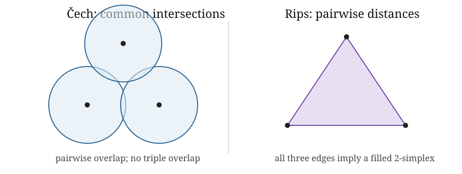

::: {.callout-tip title="Week 3 resources"}
[Slides](slides.qmd) · [Lecture walkthrough](solutions.ipynb) · [Application page](case-study.qmd)
:::

<a class="btn btn-primary" href="../../downloads/week-03-participant.ipynb" download="week-03-participant.ipynb">Download participant notebook</a>

::: {.callout-note title="Optional reading for this week"}
Edelsbrunner and Harer, Chapter III.2, supplies convex set systems and the
nerve viewpoint; Chapters III.3–III.4 develop Delaunay and alpha complexes.
Postol, Sections 5.1, 5.6 and 5.7, gives a shorter data-facing route through
Rips complexes, sublevel sets and graph-derived complexes. Chazal, de Silva
and Oudot provide the more technical geometric persistence route
[@chazal2014geometric].
:::

::: {.foundation-definition}
**[Guiding definition for Weeks 1–4](../../index.qmd#the-guiding-construction-for-weeks-14).** For a filtration $K_a\subseteq K_b$ when $a\leq b$, persistent homology is the module
$$a\mapsto H_p(K_a;\mathbb F),\qquad (a\leq b)\mapsto(\iota_{a,b})_*.$$

::: {.foundation-steps}
::: {.foundation-step}
**1 · Representation**

Scientific object, observations and the topological question.
:::
::: {.foundation-step}
**2 · Homology**

$K_a$ and $H_p(K_a;\mathbb F)$.
:::
::: {.foundation-step .is-active}
**3 · Filtration**

$K_a\subseteq K_b$ across scale. This week replaces one thresholded complex
with a nested family. The parameter records a modelling notion of resolution,
and the inclusions ensure that structure already present remains available at
later scales.
:::
::: {.foundation-step}
**4 · Memory**

Induced maps, module and barcode.
:::
:::
:::

## Learning goals

By the end of this week, you should be able to:

1. explain a filtration as a nested sequence of representations rather than as a collection of unrelated threshold choices;
2. recognise whether assigned simplex values define a valid filtration and explain why faces cannot appear after the simplices they bound;
3. read the Čech and Vietoris–Rips rules for a metric point cloud and explain the modelling idea behind each;
4. explain, at the level needed to follow a TDA argument, what the Nerve Theorem contributes to the union-of-balls interpretation; and
5. state what a filtration parameter means in the application and how changing it changes the question being asked.

## Why one complex is not enough

A data-derived complex usually depends on a threshold. Choosing one threshold and reporting its homology hides how strongly the answer depends on that choice. A **filtration** retains the nested family produced as the threshold changes:

$$
K_a\subseteq K_b\qquad\text{whenever }a\leq b.
$$

The parameter might be distance, density, intensity, similarity, interaction strength, energy, time or a behavioural score. Its interpretation is part of the model.

> *The filtration function decides what it means for structure to appear.*

Week 3 uses two representative ways to produce a filtration:

1. **value-based:** include locations or simplices according to a scalar value;
2. **proximity-based:** connect observations as a distance threshold grows.

These are enough to understand what a filtration does without turning this
week into a catalogue. The [Interlude](../../design-decisions/index.qmd)
compares the broader range of constructions and asks how the scientific object
should determine the choice.

## Value-based filtrations: sublevel sets and lower stars

:::: {.worked-example}
### First example: filter by height

Before introducing distances or growing balls, take an ordinary height
function $h:X\to\mathbb R$ on a landscape. For a chosen level $a$, retain
everything at or below that height:

$$
X_a=\{x\in X:h(x)\leq a\}.
$$

{fig-alt="Three panels show a landscape filled from below. Separate low regions appear first, join across a saddle at a middle height, and expand to cover nearly the whole landscape at a high threshold."}

At a low level, separate valleys give separate components. Raising the level
adds points rather than replacing them; at a saddle, previously separate
regions join. Raising it further includes most of the landscape. Thus
$a\leq b$ implies $X_a\subseteq X_b$.

**What was chosen?** Height supplies an ordering of the space. A temperature,
energy, density or activity field could supply a different ordering and hence
a different filtration. A superlevel filtration would instead reveal the
highest-valued regions first.

::: {.applied-translation}
**Dynamical systems interpretation.** If $h$ is an energy or potential on
state space, low sublevel sets reveal low-energy regions first and merge them
when an energy barrier is crossed. If $h$ is speed, coherence or local
instability evaluated along sampled states, the filtration instead organises
the representation by that observable. “Birth” therefore inherits its meaning
from the chosen scalar; it does not universally mean the appearance of a
physical object.
:::
::::

For a function $h:X\to\mathbb R$ on a topological space, the height example
can also be written $X_a=h^{-1}(-\infty,a]$. For a triangulated or otherwise
simplicial representation with values $g(v)$ on its vertices, the
**lower-star filtration** assigns

$$
f(\sigma)=\max_{v\in\sigma}g(v).
$$

A simplex enters when its highest-valued vertex enters. This rule guarantees
that every face is available no later than its coface. It is the discrete
counterpart of the sublevel-set construction, not a third unrelated idea.

## Proximity-based filtrations: changing resolution

:::: {.worked-example}
### Second example: filter by resolution

The same marks can support different descriptions at different resolutions.
Close up, the schematic resolves many Cs; at a middle distance, groups of Cs
form Bs; from farther away, the Bs form one A.

{fig-alt="Many small letter Cs are arranged into several letter Bs, and those B-shaped groups are arranged into one large letter A."}

This is the intuition behind changing a proximity threshold. With little
blurring, observations remain separate. With more blurring, nearby
observations connect into local groups and those groups may later connect into
a global structure. A filtration retains all these resolutions in a nested
family instead of declaring one blur level to be the answer.

**Qualification.** The letters are an analogy for resolution. A metric,
construction and threshold make the grouping rule precise; the dataset does
not objectively contain letters A, B and C.

::: {.applied-translation}
**Dynamical systems interpretation.** A trajectory sampled in state space can
be treated as a point cloud, so increasing the threshold connects states that
are progressively less similar. This may expose recurrent or loop-like
organisation, but the point cloud has already discarded temporal order unless
time is represented separately. A periodic coordinate, anisotropic units or a
delay embedding may also make ordinary Euclidean distance the wrong notion of
closeness.
:::
::::

## Filtration functions

A function on the simplices of a complex,

$$f:K\to\mathbb R,$$

defines subcomplexes $K_a=\{\sigma\in K:f(\sigma)\leq a\}$ only if it is monotone on faces:

$$
\tau\subseteq\sigma\quad\Longrightarrow\quad f(\tau)\leq f(\sigma).
$$

This is not optional bookkeeping. A triangle cannot be present while one of its edges is absent. Equal values are allowed, so a simplex and some faces may enter together.

::: {.sticking-point}
**▶ Likely sticking point.** “Larger” means containing more simplices. It does not mean occupying a larger part of the ambient space.
:::

The sublevel and lower-star constructions above satisfy this condition by
design. Edelsbrunner and Harer emphasise that the family across parameter
values is often more informative than any supposed best threshold
[@edelsbrunner2010computational, Chapter III].

## From points to unions of balls

Let $S\subset\mathbb R^d$ be a finite point cloud. At radius $r\geq0$, form

$$U_r=\bigcup_{x\in S}B(x,r).$$

As $r$ grows, $U_r$ changes from many disconnected balls to a connected region, may develop or reveal loops, and eventually fills them. The union is geometrically meaningful but awkward to store directly. A nerve converts intersection information into a simplicial complex.

::: {.applied-translation}
**Dynamical systems interpretation.** Around a sampled trajectory, $U_r$ is a
geometric thickening of the observed states. It asks what organisation is
visible when states within scale $r$ are treated as locally indistinguishable.
It is not a tube traced through time: observations that occurred far apart in
time can still lie in overlapping balls.
:::

## Čech complexes and the Nerve Theorem

The Čech complex is the nerve of the radius-$r$ balls:

$$
\check C_r(S)=\left\{\sigma\subseteq S:
\bigcap_{x\in\sigma}B(x,r)\ne\varnothing\right\}.
$$

A simplex records a genuinely joint intersection. Every non-empty finite intersection of Euclidean balls is convex and therefore contractible. The Nerve Theorem consequently gives

$$|\check C_r(S)|\simeq U_r.$$

The equivalence is homotopy equivalence. It supports equality of homotopy-invariant information such as homology; it does not say that the geometric realisation and union are equal as subsets of space.

In applied language, the union of balls and the Čech complex can be continuously simplified to the same broad shape. They need not have the same coordinates, distances or visible geometry, but corresponding components and holes agree. The convex-intersection condition is what licenses this conclusion here.

::: {.object-check}
**◇ Object check.** $S$ is the observed point cloud, $U_r$ is a union of geometric balls, $\check C_r(S)$ is an abstract simplicial complex, and $H_p(\check C_r(S);\mathbb F_2)$ is a vector space. The Nerve Theorem relates some of these objects without identifying them.
:::

## Vietoris–Rips complexes

We use the ball-radius convention from Edelsbrunner and Harer:

$$
\operatorname{Rips}_r(S)=\{\sigma\subseteq S:\operatorname{diam}(\sigma)\leq2r\}.
$$

Equivalently, connect pairs whose distance is at most $2r$ and fill every clique. This pairwise test is computationally attractive, but the full Rips complex is not merely the resulting graph.

::: {.applied-translation}
**Collective systems interpretation.** In a Rips complex, three mutually close
agents automatically generate a filled triangle. If closeness represents
pairwise interaction, that filling treats mutual pairwise proximity as a
coherent three-way unit. Week 2 showed why this can remove a graph-cycle class;
the scientific mechanism must justify the inference.
:::

::: {.qualification}
**† Qualification.** Some books and libraries define $\operatorname{Rips}_\varepsilon$ using pairwise distance at most $\varepsilon$. Their parameter $\varepsilon$ equals $2r$ in the convention used here. A silent factor of two changes numerical birth and death values and their physical interpretation.
:::

With our convention, Čech and Rips have the same vertices and edges, and

$$
\check C_r(S)\subseteq\operatorname{Rips}_r(S).
$$

The inclusion can be strict. Pairwise intersection of three balls does not guarantee a common triple intersection. Rips fills the corresponding triangle; Čech does not. More generally, Rips infers higher-order simplices from pairwise relations. The two filtrations nevertheless approximate each other through scale-dependent inclusions [@edelsbrunner2010computational, Chapter III.2].

{fig-alt="Three overlapping balls have pairwise overlaps but no common triple overlap on the left. On the right, the same three pairwise relations form a filled Rips triangle."}

In the left panel, each pair of blue balls has a lens-shaped overlap, but there
is no region belonging to all three balls. The central gap is intentional.
Consequently all three Čech edges are present but the Čech triangle is absent.
The right panel shows the different Rips decision: the three pairwise tests are
enough to add the filled triangle.

:::: {.worked-example}
### Worked example: three points at one scale

::: {.callout-tip title="Follow the example in the notebooks"}
The [lecture walkthrough](solutions.ipynb) reveals the Čech and Rips constructions one scale at a time. In the [participant practical](lab.ipynb), you choose scales, predict which edges and triangles enter, and check whether the resulting simplex values form a valid filtration.
:::

Take an equilateral triangle of side length $1.9$ and balls of radius $r=1$.

- Every pair of balls intersects because $1.9<2r$, so both complexes contain all three edges.
- The smallest ball containing all three centres has radius $1.9/\sqrt{3}\approx1.097>1$.
- Therefore the three balls have no common intersection, so Čech has no 2-simplex.
- Rips sees a three-clique and fills it.

The graph and Čech complex have one $H_1$ class over $\mathbb F_2$. The full Rips complex does not. The point cloud and scale are fixed; only the higher-order construction rule changes.
::::

Week 2 introduced the distinction between a graph and its
[clique complex](../week-02/index.qmd#graph-versus-clique-complex). Rips uses
that clique-filling operation at every scale.

## What Week 3 deliberately leaves for the Interlude

This week develops one value-based route and the Čech/Rips proximity route in
enough detail to make filtrations concrete. It does not ask participants to
choose among alpha, witness, cubical, graph, density and other constructions
before their assumptions can be compared. The
[Interlude choice map](../../design-decisions/index.qmd#design-decisions-already-in-play)
puts those alternatives beside data type, metric, filtration direction and
scientific interpretation.

Postol provides a supplementary route from sublevel sets and graph constructions into persistent homology [@postol2024algebraic, Chapter 5]. The computational geometry details used here follow Edelsbrunner and Harer [@edelsbrunner2010computational, Chapter III].

## Before moving to persistence

At the end of Week 3 we have a nested family of complexes. We have not yet tracked homology classes through the inclusion maps. That additional structure is the persistence module introduced in Week 4.
