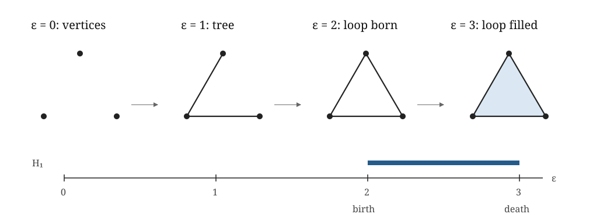
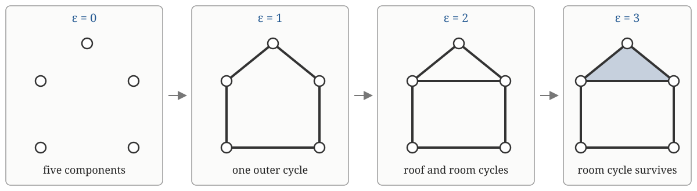

::: {.callout-tip title="Week 4 resources"}
[Slides](slides.qmd) · [Lecture walkthrough](solutions.ipynb) · [Application page](case-study.qmd)
:::

<a class="btn btn-primary" href="../../downloads/week-04-participant.ipynb" download="week-04-participant.ipynb">Download participant notebook</a>

::: {.callout-note title="Optional reading for this week"}
Edelsbrunner and Harer, Chapters VII.1–VII.2, develop persistent homology and
matrix reduction. Postol, Sections 5.1–5.3, gives a compact route through
persistence modules and barcodes. For the historical development, see
Edelsbrunner, Letscher and Zomorodian [@edelsbrunner2002persistence],
and Zomorodian and Carlsson [@zomorodian2005computing]. Diagram distances and
stability now belong to Week 6.
:::

::: {.foundation-definition}
**[Guiding definition for Weeks 1–4](../../index.qmd#the-guiding-construction-for-weeks-14).** For a filtration $K_a\subseteq K_b$ when $a\leq b$, persistent homology is the module
$$a\mapsto H_p(K_a;\mathbb F),\qquad (a\leq b)\mapsto(\iota_{a,b})_*.$$

::: {.foundation-steps}
::: {.foundation-step}
**1 · Representation**

Scientific object, observations and the topological question.
:::
::: {.foundation-step}
**2 · Homology**

$K_a$ and $H_p(K_a;\mathbb F)$.
:::
::: {.foundation-step}
**3 · Filtration**

$K_a\subseteq K_b$ across scale.
:::
::: {.foundation-step .is-active}
**4 · Memory**

Induced maps, module and barcode. Weeks 2 and 3 supplied the homology spaces
$H_p(K_a;\mathbb F)$ and nested complexes $K_a\subseteq K_b$. This week adds
the induced maps between those spaces: homology with memory, recording what
earlier classes become later, when they merge and when they become boundaries.
:::
:::
:::

## Learning goals

By the end of this week, you should be able to:

1. follow a homology class through a small filtration and distinguish inclusion of complexes from the induced linear map on homology;
2. explain the birth and death of a feature in terms of cycles, images and newly available boundaries;
3. distinguish the persistence module from its interval decomposition, barcode and persistence diagram when reading a technical account;
4. read a hand-worked or library-generated barcode using the stated scale convention and connect each interval to the underlying filtration; and
5. explain why persistence across a filtration is not automatically scientific importance.

## Why maps across scale are needed

[Week 3 used the A, B and C resolution example](../week-03/index.qmd#second-example-filter-by-resolution)
to motivate a nested family of complexes. We now ask a question that the
individual complexes cannot answer by themselves: which fine-scale class
became which intermediate or global class?

Betti numbers at separate scales report only the counts. They do not say which
fine components became which intermediate components, or whether a later loop
is the continuation of an earlier one. Inclusions provide that missing
relationship. Persistent homology applies homology to the inclusions and keeps
the resulting maps.

## Mathematics to introduce

For $i\leq j$, the inclusion $$\iota_{i,j}:K_i\hookrightarrow K_j$$
induces a linear map on homology:
$$(\iota_{i,j})_*:H_p(K_i;\mathbb F)\to H_p(K_j;\mathbb F).$$

Here “$K_j$ is larger” has a precise set-theoretic meaning: $K_i$ and
$K_j$ are collections of simplices, and every simplex belonging to
$K_i$ also belongs to $K_j$. The later complex may contain additional
vertices, edges, triangles or higher-dimensional simplices. An existing
simplex does not itself grow or acquire extra simplices inside it. For
example,

$$
K_i=\bigl\{\{0\},\{1\},\{2\},
\{0,1\},\{0,2\},\{1,2\}\bigr\}
$$

is the outline triangle, while

$$
K_j=K_i\cup\bigl\{\{0,1,2\}\bigr\}
$$

is the filled triangle. The inclusion $\iota_{i,j}$ sends every old
simplex to that same simplex in the larger collection. In this example
the vertex and edge sets are unchanged; only the triangular 2-simplex
has been added.

The intuition should be made explicit. Every simplex and chain in $K_i$
is also present in $K_j$. A cycle in $K_i$ can therefore be regarded as
the same chain in $K_j$, where it is still a cycle. If two cycles
differed by a boundary in $K_i$, they still differ by that boundary in
$K_j$, so the rule on homology classes is well defined.

::: {.object-check}
**◇ Object check.** There are three related maps. The complex inclusion
$\iota_{i,j}$ keeps each old simplex unchanged. It gives a chain map
$C_p(K_i;\mathbb F)\to C_p(K_j;\mathbb F)$ that keeps each old basis
simplex unchanged. This chain map then induces
$(\iota_{i,j})_*$ on equivalence classes in homology. Only the first two
maps are literal inclusions; the induced homology map need not be
injective.
:::

**▶ Likely sticking point.** The induced map on homology is not necessarily
an inclusion. The larger complex may contain a new higher-dimensional
chain that fills an old cycle. The old chain still exists, but its
homology class can map to zero.

For example, let $K_i$ be the outline triangle and $K_j$ the filled
triangle. The loop class is nonzero in $H_1(K_i)$, but
$$(\iota_{i,j})_*([z])=0\in H_1(K_j)$$ because $z$ has become the
boundary of the new two-simplex. This is the algebraic meaning of death.

::: {.applied-translation}
**Dynamical systems translation.** If the complexes are built from one state-space point cloud at increasing neighbourhood scales, $K_i\hookrightarrow K_j$ changes the resolution at which the same observations are represented. It does not describe the system evolving from physical time $i$ to physical time $j$. The death of the triangle's class says that nearby relations fill the loop at a coarser spatial scale; it does not say that a recurrent structure disappeared later in time. Week 7 introduces repeated persistence when physical evolution is the quantity being indexed.
:::

In $H_0$, let two components at scale $i$ have basis vectors $e_1,e_2$.
After they merge at scale $j$, both map to the same component $e$:
$$e_1\mapsto e,\qquad e_2\mapsto e.$$ Hence the difference $e_1-e_2$
maps to zero. This is the algebra beneath the merging-components picture
and the elder rule.

The persistent homology group from $i$ to $j$ is the image
$$\operatorname{im}\!\bigl(
H_p(K_i;\mathbb F)\xrightarrow{(\iota_{i,j})_*}H_p(K_j;\mathbb F)
\bigr),$$ and its dimension is the persistent Betti number.

In applied language, the image asks which directions in the earlier
homology space remain distinguishable at the later scale. This is more
information than comparing $\beta_p(K_i)$ with $\beta_p(K_j)$: equal
dimensions do not identify which classes survived.

The full $p$-dimensional persistence module is the entire collection
$$V_i=H_p(K_i;\mathbb F),\qquad
\varphi_{i,j}=(\iota_{i,j})_*,$$ with $$\varphi_{i,i}=\operatorname{id},
\qquad
\varphi_{j,k}\circ\varphi_{i,j}=\varphi_{i,k}.$$

**◇ Object check.**
A filtration is a functor from an ordered parameter set into simplicial
complexes. Homology is a functor from complexes to vector spaces. Their
composition is the persistence module:
$$(\mathbb R,\leq)\longrightarrow \mathbf{Simp}
\longrightarrow \mathbf{Vect}_{\mathbb F}.$$ The module is therefore not
just the complexes or their inclusions. It is the homology vector space
at every scale together with all compatible linear maps.

Here **functor** means a rule that preserves relationships: complexes are
sent to homology vector spaces, inclusions are sent to induced linear maps,
and compositions of inclusions are sent to compositions of linear maps.
No category-theory machinery beyond this principle is required.

### From a persistence module to intervals

For suitable finite or tame one-parameter persistence modules, there is
an interval decomposition $$V\cong \bigoplus_{\ell} I[b_\ell,d_\ell).$$
A single interval module is $$I[b,d)_a=
\begin{cases}
\mathbb F, & b\leq a<d,\\
0, & \text{otherwise},
\end{cases}$$ with identity maps while the feature is alive. Thus
$$\text{one interval module}=\text{one bar},$$ whereas the full
persistence module is generally a direct sum of many interval modules.
At any filtration value $a$, $\dim V_a$ is the number of bars crossing
$a$.

For the triangle filtration worked below, the $H_1$ module is

$$
V_\varepsilon=
\begin{cases}
0,&\varepsilon<2,\\
\mathbb F_2,&2\leq\varepsilon<3,\\
0,&\varepsilon\geq3.
\end{cases}
$$

The maps between nonzero vector spaces for $2\leq\varepsilon<3$ are
identities. This module is exactly the interval module $I[2,3)$, so its
barcode contains the single bar $[2,3)$. A general barcode repeats this
same idea after the full module has been decomposed into many interval
summands.

**† Qualification.**
The barcode does not replace the persistence module by definition. It
records its interval decomposition in the especially well-behaved
one-parameter setting. The finiteness or tameness assumptions are what
make this clean classification possible.

For a finite filtration over a field, the computation can be organised
as a reduction of one boundary matrix whose columns follow a
face-compatible filtration order. A reduced nonzero column pairs the
simplex indexed by its lowest 1 with the later simplex indexed by the
column. The first simplex triggers a birth; the later simplex records its
death. Empty reduced columns create classes, including classes that may
remain unpaired [@edelsbrunner2010computational, Chapter VII].

::: {.sticking-point}
**▶ Likely sticking point.** The algorithm pairs simplices that mark
algebraic events. A birth simplex is not itself the homology class, and a
death simplex is not the geometric hole. The class is represented by a
cycle assembled from simplices.
:::

### One triangle from filtration to barcode

::: {.callout-note title="Worked example: the complete triangle calculation"}
Use coefficients in $\mathbb F_2$ and the filtration values

$$
f(v_0)=f(v_1)=f(v_2)=0,\qquad
f(e_{01})=f(e_{02})=1,\qquad
f(e_{12})=2,\qquad f(t_{012})=3.
$$

The parameter is the filtration value $\varepsilon$. The complex
$K_\varepsilon$ contains every simplex whose value is at most
$\varepsilon$.

{fig-alt="Four filtration stages are labelled epsilon zero through epsilon three. Vertices appear at zero, a tree at one, a triangle loop at two and a filled triangle at three. An H1 barcode runs from epsilon two to epsilon three."}

| $\varepsilon$ | Simplices entering | $K_\varepsilon$ and boundary information | Homological event |
|---:|---|---|---|
| $0$ | $v_0,v_1,v_2$ | Three isolated vertices; each has zero boundary. | Three $H_0$ classes are born. |
| $1$ | $e_{01},e_{02}$ | The two edges form a connected tree. | Two $H_0$ classes merge into the surviving component. |
| $2$ | $e_{12}$ | Its endpoints were already connected; $z=e_{01}+e_{02}+e_{12}$ has zero boundary. | The class $[z]\in H_1$ is born. |
| $3$ | $t_{012}$ | $\partial t_{012}=z$. | The same $H_1$ class becomes a boundary and dies. |

Choose the face-compatible column and row order

$$
(v_0,v_1,v_2,e_{01},e_{02},e_{12},t_{012}).
$$

The complete filtered boundary matrix has a row and column for every
simplex. Over $\mathbb F_2$, it is

$$
D=
\begin{array}{c|ccccccc}
 &v_0&v_1&v_2&e_{01}&e_{02}&e_{12}&t_{012}\\\hline
v_0     &0&0&0&1&1&0&0\\
v_1     &0&0&0&1&0&1&0\\
v_2     &0&0&0&0&1&1&0\\
e_{01}  &0&0&0&0&0&0&1\\
e_{02}  &0&0&0&0&0&0&1\\
e_{12}  &0&0&0&0&0&0&1\\
t_{012} &0&0&0&0&0&0&0
\end{array}.
$$

The first three columns are zero, so the three vertices create $H_0$
classes. Let $D_j$ denote column $j$ in the displayed order. The two
tree edges have

$$
D_4=v_0+v_1,\qquad D_5=v_0+v_2.
$$

Their pivots pair two vertex births with $e_{01}$ and $e_{02}$. For the
last edge,

$$
D_6=v_1+v_2,\qquad
D_6+D_5+D_4=0.
$$

The reduced column is zero because the endpoints were already joined by
the path $e_{01}+e_{02}$. This zero column creates the $H_1$ class
represented by

$$
z=e_{01}+e_{02}+e_{12},\qquad \partial z=0.
$$

Finally,

$$
D_7=e_{01}+e_{02}+e_{12}=z.
$$

Its lowest nonzero row is the row of $e_{12}$, so the reduction pairs
the birth simplex $e_{12}$ at $\varepsilon=2$ with the death simplex
$t_{012}$ at $\varepsilon=3$. The resulting intervals are

$$
\mathcal B_0=\bigl\{[0,\infty),[0,1),[0,1)\bigr\},
\qquad
\mathcal B_1=\bigl\{[2,3)\bigr\}.
$$

Here $\mathcal B_p$ denotes the barcode as a multiset of intervals. Repeated
intervals are retained because they represent distinct homology classes.

Because the three vertices and the two tree edges enter in ties, the
particular component representative that survives depends on the
face-compatible order chosen inside each tie. The multiset of displayed
intervals does not.
:::

### Return to the house: persistent homology through a richer filtration

::: {.callout-note title="Worked example: the house filtration"}
Return to the [Week 2 house calculation](../week-02/index.qmd#cycles-boundaries-and-homology-in-the-house),
using the same vertices, edges, face and coefficients in $\mathbb F_2$. Define

$$
K_0=\{A,B,C,D,E\},
$$

then add all five outer edges at $\varepsilon=1$, the roof-base edge $w=EB$
at $\varepsilon=2$, and the filled roof $t=[A,B,E]$ at $\varepsilon=3$:

$$
K_0\subset K_1\subset K_2\subset K_3.
$$

{fig-alt="Four stages show house vertices, the outer house outline, the outline with a roof-base diagonal, and the final complex with its triangular roof filled."}

The homology events are:

| $\varepsilon$ | New simplices | $\beta_0$ | $\beta_1$ | Interpretation |
|---:|---|---:|---:|---|
| 0 | five vertices | 5 | 0 | Five component classes are born. |
| 1 | $x,y,z,u,v$ | 1 | 1 | The graph becomes connected and the outer house cycle is born. |
| 2 | $w$ | 1 | 2 | The diagonal splits the visible cycle space into roof and room directions. |
| 3 | $t$ | 1 | 1 | The roof direction becomes a boundary; the room direction remains. |

The dimensions in the table come from the same boundary algebra used in Week
2. At $K_1$, use the edge basis $(x,y,z,u,v)$. The boundary matrix is

$$
[\partial_1^{K_1}]=
\begin{array}{c|ccccc}
 &x&y&z&u&v\\\hline
A&1&0&0&0&1\\
B&1&1&0&0&0\\
C&0&1&1&0&0\\
D&0&0&1&1&0\\
E&0&0&0&1&1
\end{array}.
$$

It has rank 4 and

$$
\ker\partial_1^{K_1}
=\operatorname{span}\{c\},
\qquad c=x+y+z+u+v.
$$

At $K_2$, the new column for $w=EB$ gives the complete matrix

$$
[\partial_1^{K_2}]=
\begin{array}{c|cccccc}
 &x&y&z&u&v&w\\\hline
A&1&0&0&0&1&0\\
B&1&1&0&0&0&1\\
C&0&1&1&0&0&0\\
D&0&0&1&1&0&0\\
E&0&0&0&1&1&1
\end{array}.
$$

Its rank is still 4, so rank-nullity gives
$\dim\ker\partial_1^{K_2}=6-4=2$. A basis is

$$
r=x+v+w,\qquad q=y+z+u+w.
$$

At $K_3$, the edge matrix is unchanged and the face introduces

$$
[\partial_2^{K_3}]_{(x,y,z,u,v,w)}
=
\begin{pmatrix}1\\0\\0\\0\\1\\1\end{pmatrix},
$$

whose image is $\operatorname{span}\{r\}$. Therefore

$$
H_1(K_1)=\operatorname{span}\{[c]\},
$$

$$
H_1(K_2)=\operatorname{span}\{[r],[q]\},
$$

and

$$
H_1(K_3)
=\frac{\operatorname{span}\{r,q\}}
{\operatorname{span}\{r\}}
=\operatorname{span}\{[q]\}.
$$

Over $\mathbb F_2$,

$$
c=r+q.
$$

Therefore the inclusion-induced map does not merely compare dimensions. It
records

$$
(\iota_{1,2})_*([c])=[r+q].
$$

When the face enters, $\partial_2(t)=r$, so $[r]=0$ in $H_1(K_3)$. Hence

$$
(\iota_{2,3})_*([r])=0,\qquad
(\iota_{2,3})_*([q])=[q],
$$

and, by composition,

$$
(\iota_{1,3})_*([c])
=(\iota_{2,3})_*([r+q])=[q].
$$

The class born as the outer house loop survives, but its convenient geometric
representative changes to the square room after the roof is filled. A second
class born when $w$ enters dies when $t$ enters. One compatible interval
description is therefore

$$
\mathcal B_1=\bigl\{[1,\infty),[2,3)\bigr\}.
$$

This example shows why persistent homology needs maps rather than a sequence of
Betti numbers. The dimensions $1,2,1$ do not by themselves reveal that the
original class survives from $K_1$ to $K_3$.
:::

> *A persistence diagram is not just a picture of holes. It is a
> compressed record of how homology classes survive through a
> filtration.*

## What happens after the barcode?

Week 4 stops once the persistence module and its interval or diagram summary
are understood. Comparing two diagrams, defining bottleneck and Wasserstein
distances, and asking whether diagrams are stable under perturbation begin a
different argument. They are developed together in [Week 6: summaries,
comparisons and validation](../week-06/index.qmd#direct-diagram-distances).

For now, retain one boundary: a barcode represents the lifetimes encoded by a
one-parameter persistence module. It does not yet say whether two outputs are
close, statistically unusual or scientifically important.

## From hand calculation to software

The [lecture walkthrough](solutions.ipynb) completes the outline-to-filled
triangle map, the $H_0$ component-merging map and a small interval-module
calculation before calling `ripser`. The [participant
practical](lab.ipynb) uses the same sequence but pauses for predictions,
matrix completion and interpretation. The interval-module language needed
by both notebooks was introduced above in [From a persistence module to
intervals](#from-a-persistence-module-to-intervals); it was not assumed in
an earlier week.

Both notebooks then use `ripser` on deterministic synthetic point clouds.
The library call is deliberately last: its diagram should be read as the
output of

$$
\text{point cloud}\to\text{Rips filtration}\to
\text{persistence module}\to\text{interval summary}.
$$

The library reports pairwise-distance thresholds, matching the
$\varepsilon$ convention rather than the ball-radius $r$ convention used
in Week 3. Thus $\varepsilon=2r$. This changes numerical coordinates,
although not the nested sequence after reparameterisation.

## Examples

::: {.callout-note title="Example: two components merge through a map"}
Immediately before an edge joins two components, take

$$
H_0(K_-;\mathbb F_2)
=\operatorname{span}\{e_1,e_2\}
\cong\mathbb F_2^2.
$$

Immediately afterwards there is one component,

$$
H_0(K_+;\mathbb F_2)
=\operatorname{span}\{e\}
\cong\mathbb F_2.
$$

Both earlier component classes map to the later class:

$$
e_1\mapsto e,\qquad e_2\mapsto e,\qquad
[\,1\ \ 1\,]
\begin{pmatrix}a\\b\end{pmatrix}=a+b.
$$

Over $\mathbb F_2$, the kernel is
$\operatorname{span}\{(1,1)^T\}$. Pointwise Betti numbers say only that
$\beta_0$ changes from 2 to 1. The linear map explains which two earlier
directions become indistinguishable.
:::

::: {.callout-note title="Example: read a module from three intervals"}
Let

$$
V=I[0,4)\oplus I[1,3)\oplus I[2,5).
$$

At $\varepsilon=0.5$, only the first summand is alive, so
$V_{0.5}\cong\mathbb F$. At $\varepsilon=2.5$, all three are alive, so
$V_{2.5}\cong\mathbb F^3$. At $\varepsilon=4.5$, only $I[2,5)$ remains,
so $V_{4.5}\cong\mathbb F$. The map from $2.5$ to $4.5$ keeps the third
coordinate and sends the first two to zero. A vertical slice through a
barcode therefore gives the vector-space dimension at that parameter,
while the intervals determine the maps between slices.
:::

::: {.callout-note title="Example: deterministic noisy circle versus filled disk"}
The notebooks generate 90 observations in each data set using random seed
3024. The circle observations are equally spaced angles on the unit
circle with independent Gaussian coordinate noise of standard deviation
0.035. The disk observations use radius $\sqrt U$ with
$U\sim\operatorname{Uniform}(0,1)$ and a uniform angle, producing uniform
area density in the unit disk.

For each point cloud, the notebooks construct a Vietoris–Rips filtration
and compute $H_1$ over $\mathbb F_2$. Before computing, the relevant
prediction is that the circle construction should support a loop over a
wider range of pairwise-distance thresholds, whereas interior disk
points should provide fillings sooner. The calculation then compares the
longest finite $H_1$ interval with the radial coefficient of variation.

This is a controlled teaching comparison, not evidence that persistence
is uniquely necessary. The radial baseline already separates these
deliberately simple synthetic data sets. The useful question is whether
the topological summary remains informative in a later example where a
simpler geometric statistic does not already settle the comparison.
:::

## Applied relevance

The DP use is initially diagnostic. Rather than asking whether a
topological feature exists at one threshold, ask whether it persists
across a meaningful range of scales. Candidate interpretations might
involve fragmentation, recurrence, circulation, communication pathways
or collective organisation. At this point, the right question is still
modest: does static persistence add information beyond simpler metrics?

The algebraic sequence and matrix reduction follow Edelsbrunner and
Harer [@edelsbrunner2010computational, Chapter VII]. Postol provides a
complementary introduction to persistent groups, barcodes and diagrams
[@postol2024algebraic, Chapter 5].
