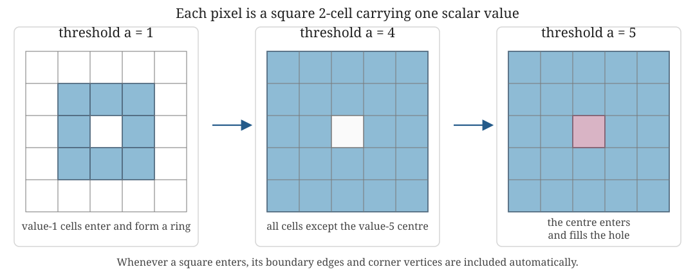

::: {.callout-tip title="Week 5 resources"}
[Slides](slides.qmd) · [Lecture walkthrough](solutions.ipynb) · [Application page](case-study.qmd)
:::

<a class="btn btn-primary" href="../../downloads/week-05-participant.ipynb" download="week-05-participant.ipynb">Download participant notebook</a>

::: {.callout-note title="Optional reading for this week"}
The two guiding books remain background rather than weekly companions. For
point-cloud constructions and their geometric guarantees, see Chazal, de
Silva and Oudot [@chazal2014geometric]. The practical implementation follows
the [GUDHI documentation](https://gudhi.inria.fr/python/latest/) for Rips,
simplex-tree and cubical constructions.
:::

::: {.foundation-definition}
**Where this week sits.** The first four weeks explained the route
$K_a\mapsto H_p(K_a;\mathbb F)$ and the maps across $a$. Week 5 now asks how
the observed data type determines a defensible filtered construction. The data
object comes first; the complex follows.
:::

## Learning goals

By the end of this week, you should be able to:

1. begin with the observed data type and explain why a point cloud, weighted graph or scalar field leads naturally to a different filtered construction;
2. read point-cloud, graph and cubical persistence workflows and identify what mathematical object each software step creates;
3. predict how maximum dimension, filtration range and sparsification affect both the question and the computational burden;
4. use a small computation to check that the software output agrees with the intended construction; and
5. distinguish testing sensitivity to a modelling choice from silently changing the scientific question.

## What Week 5 adds

Weeks 2–4 kept the examples small enough that every simplex, matrix column and
homology event could be inspected by hand. That established what the
calculation means. Week 5 asks a different question:

> *How do we turn an actual stored data object into the intended filtered
> complex, run the computation without hiding its assumptions, and decide
> whether the output is trustworthy enough to interpret?*

This is the first **end-to-end implementation week**. The new content is not a
new homology definition. It is the practical layer between the mathematical
definition and a defensible analysis:

1. inspect the data representation and units;
2. choose a construction compatible with that representation;
3. translate mathematical parameters into library arguments;
4. budget dimension, threshold, runtime and memory;
5. inspect the constructed object before trusting its persistence output;
6. compare one controlled change at a time; and
7. report enough information for another analyst to reproduce the result.

::: {.applied-translation}
**Dynamical systems interpretation.** “Static” describes the object supplied
to this calculation, not necessarily the scientific system. It may be one
state-space cloud, one delay embedding, one interaction network, one spatial
field or one time window. Static persistence is the inspectable baseline that
should work before a more elaborate time-varying method is justified.
:::

## Method map

The starting representation constrains the sensible constructions. The table
is a routing guide, not a claim that each row has one uniquely correct method.

| Starting data object | What is already known? | Core Week 5 construction | Filtration parameter means | First question to audit |
|---|---|---|---|---|
| Point cloud with coordinates | Locations and a chosen coordinate system | Vietoris–Rips complex | Pairwise-distance threshold | Is the metric meaningful after units, periodicity and scaling are considered? |
| Distance or dissimilarity matrix | Pairwise closeness, but possibly no coordinates | Vietoris–Rips complex | Supplied pairwise dissimilarity | Is the matrix a genuine metric, and does the software require one? |
| Weighted graph | Specified vertices, edges and activation weights | Graph filtration, optionally expanded to a clique complex | Edge-entry weight | Does clique filling represent justified higher-order relations? |
| Image, volume or scalar grid | Values attached to pixels, voxels or grid cells | Cubical sublevel filtration | Cell value | Do low values or high values represent the structures of interest? |
| Values on vertices of a supplied complex | A complex plus a scalar at each vertex | Lower-star filtration | Maximum vertex value on a simplex | What does the scalar measure, and why should low values enter first? |

Alpha, witness, sparse Rips, chromatic and other constructions remain available
when geometry, scale or labels require them. The
[Interlude method-choice table](../../design-decisions/index.qmd#design-decisions-already-in-play)
is the broader menu; Week 5 practises three core routes deeply enough to audit
their software implementations.

## The practical workflow

For every route in the notebook, use the same audit sequence:

| Stage | Question | Evidence to record |
|---:|---|---|
| 1. Inspect | What object is actually stored? | Shape, units, missingness, ranges and a direct plot |
| 2. Predict | What should appear before computation? | Expected components or loops and an approximate parameter range |
| 3. Construct | What filtered object did the library create? | Complex type, filtration convention, simplex or cell counts |
| 4. Compute | What algebra was requested? | Coefficient field, maximum homology degree and threshold |
| 5. Check | Does a small visible case agree with hand reasoning? | One inspected simplex, filtration value or interval |
| 6. Compare | What single decision changes? | Fixed quantities, changed quantity and predicted consequence |
| 7. Interpret | What claim survives the checks? | Result, limitation and simpler baseline |

## Computational cautions

Rips complexes grow quickly. For an $N$-point cloud, the Vietoris–Rips
filtration contains $O(N^2)$ edges, $O(N^3)$ triangles, $O(N^4)$
tetrahedra and so on. Even when truncating at dimension 2, the size can
scale like $O(N^3)$. This is why the choice of maximum dimension,
maximum filtration value and sparsification strategy is not merely
technical.

More precisely, a Rips complex can contain as many as
$\binom{N}{k+1}$ simplices in dimension $k$. Homology in dimension $p$ depends
on two boundary maps,

$$
C_{p+1}\xrightarrow{\partial_{p+1}}C_p
\xrightarrow{\partial_p}C_{p-1},
$$

so the complex must normally be constructed through dimension $p+1$:

| Homology requested | Structures being detected | Highest simplices needed to decide whether they are filled | Worst-case count of those simplices |
|---|---|---|---:|
| $H_0$ | connected components | edges | $\binom N2$ |
| $H_1$ | edge cycles or loops | triangles | $\binom N3$ |
| $H_2$ | closed triangular surfaces or cavities | tetrahedra | $\binom N4$ |
| $H_p$ | $p$-cycles | $(p+1)$-simplices | $\binom N{p+2}$ |

This is the central dimensional cost. Moving from $H_1$ to $H_2$ does not
merely add another row to the output: it can replace a triangle-scale
construction with a tetrahedron-scale one. The boundary matrix
$[\partial_{p+1}]$ has one column for every $(p+1)$-simplex and one row for
every $p$-simplex. Storing and reducing that matrix can dominate both memory
and runtime even when the final barcode contains only a few intervals.

::: {.sticking-point}
**▶ Likely sticking point.** Setting `max_dimension=1` is not generally enough
to compute correct $H_1$. It retains the graph cycles but omits triangles, the
2-simplices that can make those cycles boundaries. An omitted triangle can
turn a class that should die into an apparently essential class. Conversely,
constructing dimensions above $p+1$ cannot change $H_p$ and wastes resources.
:::

The ambient coordinate dimension and homological dimension are different. A
point cloud in $\mathbb R^{20}$ may still be analysed only in $H_0$ and $H_1$;
requesting $H_{20}$ is neither automatic nor usually feasible. Report the
largest homology degree requested, the largest simplex dimension constructed
and the reason for both.

## One implementation pattern, three data types

::: {.callout-tip title="Compare the three workflows"}
The [lecture walkthrough](solutions.ipynb) narrates how a point cloud, weighted graph and scalar grid become different filtered objects. The [participant practical](lab.ipynb) lets you vary one modelling choice in each workflow and explain whether the scientific question has changed.
:::

The Week 5 notebooks use GUDHI throughout. A Rips complex represents a
metric point cloud, a simplex tree stores a weighted graph and optionally
expands its cliques, and a cubical complex represents a gridded field.
Using one stack makes the object changes easier to see. It does not imply
that one library or complex is best for every application.

A lower-star filtration begins with values on vertices and assigns a simplex
the maximum value of its vertices. In the cubical practical, GUDHI instead
receives values on top-dimensional grid cells: pixels in two dimensions or
voxels in three. Each pixel is treated as a filled square 2-cell, not merely as
a plotted dot. When a square enters, its four boundary edges and four corner
vertices are included automatically.

:::: {.worked-example}
### Worked example: read a cubical sublevel filtration

{fig-alt="At threshold one, low-valued square cells form a ring. At threshold four, every square except the high-valued centre is included. At threshold five, the centre enters and fills the hole."}

The filtration contains every cell whose value is at most $a$:

- at $a=1$, the value-1 pixels form a ring and an $H_1$ class is present;
- at $a=4$, more squares enter but the value-5 centre is still absent, so the
  opening remains; and
- at $a=5$, the central square enters and fills the opening, so the class dies.

The birth and death coordinates are therefore scalar-field values. They are
not Euclidean distances. Negating the field would reveal high-valued regions
first, changing the scientific question rather than merely changing a software
setting.
::::

| Observed representation | Constructed object | Filtration meaning | Controlled comparison |
|---|---|---|---|
| Point cloud | Rips complex | Pairwise-distance threshold | Subsampling |
| Weighted graph | Graph or clique complex | Edge activation weight | Clique filling off/on |
| Scalar grid | Cubical complex | Cell value | Field versus negated field |

::: {.sticking-point}
**▶ Likely sticking point.** Negating a field or filling graph cliques is
not merely a robustness setting. It changes what birth and death mean.
:::

## Implementation clinics

::: {.callout-note title="Choose one clinic first"}
The three clinics are alternative routes for different data types, not three
new theories to master in one sitting. Work through the clinic closest to your
data in full. Use the other two to compare how the observed object changes the
appropriate representation.
:::

:::: {.worked-example}
### Implementation clinic 1: state cloud

**Starting object.** Seventy sampled states form a noisy annular point cloud.

**Choice.** Use Euclidean distance and a Rips pairwise threshold, construct
through dimension 2 to compute $H_1$, and stop at threshold 1.8.

**Prediction.** Short edges connect neighbouring samples into a loop. At a
larger threshold, Rips triangles should eventually fill it.

**Software audit.** Record the 70 observations, total simplex count, maximum
simplex dimension, coefficient field and the fact that GUDHI's parameter is a
pairwise-distance threshold rather than a ball radius.

**Controlled comparison.** Retain every other observation and repeat the same
pipeline. This tests sampling sensitivity while holding representation,
metric and construction fixed. It does not test a different notion of
closeness.
::::

:::: {.worked-example}
### Implementation clinic 2: weighted interaction graph

**Starting object.** Five vertices have weighted edges

$$
01:0.30,\quad12:0.40,\quad02:0.45,
\quad23:0.70,\quad34:0.80,\quad24:0.85.
$$

The filtration contains all edges with weight at most $a$.

**Graph-only prediction.** At $a=0.45$, edge $02$ closes the cycle
$0\!-!1\!-!2\!-!0$. At $a=0.85$, edge $24$ closes the second cycle
$2\!-!3\!-!4\!-!2$. With no 2-simplices available, both graph cycles remain
unfilled. GUDHI reports $H_1$ intervals $[0.45,\infty)$ and
$[0.85,\infty)$.

**Clique-complex prediction.** Expanding cliques adds triangle $[0,1,2]$ at
0.45 and triangle $[2,3,4]$ at 0.85. Each face enters at the same value as its
last edge and immediately makes the corresponding edge cycle a boundary.
There are therefore no positive-length $H_1$ intervals.

**Choice exposed.** The vertices, weighted edges and thresholds did not
change. Only the assertion “every three-clique is a filled 2-simplex” changed.
This is a representation comparison, not numerical robustness testing.
::::

:::: {.worked-example}
### Implementation clinic 3: scalar field

**Starting object.** On a $45\times45$ grid, the notebook evaluates

$$
f(x,y)=\bigl(x^2+y^2-1\bigr)^2.
$$

Values are smallest near the unit circle, equal to 1 at the origin and larger
far from the circle.

**Construction.** Treat every array entry as a filled square carrying its
field value and use a cubical sublevel filtration. Low-valued squares near the
unit circle enter first.

**Prediction.** The early squares form an annular band, creating an $H_1$
class. The centre remains absent until the threshold approaches
$f(0,0)=1$, when it fills the opening.

**Computed check.** At this grid resolution, the main interval is
approximately $[0.0055,1.0000)$. The small nonzero birth reflects the fact that
the discrete grid does not sample the unit circle exactly. Its death agrees
with the central field value.

**Choice exposed.** Repeating the calculation on $-f$ includes the original
high-valued regions first. That is a superlevel analysis of $f$ and answers a
different question; it is not a harmless sign convention or sensitivity
check.
::::

## Minimum computational report

For any practical result, record:

- the starting data object, dimensions, units and preprocessing;
- the metric or scalar-field convention;
- the complex and filtration definition;
- whether the parameter is a ball radius, pairwise threshold, edge weight or
  cell value;
- coefficient field and requested homology dimensions;
- maximum filtration value, truncation and sparsification;
- observation, simplex or cell counts;
- software and version; and
- runtime, memory failures and any censored infinite intervals.

A barcode without this information cannot be reconstructed as an analysis
pipeline.
