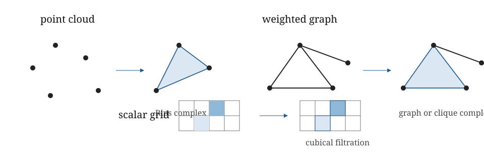

::: {.callout-tip title="Week 5 resources"}
[Slides](slides.qmd) · [Lecture walkthrough](solutions.ipynb) · [Application page](case-study.qmd)
:::

<a class="btn btn-primary" href="../../downloads/week-05-participant.ipynb" download="week-05-participant.ipynb">Download participant notebook</a>

## Learning goals

By the end of this week, you should be able to:

1. begin with the observed data type and explain why a point cloud, weighted graph or scalar field leads naturally to a different filtered construction;
2. read point-cloud, graph and cubical persistence workflows and identify what mathematical object each software step creates;
3. predict how maximum dimension, filtration range and sparsification affect both the question and the computational burden;
4. use a small computation to check that the software output agrees with the intended construction; and
5. distinguish testing sensitivity to a modelling choice from silently changing the scientific question.

## Story

Week 5 is the first practical week. The aim is not just to compute
persistence, but to choose a construction appropriate to the data
object. The data object comes first; the complex follows.

## Method map

- Point cloud with coordinates: Rips complexes in the core practical; alpha complexes are an optional computational-geometry extension.

- Pairwise distances only: Vietoris–Rips complexes.

- Image, volume or gridded scalar field: cubical complexes or lower-star
  filtrations.

- Weighted graph: graph filtration or clique complex.

- Large point cloud: sparse Rips or witness constructions.

- Labelled or coloured point cloud: chromatic or relative-style
  constructions.

{fig-alt="A point cloud maps to a Rips complex, a weighted graph maps to a graph or clique complex, and a scalar grid maps to a cubical filtration."}

## Computational cautions

Rips complexes grow quickly. For an $N$-point cloud, the Vietoris–Rips
filtration contains $O(N^2)$ edges, $O(N^3)$ triangles, $O(N^4)$
tetrahedra and so on. Even when truncating at dimension 2, the size can
scale like $O(N^3)$. This is why the choice of maximum dimension,
maximum filtration value and sparsification strategy is not merely
technical.

## One implementation pattern, three data types

::: {.callout-tip title="Compare the three workflows"}
The [lecture walkthrough](solutions.ipynb) narrates how a point cloud, weighted graph and scalar grid become different filtered objects. The [participant practical](lab.ipynb) lets you vary one modelling choice in each workflow and explain whether the scientific question has changed.
:::

The Week 5 notebooks use GUDHI throughout. A Rips complex represents a
metric point cloud, a simplex tree stores a weighted graph and optionally
expands its cliques, and a cubical complex represents a gridded field.
Using one stack makes the object changes easier to see. It does not imply
that one library or complex is best for every application.

A lower-star filtration begins with values on vertices and assigns a
simplex the maximum value of its vertices. In the cubical practical,
GUDHI instead receives values on top-dimensional grid cells. The software
constructs the associated cubical filtration using its cell-value
convention. These are distinct inputs, even when both are used to study
sublevel topology. Always report where the scalar values live: vertices,
pixels, voxels or top-dimensional cells.

| Observed representation | Constructed object | Filtration meaning | Controlled comparison |
|---|---|---|---|
| Point cloud | Rips complex | Pairwise-distance threshold | Subsampling |
| Weighted graph | Graph or clique complex | Edge activation weight | Clique filling off/on |
| Scalar grid | Cubical complex | Cell value | Field versus negated field |

::: {.sticking-point}
**▶ Likely sticking point.** Negating a field or filling graph cliques is
not merely a robustness setting. It changes what birth and death mean.
:::

## Examples

Use a noisy circle versus noisy disk as a sanity check. Use an annulus
with uneven sampling to show that persistence is not immune to sampling
effects. Use a greyscale image to introduce lower-star or cubical
persistence. Use a small weighted graph to ask whether pairwise cycles
or clique-complex holes are the object of interest.

## DP relevance

Static persistence is not claiming that a dynamical system is static. It
freezes one representation: a time window, a state cloud, a snapshot, an
interaction graph or a scalar field. This is the lowest-risk baseline.
If a single topological snapshot cannot distinguish regimes or
performance-relevant states, then more sophisticated dynamic topology
needs stronger justification.
