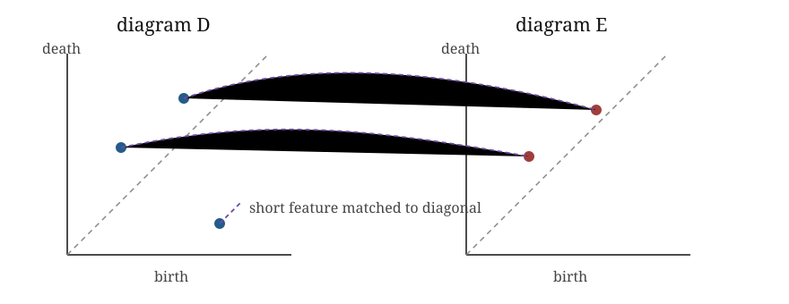

::: {.callout-tip title="Week 6 resources"}
[Slides](slides.qmd) · [Lecture walkthrough](solutions.ipynb) · [Application page](case-study.qmd)
:::

<a class="btn btn-primary" href="../../downloads/week-06-participant.ipynb" download="week-06-participant.ipynb">Download participant notebook</a>

## Learning goals

By the end of this week, you should be able to:

1. explain the different questions answered by bottleneck distance, Wasserstein distance, Betti curves and vectorised persistence summaries;
2. inspect a comparison or summary used in a paper and state what information from the original diagrams it retains and forgets;
3. choose a summary because it matches the scientific comparison, not merely because it is convenient for software or machine learning;
4. interpret an observed topological statistic relative to an explicit null or surrogate mechanism; and
5. compare the topological result with a simpler non-topological baseline before claiming added value.

## Story

Once diagrams exist, the next modelling choice is how to use them. A
diagram can be compared directly, summarised by a scalar, converted into
a function, turned into an image, or used as input to statistics and
machine learning. These choices preserve and discard different
information.

## Objects to introduce

- Bottleneck distance: worst matched feature.

- Wasserstein distance: accumulated matching cost.

- Betti curves: Betti numbers as functions of filtration scale.

- Persistence landscapes: functional summaries in a vector space.

- Persistence images: stable vector summaries for machine learning.

- Persistence entropy, total persistence, maximum persistence and
  thresholded counts.

The core practical develops bottleneck distance, Wasserstein distance,
Betti curves, one persistence image and maximum persistence. Landscapes,
entropy and additional scalar summaries are optional extensions. They
should not be treated as interchangeable merely because all have fixed-size
representations.

### A two-point matching by hand

::: {.callout-tip title="Compare summaries, not just outputs"}
Use the [lecture walkthrough](solutions.ipynb) to follow the hand matching before software computes a distance. The [participant practical](lab.ipynb) then compares diagram distances, Betti curves and a persistence image, with prompts to identify what each summary forgets.
:::

Let

$$D=\{(0,2),(1,1.4)\},\qquad E=\{(0.1,2.1)\}.$$

Using the $L_\infty$ ground metric, matching the long intervals costs
$0.1$. The short point $(1,1.4)$ can be matched to the diagonal. Its
distance to the diagonal is half its persistence:

$$\frac{1.4-1}{2}=0.2.$$

The bottleneck cost of this matching is the worst individual cost,
$\max(0.1,0.2)=0.2$. A Wasserstein cost aggregates the individual costs,
so it responds to the accumulation of many modest differences. The
optimisation searches over all admissible matchings, including diagonal
matches. The diagram metric, ground metric, Wasserstein order and treatment
of essential classes must be stated.

{fig-alt="Two persistence diagrams are shown side by side. Two long-lived features are matched across diagrams, while a short-lived point is matched to the diagonal."}

**† Qualification.**
These objects compare or vectorise persistence diagrams. They do not, by
themselves, recover the maps between persistence modules or establish
the identity of a feature through external time.

> *Stable does not mean automatically interpretable, and vectorised does
> not mean scientifically meaningful.*

## Examples

Use two diagrams with the same longest bar but different clouds of
shorter bars to show why single statistics can be misleading. Use a
real-versus-shuffled comparison to show that the question is not “is
there a barcode?” but “does this barcode differ from what this
construction would produce anyway?”

## Validation protocol

1. State the statistic before generating surrogates.
2. State which properties the surrogate preserves and destroys.
3. Generate the null distribution through the complete pipeline.
4. Compare with a simpler non-topological statistic.
5. Repeat under at least one upstream modelling choice.

The notebook uses coordinate shuffling only as a transparent teaching
null. It preserves separate coordinate marginals while destroying their
pairing. It is not automatically appropriate for trajectories, spatial
dependence or exchangeable agents.

::: {.applied-translation}
**Dynamical systems translation.** For a scalar trajectory, independently shuffling samples destroys temporal dependence as well as any reconstructed geometry. If the scientific null is “a linear stochastic process with this spectrum”, a phase-randomised surrogate may be more appropriate because it retains the power spectrum while disrupting selected nonlinear phase relations. If the marginal distribution must also be retained, an amplitude-adjusted Fourier surrogate may be considered. These are examples, not defaults: the appropriate surrogate is determined by the dynamical claim and by exactly which structure should survive the randomisation.
:::

::: {.qualification}
**† Qualification.** An empirical exceedance proportion becomes a valid
inferential quantity only under a justified randomisation or sampling
scheme. Producing many surrogate barcodes does not supply that
justification.
:::

## DP relevance

This week asks whether topology adds explanatory or predictive value
beyond simpler baselines. Reasonable first summaries include maximum
persistence, total persistence, Betti curves, persistence entropy,
diagram distances to a baseline and vectorised persistence images or
landscapes. Vineyards are only justified if the identity or trajectory
of features matters, not merely their distribution at each time or
parameter value.
