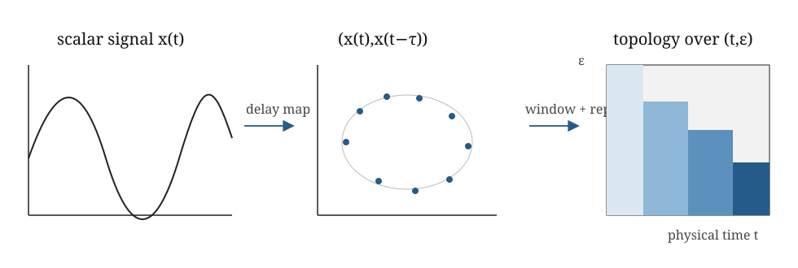

## The decision for today

What object are we constructing, what information does it retain, and what scientific claim could it support?

[Lecture walkthrough](solutions.ipynb)

---

## Where Week 7 sits

Week 7 distinguishes three constructions: repeated persistence through
physical time, sliding-window persistence for periodicity, and a genuine
two-parameter bifiltration.

---

## What are the time-indexed objects?

| Symbol | Object at time $t$ |
|---|---|
| $X_t$ | point cloud |
| $G_t$ | graph |
| $I_t$ | image or scalar field |
| $W_t$ | sliding-window point cloud |
| $K_{\bullet,t}$ | filtration across scale at fixed $t$ |

The notation says when each object was observed. It does not create maps
between consecutive objects.

---

## Mathematics and summaries

This is not genuinely dynamic topology in the strongest sense because no
method has identified a specific feature across time. It is repeated
static persistence.

**◇ Object check.**
At each time $t$, there may be a complete ordinary persistence module
$V_t$ and its diagram $D_t$. What is absent is a coherent family of maps
connecting $V_s$ to $V_t$. A time series of diagrams is therefore not
yet a vineyard module.

---

## A scalar time series is not yet a point cloud

$$\Phi_{m,\tau}(t)=\bigl(x(t),x(t-\tau),\ldots,x(t-(m-1)\tau)\bigr).$$

Choose lag, dimension, sampling and window length.

Point-cloud persistence does not retain temporal order by itself.

{fig-alt="Signal to delay-coordinate cloud to time-and-scale topological summary." height="210"}

---

## Two axes, two meanings

Physical time $t$: when the system is observed.

Filtration scale $\varepsilon$: threshold inside one static computation.

$$C_p(t,\varepsilon)=\#\{(b,d)\in D_t^{(p)}:b\leq\varepsilon<d\}.$$

---

## What a CROCKER-style plot says

**CROCKER:** Contour Realization Of Computed $k$-dimensional hole Evolution in
the Rips complex.

It displays $\beta_k(t,\varepsilon)$ through time and scale.

It can reveal transitions and regimes.

It forgets birth-death pairing and does not identify a class across frames.

---

## SW1PerS: periodicity as a loop

$$\operatorname{SW}_{m,\tau}x(t)
=(x(t),x(t+\tau),\ldots,x(t+m\tau)).$$

A periodic signal repeatedly visits the same phases, producing a loop-like
sliding-window cloud after centring and normalising.

Persistent $H_1$ measures the strength of that loop. Lag, window length and
sampling remain modelling choices.

---

## Two axes do not automatically make a bifiltration

Independent frames $X_t$ need not satisfy $X_t\subseteq X_{t+1}$.

For codensity $q(x)$, instead let

$$X_\delta=\{x:q(x)\leq\delta\},\qquad
K_{\delta,\varepsilon}=\operatorname{VR}_\varepsilon(X_\delta).$$

Increasing either $\delta$ or $\varepsilon$ gives inclusions: this is a genuine
two-parameter module.

---

## Window length is modelling

Short: poor sampling. Long: mixed regimes. Overlap: smoother but more dependent.

---

## Baseline before escalation

Compare with an order parameter, radial spread, recurrence statistic or graph measure.

Escalate only if identity or transport through time matters.

---

## Before we leave

1. What is the mathematical object?
2. Which choice most changed its interpretation?
3. When would this construction mislead us?

See the [applied glossary](../../glossary.qmd) for the translation layer.

[Participant practical](lab.ipynb)
