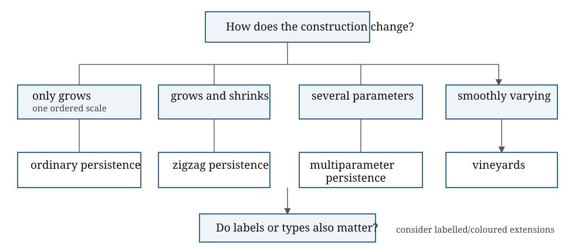

::: {.callout-tip title="Week 8 resources"}
[Slides](slides.qmd) · [Lecture walkthrough](solutions.ipynb) · [Application page](case-study.qmd)
:::

<a class="btn btn-primary" href="../../downloads/week-08-participant.ipynb" download="week-08-participant.ipynb">Download participant notebook</a>

## Learning goals

By the end of this week, you should be able to:

1. diagnose what ordinary or repeated persistence fails to retain in a dynamic or multiparameter problem;
2. explain, in applied language, the extra structure supplied by zigzag persistence, multiparameter persistence, vineyards and vineyard modules;
3. recognise which framework a technical paper is using by identifying its indexing set, objects and maps;
4. justify an advanced framework only when its extra structure matters to the scientific question; and
5. follow the two parameter directions in the Turner example and interpret, at a conceptual level, what an off-diagonal transport term over $\mathbb F_2$ records.

::: {.callout-important title="Core versus research extension"}
**Core Week 8:** diagnose whether the problem needs ordinary persistence,
repeated persistence, zigzag persistence, multiparameter persistence or a
vineyard. Be able to name the extra structure and cost of each escalation.

**Research extension:** analyse the Turner example, transport matrices,
vineyard modules and indecomposability. This material supports the Discovery
Project direction but is not required for every participant.
:::

## Escalation map

::: {.callout-tip title="Diagnose before escalating"}
The [participant practical](lab.ipynb) presents short scenarios in which you decide what ordinary or repeated persistence fails to retain. The [lecture walkthrough](solutions.ipynb) connects those decisions to the advanced frameworks below and then works through the Turner transport example.
:::

| Failure of the simpler method | Candidate framework | Extra structure retained |
|---|---|---|
| Complex only grows | Ordinary persistence | Maps along one filtration |
| Complexes appear and disappear | Zigzag persistence | Maps through insertions and deletions |
| Two parameters form one partial order | Multiparameter persistence | Jointly indexed module |
| Fixed complex, smoothly changing filtration | Vineyard | Trajectories of diagram points |
| Transport maps between time-indexed modules matter | Vineyard module | Coherent inter-module maps |

The final row is the strongest claim and the highest data burden. It
should not be selected merely because the observations vary through time.

{fig-alt="A decision tree maps only-growing complexes to ordinary persistence, growing and shrinking complexes to zigzag persistence, several parameters to multiparameter persistence, and smoothly varying filtrations to vineyards, with a further question about labels and types."}

## Story

Week 8 should be organised by problem type rather than by a list of
advanced methods. The aim is to teach method selection: what breaks in
ordinary persistence, and which tool responds to that break?

## Case 1: complexes only grow

If complexes only grow, ordinary one-parameter persistence is the
natural tool. This is the clean barcode setting. The inclusion maps all
point in the same direction:
$$K_0\subseteq K_1\subseteq\cdots\subseteq K_n.$$

## Case 2: complexes grow and shrink

If complexes grow and shrink, zigzag persistence is the natural
extension. Instead of all maps pointing in one direction, the diagram
can zigzag: $$K_0\to K_1 \leftarrow K_2 \to K_3 \leftarrow \cdots.$$
Zigzag persistence is designed for insertions and deletions of
simplices. It is mathematically appropriate for non-monotone sequences,
but it can be computationally and interpretively heavy.

> *Standard persistence tracks features that survive as a space grows.
> Zigzag persistence tracks features that survive as a space changes.*

## Case 3: there is more than one genuine parameter

If scale and time, scale and density, or another pair of parameters are
both genuine, then multiparameter persistence is the relevant framework.
The warning is essential: the clean barcode decomposition of
one-parameter persistence does not carry over in the same way.
Multiparameter persistence may be the right mathematical object even
when a practical analysis later uses lower-dimensional summaries.

**† Qualification.**
The presence of two named variables does not by itself decide the
framework. The question is whether they form one partial order to be
analysed jointly, or whether one parameter indexes a controlled family
of ordinary persistence modules with additional transport data.

## Case 4: a fixed complex has a smoothly changing filtration

Vineyards apply when there is a fixed simplicial complex $K$ and a
time-dependent filtration function $$f_t:K\to\mathbb{R}.$$ There are now
two distinct parameters:
$$\underbrace{t}_{\text{external or physical time}},
\qquad
\underbrace{a}_{\text{filtration height or scale}}.$$ At each fixed time
$t$, the sublevel filtration of $f_t$ produces an ordinary persistence
module $$V_t(a)=H_p(K_{t,a};\mathbb F)$$ and a persistence diagram
$D_t$. A vineyard tracks how the birth–death points of $D_t$ move as $t$
varies. Each tracked curve is a vine.

The useful teaching picture is a landscape whose height function changes
over time. Ordinary persistence studies flooding one fixed landscape. A
vineyard studies what happens when the landscape itself slowly morphs.

Vineyards assume controlled change. The set of simplices is fixed,
filtration values vary continuously, and changes in the filtration order
occur through adjacent swaps. Between swaps, persistence pairings remain
fixed and vines move linearly or smoothly. At a swap, the reduced
boundary matrix is updated locally rather than recomputed from scratch.

**† Qualification.** A
vineyard is a geometric record of moving birth–death points. It does not
automatically retain the full linear maps connecting the persistence
modules at different times.

> *A vineyard is not a stack of unrelated diagrams. It is a
> one-parameter family of persistence diagrams realised as curves in
> birth–death–time space.*

## Vineyard modules: what the vineyard omits

A vineyard module retains more than the visible trajectories. It
consists of the persistence module $V_t$ at each external time together
with coherent interleaving maps between the modules at different times.
Schematically, the horizontal direction is ordinary persistence through
filtration height, while the vertical direction transports information
through physical time: $$\begin{array}{ccccc}
V_s(a)&\longrightarrow&V_s(b)&\longrightarrow&V_s(c)\\
\downarrow&&\downarrow&&\downarrow\\
V_t(a+\varepsilon)&\longrightarrow&
V_t(b+\varepsilon)&\longrightarrow&
V_t(c+\varepsilon).
\end{array}$$

**▶ Likely sticking point.** For a single well-behaved one-parameter module,
its barcode classifies the module up to isomorphism. But the source and
target barcodes do not classify a particular map between two modules.
Dynamic questions may depend on those maps.

A direct sum of vine modules would mean that each visible vine can be
treated as one independent algebraic feature for all time:
$$I[\gamma_1]\oplus\cdots\oplus I[\gamma_m].$$ Turner’s central point is
that a vineyard may visibly contain several vines while its vineyard
module is nevertheless indecomposable. The homology generators can mix
under transport through time.

## Concrete reading of Turner Figure 1

Use Figure 1 of Turner, [*Representing Vineyard
Modules*](https://arxiv.org/abs/2307.06020), as the concrete example.

The domain is a disc divided into four pieces:

- $A$: the open inner disc;

- $B$: the inner boundary circle;

- $C$: the open surrounding annulus;

- $D$: the outer boundary circle.

The time-dependent function assigns
$$f_t(A)=21-t,\qquad f_t(B)=14-t,\qquad
f_t(C)=15+t,\qquad f_t(D)=t.$$

**◇ Object check.**
The horizontal axis in the figure is external time $t$. The vertical
axis is filtration height $a$. The four black sloping lines are the
values of $f_t$ on $A,B,C,D$. At a fixed $t$, move vertically upward to
watch the sublevel set acquire these four pieces.

The critical ordering changes when lines cross:
$$f_3(A)=f_3(C),\qquad f_7(B)=f_7(D).$$ Hence the dashed vertical lines
at $t=3$ and $t=7$ divide three regimes. At every fixed time there are
two $H_1$ bars: $$[14-t,21-t)
\qquad\text{and}\qquad
[t,15+t).$$ The coloured vertical segments drawn at selected times are
these bars. Following each colour through time produces a vine.

The first bar is born when $B$ enters and dies when $A$ fills its inner
loop. The second is born when $D$ enters and dies when $C$ fills the
annular class.

**▶ Likely sticking point.** The coloured curves make the example look like
two independent features, but the visible vines do not determine how
their homology generators are transported through time. That missing
information is exactly what the vineyard module retains.

## Why the Figure 1 module is indecomposable

Before the first critical event, a natural basis is $$[B],\qquad[D+B],$$
whereas after the second critical event the forced basis is
$$[B],\qquad[D].$$ Over $\mathbb F_2$, $$[D]=[D+B]+[B].$$ Thus the
change of basis mixes the two visible vines. After coherent
simplification, an off-diagonal term remains in a transport matrix of
the form $$\begin{pmatrix}
1&1\\
0&1
\end{pmatrix}.$$

The off-diagonal $1$ means that transporting the second generator
through time necessarily picks up part of the first. There is no
globally coherent choice of bases that turns the family into two
independent $1\times 1$ problems.

> *Two visible vines do not necessarily mean two independent evolving
> homology classes.*

This is the conceptual reason to care about persistence modules rather
than only diagrams: the diagram records where classes are born and die;
the module-level maps record how classes are related and transported.

## Why vineyards are delicate

Smooth motion of points does not necessarily imply smooth behaviour of
the filtration order. In a moving point cloud, many distances can change
relative order at once. Edges, triangles and higher-dimensional
simplices can undergo large global reorderings. This makes it hard to
identify the same topological feature across time. The persistence
diagram may be stable in bottleneck distance, while feature identity is
still unstable.

This is the distinction to emphasise:
$$\text{diagram stability} \neq \text{reliable feature tracking}.$$

## Case 5: labels, colours or types matter

If points, regions or agents carry labels, colours or types, ordinary
persistence may ignore the structure of interest. Chromatic or
relative-style methods ask how different classes spatially mingle,
separate or interact. Relative homology, image persistence, kernel
persistence and cokernel persistence can be introduced conceptually here
as tools for asking what part of a feature belongs to, is contributed
by, or is shared across different subobjects.

## DP relevance

For swarms or physical reservoirs, vineyards are attractive because they
offer feature identity, continuous trajectories and potential online
updates. But they are also high risk. A literal moving point-cloud Rips
filtration may not satisfy the assumptions needed for vineyard tracking.

Two more plausible strategies are:

1.  fix an interaction-graph or clique-complex scaffold and let edge or
    simplex weights vary smoothly through time;

2.  fix an ambient mesh and define a smooth density or activity field
    from the swarm or reservoir state.

Both strategies disconnect the fixed simplicial object from the raw
moving agent geometry. The topology then belongs to an interaction
structure or ambient field rather than directly to the moving point
cloud.

## Software scope: Python first, Julia as a research extension

The implemented course should retain Python as its primary environment.
GUDHI supplies simplex-tree, Rips and cubical representations together
with persistent-cohomology tools, while Ripser.py provides a focused
interface for Rips persistence on point clouds and distance matrices.
This covers the static, validation and repeated-persistence workflows
used in Weeks 4–7.

Julia becomes attractive when the surrounding dynamical simulation or
numerical workflow is already written in Julia, or when a benchmark of
the pure-Julia Ripserer implementation is scientifically useful.
Ripserer supports ordinary persistence computations and representative
cocycle workflows. It should not be introduced merely to reproduce the
same classroom barcode in a second language.

Interoperability is feasible through PythonCall/JuliaCall, including
controlled conversion and non-copying array exchange. For a research
prototype, prefer a narrow boundary: exchange point arrays, distance
matrices or persistence intervals, rather than passing live complex
objects between runtimes.

**Current recommendation.** Keep the reproducible teaching pipeline in
Python. Add a Julia benchmark only when the DP simulation is Julia-native
or when profiling identifies persistence computation as a real
bottleneck. Treat zigzag, multiparameter and vineyard-module computation
as separate research evaluations; ordinary Ripser interoperability does
not supply those methods automatically.

Official capability references: [GUDHI Python
documentation](https://gudhi.inria.fr/python/latest/), [Ripser.py
documentation](https://ripser.scikit-tda.org/en/latest/reference/stubs/ripser.ripser.html),
[Ripserer.jl documentation](https://mtsch.github.io/Ripserer.jl/v0.14/),
and [PythonCall/JuliaCall](https://juliapy.github.io/PythonCall.jl/stable/).
